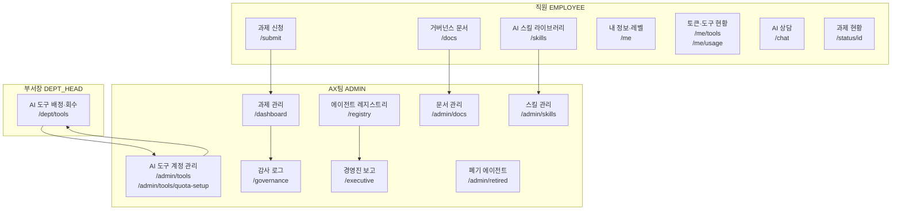

# 삼성자산운용 AX AI 거버넌스 문서 체계

> 이 파일은 AX AI 거버넌스 문서 전체를 관리하는 마스터 인덱스다.  
> 새 문서 추가·개정 시 반드시 이 파일을 함께 갱신한다.  
> 최종 갱신: 2026-07-22

---

## 문서 계층 구조

```
규정 (Regulation)          — 전사 강제 준수 사항
 └─ 정책/지침 (Policy)     — 운영 기준, 상세 절차
     ├─ 지침 (Guideline)   — 원칙 및 방침
     ├─ 개발표준 (Standard)— 기술 요건 (신설 2026-07-15)
     ├─ 추가조항 (Addendum)— 플로우 보완 (신설 2026-07-06)
     ├─ 매뉴얼 (Manual)    — 사용자 안내
     └─ 아키텍처 (Arch)    — 시스템 설계 참조
```

---

## 문서 목록

### 공식 문서 (Markdown SSOT — Word는 필요 시 별도 변환)

| 문서번호 | 파일명 (.md) | 버전 | 제정일 | 상태 | 내용 요약 |
|----------|-------------|------|--------|------|-----------|
| AX-REGULATION-2026-001 | `AX-REGULATION-2026-001_AI운영규정.md` | v1.0 | 2026-07-02 | ✅ 시행 | 데이터 기밀등급(G1/G2/G3), 과제 신청·평가·승인 기준, AI 서비스 금지 행위 |
| AX-POLICY-2026-001 | `AX-POLICY-2026-001_AI거버넌스지침.md` | v4.0 (통합) | 2026-07-08 | ✅ 시행 | 총칙·사용원칙(제1~5장) + AI 크루 파이프라인(제6~8장) + AX위원회·Agent 운영·생성형AI·PI T/F(제9~12장) |
| AX-GUIDELINE-2026-001 | `AX-GUIDELINE-2026-001_AI거버넌스기본지침.md` | v1.0 | 2026-07-02 | ✅ 시행 | AI 활용 기본 방침(5원칙), 지침 개정 절차 |
| AX-MANUAL-2026-001 | `AX-MANUAL-2026-001_사용가이드라인.md` | v1.0 | 2026-07-02 | ✅ 시행 | AX Request Hub 신청·평가·승인 실무 가이드, FAQ |
| AX-MANUAL-2026-002 | `AX_AI도구계정_관리운영가이드.md` | v1.0 | 2026-07-21 | ✅ 시행 | GPT 150 + Gemini 50 계정 신청·배분·회수·모니터링 운영 절차 |

### 보완 문서 (Markdown SSOT)

| 파일명 | 신설일 | 상태 | 보완 대상 | 내용 요약 |
|--------|--------|------|-----------|-----------|
| `AX_개발표준_전사AI과제용.md` | 2026-07-15 | ✅ 시행 | AX-POLICY-2026-001 제22조 확장 | 표준 기술 스택(강제), 3단계 개발 요건, 코드품질, 데이터 거버넌스, 테스트 기준 |
| `AX_AI개발플로우_추가조항.md` | 2026-07-06 (v1.1 2026-07-15) | ✅ 시행 | AX-POLICY-2026-001 제19~27조 보완 | AI 크루 범위·인수 기준, 배포환경 결정트리, 데이터플랫폼 연계, Gate 2 기술표준 자가점검 |
| `AX_전사AI운영체계_제안_2026-07.md` | 2026-07 | 📋 초안 검토중 | AX팀 운영 체계 개선 | 스킬 관리·문서 관리·계정 배분 등 전사 AI 운영체계 개선 방향 제안 |
| `architecture.md` | 2026-07-01 (갱신 2026-07-22) | ✅ 시행 | 시스템 설계 참조 | AX Request Hub 전체 시스템 구조, 페이지·API 명세, DB 모델 |
| `registry-lifecycle-design.md` | 2026-07-14 | ✅ 시행 | AX-POLICY-2026-001 제9조 (AI 에이전트 운영) 보완 | 에이전트 Gate 라이프사이클 기반 레지스트리 — Gate 진행도·신뢰점수·AXProject M:N 설계 |
| `AX_Hub_검토보고_2026-07-22.md` | 2026-07-22 | 📋 조치 진행중 | 문서·시스템 전반 | 문서-시스템 정합성·거버넌스 리스크·아키텍처 이슈 교차 검토 보고 |

---

## 공식 문서 → 보완 문서 참조 현황

| 공식 문서 조항 | .md 반영 상태 | 참조 위치 |
|---------------|--------------|-----------|
| AX-REGULATION 제5조 (승인기준) | ✅ 반영 완료 | 제5조 하단 Gate 2 callout → `AX_AI개발플로우_추가조항.md` §4 |
| AX-REGULATION 제1조·제5조 (등급·상용 확정 권한) | ✅ 반영 완료 | 제1조: 데이터 자산 등급 부여 의무·등급 확정 주체(데이터플랫폼팀) 추가. 제5조: G3 이중 승인·상용 확정 권한=협의회 의결 추가 |
| AX-POLICY v4 제22조 (엔지니어 기준) | ✅ 반영 완료 | 제22조 하단 callout → `AX_개발표준_전사AI과제용.md` (커버리지도 80%로 통일) |
| AX-POLICY v4 제9조 (에이전트 운영) | ✅ 반영 완료 | → `registry-lifecycle-design.md` (Gate 라이프사이클 상세) |
| AX-POLICY v4 제9~10장 (AX위원회 심의·의결) | ✅ 반영 완료 | 제28조: 상용 전환 심의 안건 5종·상정 요건 3가지 명문화. 제29조의2: 의결 유형 5종 추가 |
| AX-POLICY v4 제19~27조 (파이프라인·데이터) | ✅ 반영 완료 | 제27조의2: 개발/상용 라이프사이클 분리 절차 신설. 제27조의3: 데이터 프로비저닝 절차 신설 |
| AX-GUIDELINE 제4조 (기본방침) | ✅ 반영 완료 | 5개 원칙 하단 개발자 추가 원칙 → `AX_개발표준_전사AI과제용.md` |
| AX-MANUAL 3단계 (처리 절차) | ✅ 반영 완료 | Gate 2 자가점검을 별도 callout으로 분리 |
| AX-MANUAL-2026-001 (데이터 신청 가이드) | ✅ 반영 완료 | 6단계: 데이터 카탈로그 탐색→DataRequest 신청→데이터플랫폼팀 검토→DataProvision 제공 가이드 신규 추가 |

> **📌 Word 변환 시 참고**: .md 파일이 SSOT. Word 파일이 필요한 경우 해당 .md를 기준으로 변환.

---

## 신규 과제 신청 시 적용 문서 흐름

```
신청자 → AX Request Hub(/submit)
            │
            ├─ 기밀등급 판단     → AX-REGULATION-2026-001 제1조
            ├─ 신청서 항목       → AX-MANUAL-2026-001 §2 (점수 올리는 팁)
            │
            ↓ 제출
         AI 자동평가 (6차원)    → AX-REGULATION-2026-001 제4조
            │
            ├─ Gate 2 자가점검  → AX_AI개발플로우_추가조항.md §4
            │
            ├─ 자동승인 (G1/G2 ≥70점)
            └─ 에스컬레이션 (G3 또는 <70점)

개발 착수 시
            ├─ 크루 PoC 범위    → AX_AI개발플로우_추가조항.md §1
            ├─ 기술 스택 선택   → AX_개발표준_전사AI과제용.md §4 (강제)
            ├─ 배포환경 결정    → AX-POLICY-2026-001 v4 제24조
            └─ 데이터 연동      → AX-POLICY-2026-001 v4 제25~27조

AI 도구 계정 배정
            ├─ 부서장 → /dept/tools (AX팀 위임 범위 내)
            └─ AX팀 → /admin/tools (전체 관리)
                       운영 기준 → AX-MANUAL-2026-002
```

---

## AX Hub 시스템 연결 구조 (2026-07-22 기준)



---

## 검토보고 지적사항 조치 현황 (2026-07-22)

| 구분 | 항목 | 조치 상태 | 비고 |
|------|------|-----------|------|
| P1-1 | G3 데이터 → Claude API 전송 순서 | ✅ 완료 | 안A 적용: G3 선판단 후 즉시 AX팀 수동 검토 (`/api/evaluate`) |
| P1-2 | Telegram 알림 채널 제거 | ✅ 완료 | Telegram 호출 전면 제거. 사내 채널 연동은 추후 결정 |
| P1-3 | 이의제기(재심) 절차 부재 | ✅ 완료 | `/api/projects/[id]/appeal` 신설, ProjectAppeal 모델 추가 |
| P2-1 | Agent vs AgentRegistry 이중 모델 | 📝 문서 명시 | architecture.md §8 경고 추가 |
| P2-2 | 상태 체계 3종 매핑 미정의 | 📝 문서 명시 | architecture.md §8 전환 기준 명시 |
| P2-3 | /api/governance-docs/seed 인증 없음 | ✅ 완료 | ADMIN 인증 추가 |
| P3-1 | 문서체계 구조도 누락 페이지 | ✅ 완료 | 이 파일 구조도 갱신 |
| P3-2 | 스킬/리터러시/토큰 정책 문서 공백 | ⏳ 검토 필요 | 신규 문서 초안 필요 |
| P3-3 | EXECUTIVE 역할 분리 | ✅ 완료 | `/api/executive` C_LEVEL + AX_TEAM 인증 추가 |
| P3-3 | 부서장(DEPT_HEAD) 지정 절차 | ⏳ 검토 필요 | 권한 부여 주체·절차 미정의 — 조직 결정 필요 |
| P3-4 | architecture.md 미결사항 추가 | ✅ 완료 | §18에 6개 항목 추가 |
| P3-5 | 문서 목록 상태 컬럼 추가 | ✅ 완료 | 위 테이블에 상태 컬럼 반영 |
| P3-5 | registry-lifecycle 참조 추가 | ✅ 완료 | 참조 현황 테이블 갱신 |

---

## 문서 이력

| 버전 | 일자 | 변경 내용 |
|------|------|-----------|
| v1.0 | 2026-07-15 | 최초 작성 — 공식 문서 4종 + 보완 md 3종 통합 인덱스 |
| v1.1 | 2026-07-21 | AX-MANUAL-2026-002 (AI 도구계정 관리운영가이드) 추가 |
| v1.2 | 2026-07-22 | 보완 문서 3종 추가, 시스템 연결 구조도 전면 갱신, architecture.md 갱신 반영 |
| v1.3 | 2026-07-22 | 검토보고(AX_Hub_검토보고_2026-07-22) 반영: 상태 컬럼 추가, registry-lifecycle 참조 추가, 조치 현황 테이블 신설, 구조도 누락 페이지 보완 |
| v1.4 | 2026-07-23 | v3 신규 항목 4건 참조 현황 추가: REGULATION 제1조·제5조(등급부여의무·G3이중승인·상용확정권한), POLICY 제9~10장(협의회 안건5종·의결유형5종), POLICY 제19~27조(이중라이프사이클·데이터프로비저닝), MANUAL 데이터신청가이드 |
