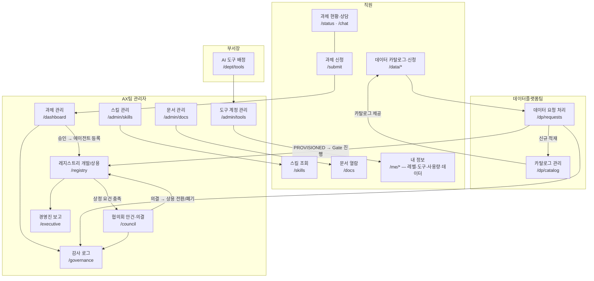

# 삼성자산운용 AX AI 거버넌스 문서 체계

> 이 파일은 AX AI 거버넌스 문서 전체를 관리하는 마스터 인덱스다.
> 새 문서 추가·개정 시 반드시 이 파일을 함께 갱신한다.
> 최종 갱신: 2026-07-23

---

## 문서 계층 구조

```
규정 (Regulation)          — 전사 강제 준수 사항
 └─ 정책/지침 (Policy)     — 운영 기준, 상세 절차
     ├─ 지침 (Guideline)   — 원칙 및 방침
     ├─ 개발표준 (Standard)— 기술 요건 (신설 2026-07-15)
     ├─ 추가조항 (Addendum)— 플로우 보완 (신설 2026-07-06)
     ├─ 매뉴얼 (Manual)    — 사용자 안내
     └─ 아키텍처 (Arch)    — 시스템 설계 참조
```

---

## 문서 목록

### 공식 문서 (Markdown SSOT — Word는 필요 시 별도 변환)

| 문서번호 | 파일명 (.md) | 버전 | 제정일 | 내용 요약 |
|----------|-------------|------|--------|-----------|
| AX-REGULATION-2026-001 | `AX-REGULATION-2026-001_AI운영규정.md` | v1.0 | 2026-07-02 | 데이터 기밀등급(G1/G2/G3), 과제 신청·평가·승인 기준, AI 서비스 금지 행위 |
| AX-POLICY-2026-001 | `AX-POLICY-2026-001_AI거버넌스지침.md` | v4.0 (통합) | 2026-07-08 | 총칙·사용원칙(제1~5장) + AI 크루 파이프라인(제6~8장) + AX위원회·Agent 운영·생성형AI·PI T/F(제9~12장) |
| AX-GUIDELINE-2026-001 | `AX-GUIDELINE-2026-001_AI거버넌스기본지침.md` | v1.0 | 2026-07-02 | AI 활용 기본 방침(5원칙), 지침 개정 절차 |
| AX-MANUAL-2026-001 | `AX-MANUAL-2026-001_사용가이드라인.md` | v1.0 | 2026-07-02 | AX Request Hub 신청·평가·승인 실무 가이드, FAQ |
| AX-MANUAL-2026-002 | `AX_AI도구계정_관리운영가이드.md` | v1.0 | 2026-07-21 | GPT 150 + Gemini 50 계정 신청·배분·회수·모니터링 운영 절차 |

### 보완 문서 (Markdown SSOT)

| 파일명 | 신설일 | 보완 대상 | 내용 요약 |
|--------|--------|-----------|-----------|
| `AX_개발표준_전사AI과제용.md` | 2026-07-15 | AX-POLICY-2026-001 제22조 확장 | 표준 기술 스택(강제), 3단계 개발 요건, 코드품질, 데이터 거버넌스, 테스트 기준 |
| `AX_AI개발플로우_추가조항.md` | 2026-07-06 (v1.1 2026-07-15) | AX-POLICY-2026-001 제19~27조 보완 | AI 크루 범위·인수 기준, 배포환경 결정트리, 데이터플랫폼 연계, Gate 2 기술표준 자가점검 |
| `AX_전사AI운영체계_제안_2026-07.md` | 2026-07 | 전사 AI 운영 체계 개선 제안 | AX팀 조직·역할·프로세스 개선 방향 제안서 |
| `architecture.md` | 2026-07-01 (**v3 통합 2026-07-23**) | 시스템 설계 참조 | AX Hub 전체 시스템 구조 — **데이터 프로비저닝·이중 라이프사이클·협의회 승인 체계·Agent 모델 통합 반영** |
| `registry-lifecycle-design.md` | 2026-07-14 | AX-POLICY-2026-001 제19~27조 (에이전트 운영) | 라이프사이클 기반 레지스트리 설계 — ⚠️ architecture v3 이중 라이프사이클로 전면 갱신 예정 |
| `AX_Hub_검토보고_2026-07-22.md` | 2026-07-22 | 전체 교차 검토 | 규정 리스크 P1 3건, 아키텍처 정합성 P2 3건, 보완 P3 — 조치 추적용 |

---

## 공식 문서 → 보완 문서 참조 현황

| 공식 문서 조항 | .md 반영 상태 | 참조 위치 |
|---------------|--------------|-----------|
| AX-REGULATION 제5조 (승인기준) | ✅ 반영 완료 | 제5조 하단 Gate 2 callout → `AX_AI개발플로우_추가조항.md` §4 |
| AX-REGULATION 제1조·제5조 (등급·상용 확정 권한) | ✅ 반영 완료 | 제1조: 데이터 자산 등급 부여 의무·등급 확정 주체(데이터플랫폼팀) 추가. 제5조: G3 이중 승인(AX팀 에스컬레이션+데이터플랫폼팀 기밀 검토)·상용 확정 권한=협의회 의결 추가 |
| AX-POLICY v4 제22조 (엔지니어 기준) | ✅ 반영 완료 | 제22조 하단 callout → `AX_개발표준_전사AI과제용.md` (커버리지 80% 통일) |
| AX-POLICY v4 제9~10장 (AX위원회) | ✅ 반영 완료 | 제28조: 상용 전환 심의 안건 5종(PROD_APPROVAL 외)·상정 요건 3가지 명문화. 제29조의2: 의결 유형 5종(APPROVED/CONDITIONAL/REMANDED/REJECTED/DEFERRED) 추가 |
| AX-POLICY v4 제19~27조 (파이프라인·데이터) | ✅ 반영 완료 | 제27조의2: 개발(SUBMITTED→COUNCIL_PENDING)/상용(ACTIVE~RETIRED) 라이프사이클 분리 절차 신설. 제27조의3: 데이터 프로비저닝 절차(DataRequest→DataProvision) 신설 |
| AX-GUIDELINE 제4조 (기본방침) | ✅ 반영 완료 | 5개 원칙 하단 개발자 추가 원칙 → `AX_개발표준_전사AI과제용.md` |
| AX-MANUAL 3단계 (처리 절차) | ✅ 반영 완료 | Gate 2 자가점검 별도 callout 분리 |
| AX-MANUAL-2026-001 (데이터 신청 가이드) | ✅ 반영 완료 | 6단계: 데이터 카탈로그 탐색→DataRequest 신청→데이터플랫폼팀 검토→DataProvision 제공 실무 가이드 섹션 신규 추가 |

> **📌 Word 변환 시 참고**: .md 파일이 SSOT. Word 파일이 필요한 경우 해당 .md를 기준으로 변환.

---

## 신규 과제 신청 시 적용 문서 흐름

```
신청자 → AX Request Hub(/submit)
            │
            ├─ 기밀등급 판단        → AX-REGULATION-2026-001 제1조
            ├─ 신청서 항목          → AX-MANUAL-2026-001 §2
            ├─ 데이터 필요 여부 선언 → architecture v3 §10 (신설)
            │
            ↓ 제출
         AI 자동평가 (6차원)       → AX-REGULATION-2026-001 제4조
            ├─ Gate 2 자가점검     → AX_AI개발플로우_추가조항.md §4
            ├─ 자동승인 (G1/G2 ≥70점)
            └─ 에스컬레이션 (G3 또는 <70점)

개발 착수 (개발 라이프사이클)
            ├─ 크루 PoC 범위       → AX_AI개발플로우_추가조항.md §1
            ├─ 기술 스택 선택      → AX_개발표준_전사AI과제용.md §4 (강제)
            ├─ 배포환경 결정       → AX-POLICY-2026-001 v4 제24조
            └─ 데이터 확보         → architecture v3 §10 (신설)
                 카탈로그 검색(/data/catalog) → 있음: 이용 신청 / 없음: 신규 요청
                 데이터플랫폼팀 승인 (G3는 정보보호 협의) → 제공
                 ※ 데이터 PROVISIONED 전까지 Gate 2 진행 불가

상용 전환 (협의회 승인 — 신설)
            ├─ 상정 요건 5종 자동 검증 → architecture v3 §8-1
            ├─ AX위원회 심의·의결      → AX-POLICY-2026-001 v4 제9~10장
            └─ 승인 시 상용 라이프사이클 이관 (데이터 상용 재승인 필수)

상용 운영
            ├─ 월별 상용 KPI 입력·판정 → architecture v3 §7-2
            └─ 폐기 트리거 → 협의회 보고 → DEPRECATED → RETIRED

AI 도구 계정 배정
            ├─ 부서장 → /dept/tools (AX팀 위임 범위 내)
            └─ AX팀 → /admin/tools — 운영 기준 → AX-MANUAL-2026-002
```

---

## AX Hub 시스템 연결 구조 (v3)



---

## 문서 이력

| 버전 | 일자 | 변경 내용 |
|------|------|-----------|
| v1.0 | 2026-07-15 | 최초 작성 — 공식 문서 4종 + 보완 md 3종 통합 인덱스 |
| v1.1 | 2026-07-21 | AX-MANUAL-2026-002 (AI 도구계정 관리운영가이드) 추가 |
| v1.2 | 2026-07-22 | 보완 문서 2종 추가(registry-lifecycle-design, 전사AI운영체계 제안), 시스템 연결 구조도 신설, architecture.md 갱신 반영 |
| v1.3 | 2026-07-23 | architecture.md **v3 통합**(데이터 프로비저닝·이중 라이프사이클·협의회 승인) 반영, 검토보고 문서 등재, 시스템 연결 구조도 v3 개편(고립 노드 해소, /data·/dp·/council 추가), 참조 현황에 반영 필요 항목 4건 등재, 과제 적용 문서 흐름에 데이터 확보·상용 전환·상용 운영 단계 신설 |
| v1.4 | 2026-07-23 | 참조 현황 ⬜ 4건 → ✅ 완료 처리: REGULATION 제1조·제5조, POLICY 제9~10장, POLICY 제19~27조, MANUAL 데이터 신청 가이드 — 각 규정 문서 v1.1/v4.1/v1.1로 개정 |
