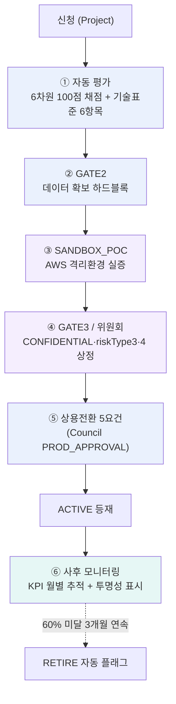

# 에이전트 심사 → 등재 과정 — 심층 분석

> 작성: Claude AI / 2026-09-04
> 목적: "에이전트 심사 강조" 피드백에 대응하기 위한 실제 심사 메커니즘 전수 확인
> 결론: 심사 자체는 생각보다 촘촘함. 그런데 그 심사를 통째로 우회할 수 있는 별도 API가 존재함 — 이것부터 막아야 "심사가 엄격하다"는 설명이 정직해짐.

---

## 1. 심사는 한 단계가 아니라 5단계로 겹쳐 있음

지금까지 GATE1~3만 강조해왔는데, 실제로는 그보다 훨씬 촘촘함:



### ① 자동 평가 (신청 직후)
- Qwen/Claude가 6차원으로 채점(합 100점): 영향도(25)·ROI(25)·기밀등급(15)·난이도(15)·준비도(10)·전략정합성(10)
- 별도로 기술표준 체크리스트 6항목(API스펙·데이터등급문서화·감사로깅·테스트커버리지·데이터무결성·Human-in-loop) 통과 여부 기록
- **CONFIDENTIAL 등급은 채점 자체를 생략**하고 곧바로 AX팀 전원 수동검토로 감 — 점수로 판단할 사안이 아니라는 뜻
- 70점 이상만 자동 통과, 68~69점은 재검토, 68점 미만은 반려(오늘 고친 부분 — 예전엔 특정 개인 하드코딩, 지금은 AX팀 전체)

### ② GATE2 — 데이터 확보 하드블록
- 연결된 과제에 미제공(PROVISIONED 아닌) 데이터 신청이 하나라도 있으면 **전환 자체가 422로 거부됨** — 우회 불가능한 강제 조건

### ③ SANDBOX_POC — 오늘 신설
- AWS Landing Zone 격리 환경에서 실제 기술 검증. 완료 보고(`pocResultSummary`) 없이는 GATE3 진입 불가

### ④ GATE3 / 위원회 상정
- CONFIDENTIAL 등급 또는 riskType 3·4(자율실행+메모리 / 완전자율에이전트)는 AI위원회 안건으로 자동 생성됨
- 위원회는 거부권(CISO·CRO)·제척(이해상충 위원)·경과조치(시행 초기 전건 상정) 규정 적용

### ⑤ 상용전환 5요건 — 가장 촘촘한 관문
GATE3 이후 실제 프로덕션(ACTIVE) 전환을 위해 **5가지를 전부** 충족해야 위원회에 PROD_APPROVAL 안건 상정 가능:

| 요건 | 내용 |
|---|---|
| Gate3 통과 | devStage가 GATE3/PILOT_PROVEN이거나 gate3Passed=true |
| KPI 실적 | 파일럿 기간 KPI 기록 1건 이상 |
| 데이터 정상 | 과제 연결 + 데이터 제공 전건 PROVISIONED (만료·회수 없음) |
| 기술표준 이행 | Project.techStandardsPassed = true |
| 운영계획 등록 | 상용 운영 KPI 목표(prodKpiTarget) 등록 완료 |

5개 중 하나라도 미충족이면 안건 상정 자체가 422로 막힘.

### ⑥ 사후 모니터링 — 등재 후에도 끝이 아님
- 월별 KPI(`achieveRate`) 기록
- **3개월 연속 60% 미달 시 자동으로 RETIRE_CANDIDATE 플래그** — 사람이 놓쳐도 시스템이 잡아냄
- 고영향 AI(`isHighImpact`)는 투명성 표시 의무(AI-GUI-002 제12조) — SYSTEM_NOTICE/SERVICE_DESC/PUBLIC_NOTICE 중 하나 적용 기록

---

## 2. 그런데 이 전부를 우회하는 API가 따로 있음 — Critical

`PATCH /api/registry/[id]` (개별 에이전트 메타데이터 수정용 엔드포인트)를 열어보니:

```ts
// app/api/registry/[id]/route.ts
export async function PATCH(...) {
  const auth = await requireRole('AX_TEAM')   // 권한 체크는 이것뿐
  ...
  const { ..., lifecycleStage } = body
  const updated = await prisma.agentRegistry.update({
    where: { id },
    data: {
      ...(lifecycleStage !== undefined && { lifecycleStage }),   // ← 조건 없이 그냥 반영
    },
  })
}
```

**GATE1→GATE2 데이터 하드블록도, GATE2→GATE3 샌드박스 가드도, 위원회 5요건도 전혀 체크 안 함.** AX팀 권한만 있으면 이 API로 `lifecycleStage: "ACTIVE"`를 그냥 보내서 위 5단계를 전부 건너뛸 수 있음. `PATCH /api/registry`(다른 엔드포인트, 오늘 우리가 가드 넣은 곳)와 별개 라우트라서, 하나를 아무리 촘촘하게 만들어도 이쪽이 뚫려있으면 전체가 무력화됨.

**이건 오늘 아침에 잡았던 "인표님 하드코딩"과 똑같은 성격의 문제** — 정식 절차 옆에 비공식 우회로가 남아있는 패턴.

### 권장 조치
```ts
// PATCH /api/registry/[id]에서 lifecycleStage 필드 제거
// 라이프사이클 전환은 오직 PATCH /api/registry(가드 있는 곳)로만 가능하게 강제
```
이 한 줄(필드 제거) 수정이 급함 — "심사를 강조"하려면 이 우회로부터 막아야 그 강조가 사실이 됨.

---

## 3. 부수 발견 — 투명성 의무도 강제 조건이 아님 (Medium)

`isHighImpact=true`인 에이전트가 `transparencyMethod`를 채우지 않아도 상용전환 5요건 체크(`checkProdEligibility`)에 걸리지 않음 — AI-GUI-002 제12조 의무가 데이터 필드로는 존재하지만 **게이트 조건으로 강제되지 않음**. GATE3 심사 규정처럼, 이것도 "규정은 있는데 코드가 체크 안 하는" 같은 계열의 갭.

---

## 4. 정리 — 무엇을 강조하고, 무엇을 먼저 고쳐야 하는가

**강조할 수 있는 것 (사실임)**:
- 신청부터 등재까지 5단계 심사, 그중 데이터 확보와 상용전환 5요건은 하드 블록으로 우회 불가능
- 등재 후에도 KPI 3개월 연속 미달 시 자동 폐기 플래그 — "등재하면 끝"이 아닌 지속 관리 체계

**먼저 고쳐야 정직해지는 것**:
1. **(Critical)** `/api/registry/[id]` PATCH의 `lifecycleStage` 우회 경로 — 이걸 안 막고 "심사가 엄격하다"고 발표하면, 나중에 실제로 문제가 생겼을 때 "그때 이미 알고 있었잖아요"가 됨
2. **(Medium)** 고영향 AI 투명성 표시를 상용전환 요건에 6번째 항목으로 추가

1번은 CTO에게 지금 바로 넘길 정도의 우선순위로 보는 게 맞음 — 스펙이랄 것도 없는 한 줄 수정.
