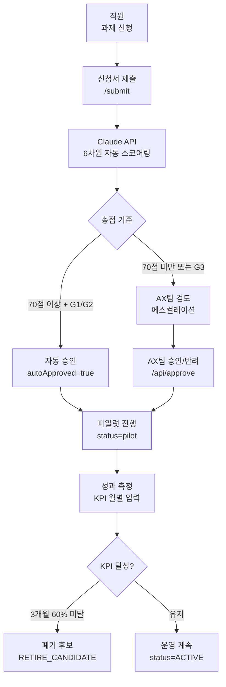
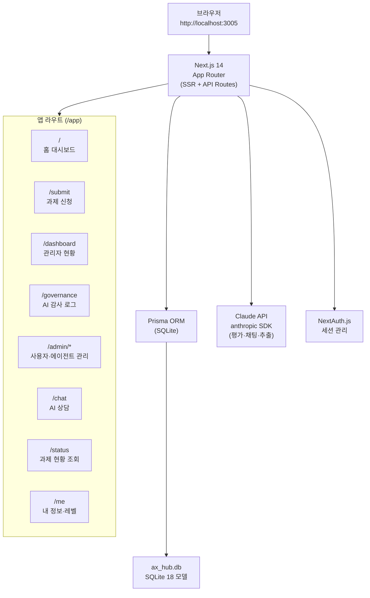
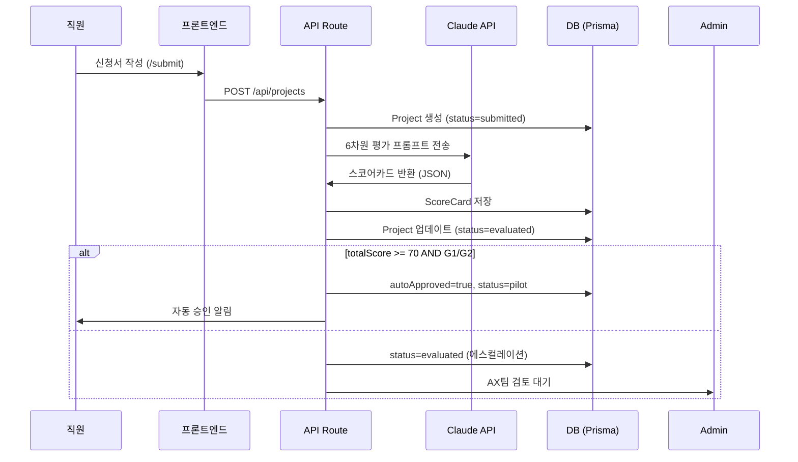
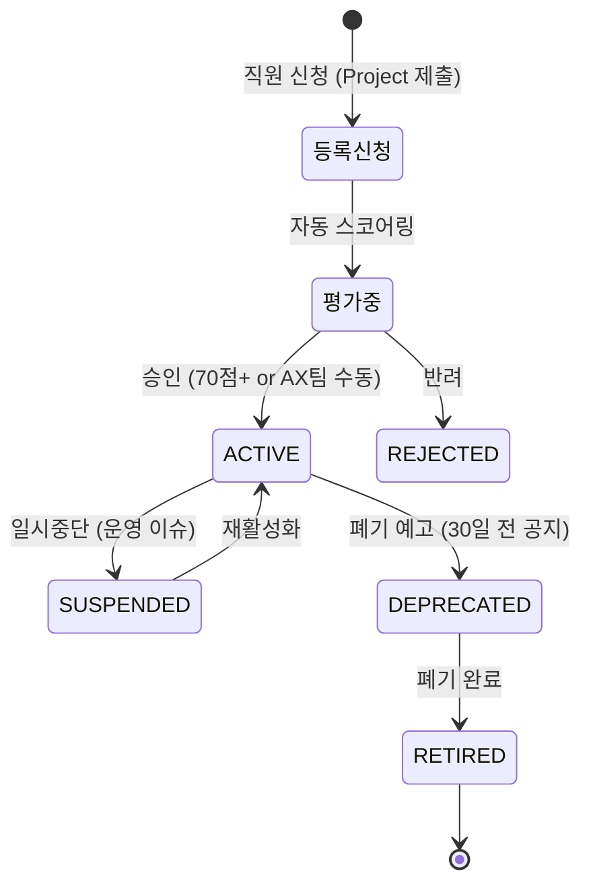

# 삼성AM AI Hub — 시스템 아키텍처

> 최종 갱신: 2026-07-10  
> 레포: honggun2233/ax-request-hub (PRIVATE)  
> 목표: **삼성자산운용 전사 AI 과제 신청·평가·거버넌스·에이전트 라이프사이클 통합 관리**

---

## 1. 설계 원칙

| 원칙 | 구현 |
|------|------|
| 거버넌스 추적 가능성 | 모든 AI 과제·에이전트 결정에 감사 로그 (AuditLog) |
| 자동화 + 인간 검토 | 6차원 자동 스코어링 → 임계값 이상 자동승인, 나머지 에스컬레이션 |
| KPI 기반 관리 | 에이전트 등록 시 KPI 4필드 필수. 토큰 사용량 ≠ 성과 지표 |
| 접근 권한 분리 | 일반 직원 / AX팀 관리자 역할 분리, NextAuth 세션 기반 |
| 단일 진실 소스 | Prisma + SQLite가 모든 상태의 SSOT |

---

## 2. 전체 시스템 플로우



---

## 3. 시스템 구성도



---

## 4. 사용자 역할 & 접근 권한

```
┌─────────────────────────────────────────────────────────┐
│  역할        접근 가능 페이지             주요 기능         │
├─────────────────────────────────────────────────────────┤
│  EMPLOYEE    /submit, /status, /chat,     과제 신청       │
│              /me                          내 과제 조회     │
│                                           AI 상담         │
│                                           리터러시 수강    │
├─────────────────────────────────────────────────────────┤
│  ADMIN       전체 페이지                  과제 평가·승인   │
│  (AX팀)      /admin/*, /governance,       에이전트 관리    │
│              /dashboard                  직원 권한 관리    │
│                                           토큰 정책 설정   │
│                                           감사 로그 조회   │
└─────────────────────────────────────────────────────────┘
```

---

## 5. 과제 신청 → 평가 시퀀스



---

## 6. 6차원 자동 스코어카드

| 차원 | 가중치 | 측정 기준 |
|------|--------|---------|
| 비즈니스 임팩트 | 25점 | 영향 범위, 반복성, 자동화 가능성 |
| ROI 예상 | 25점 | 시간 절감, 비용 절감, 수익 기여 |
| 기밀등급 리스크 | 15점 | G1(공개)=15, G2(내부)=10, G3(기밀)=5 |
| 기술 난이도 | 15점 | 낮을수록 높은 점수 |
| AI 준비도 | 10점 | 데이터 품질, 인프라 준비도 |
| 전략 정합성 | 10점 | AX팀 전략 목표 부합 |
| **합계** | **100점** | |

**자동 승인 조건:** 총점 ≥ 70 AND 기밀등급 G1 또는 G2  
**에스컬레이션:** 총점 < 70 OR G3(기밀) → AX팀 수동 검토

---

## 7. AI 에이전트 라이프사이클



**폐기 기준 (제15조의2):**
- KPI 60% 미달 3개월 연속 → RETIRE_CANDIDATE 플래그
- 12개월 미사용 (lastUsedAt 기준)
- 데이터 보안 위반 발생
- 연관 사업 폐지

**KPI 4필드 (등록 필수):**
```
kpiName          예: "문서 분류 정확도"
kpiTarget        예: 90.0 (%)
kpiType          정확도형 | 완료율형 | 시간절감형 | 만족도형
kpiMeasureMethod 예: "월별 샘플 100건 검토"
kpiMeasureCycle  MONTHLY | QUARTERLY
```

---

## 8. DB 모델 구성 (18개 Prisma 모델)

```
┌──────────────────────────────────────────────────────────────────┐
│                         과제 관리                                  │
│  Project (과제) ──1:1── ScoreCard (6차원 점수)                    │
│  Project ──1:1── ChatSession (AI 상담 내역)                       │
│  AuditLog (모든 주요 결정 감사 추적)                               │
├──────────────────────────────────────────────────────────────────┤
│                         직원 & 권한                                │
│  Employee (직원 정보 + AI 리터러시 레벨 L0~L4)                    │
│  LevelApplication (레벨 신청) ── LevelHistory (이력)              │
│  ServiceAllocation (서비스별 토큰 할당)                            │
│  DistributionPolicy (부서별 토큰 배분 정책)                        │
│  TokenPolicy (글로벌 토큰 정책)                                    │
│  UsageRecord (토큰 사용 기록) ── UsageAlert (사용량 알림)           │
├──────────────────────────────────────────────────────────────────┤
│                         AI 에이전트                                │
│  Agent (에이전트 정보 + KPI + 라이프사이클 상태)                   │
│  AgentKpiRecord (월별 KPI 실적 기록)                              │
│  AgentArtifact (에이전트 산출물)                                   │
│  AgentKnowledgeExtract (지식 추출)                                │
├──────────────────────────────────────────────────────────────────┤
│                         리터러시                                   │
│  LiteracyCourse (AI 리터러시 교육 과정)                            │
│  LiteracyEnrollment (수강 신청 + 이수)                             │
└──────────────────────────────────────────────────────────────────┘
```

### Agent 모델 핵심 필드

```prisma
model Agent {
  id                  String    // CUID
  name                String    // 에이전트명
  department          String    // 소속 부서
  description         String    // 설명
  status              String    // ACTIVE | SUSPENDED | DEPRECATED | RETIRED

  // 라이프사이클
  deprecatedAt        DateTime?
  retiredAt           DateTime?
  deprecationReason   String?
  successorAgentId    String?

  // KPI 정의 (등록 필수 4필드)
  kpiName             String?
  kpiTarget           Float?
  kpiType             String?
  kpiMeasureMethod    String?
  kpiMeasureCycle     String?   // MONTHLY | QUARTERLY

  // 성과 추적 (자동)
  lastUsedAt          DateTime? // 호출 시 자동 업데이트
  kpiMissCount        Int       // 연속 KPI 미달 횟수
  kpiLastScore        Float?    // 최근 달성률
  performanceFlag     String?   // WARNING | RETIRE_CANDIDATE | null
}
```

---

## 9. 프론트엔드 페이지 구성

```
app/
├── page.tsx                홈 대시보드
│   └── KPI 요약 카드 (신청/승인/거절 수)
│   └── 신청 추세 라인차트 (recharts)
│   └── 서비스별 토큰 사용 바차트
│
├── submit/                 AI 과제 신청
│   └── 다단계 폼 (사업 배경 → 기대효과 → 기밀등급 → 챔피언 지정)
│   └── 실시간 스코어 미리보기 (선택)
│
├── dashboard/              관리자 현황 (ADMIN만)
│   └── 과제 칸반보드 (submitted → evaluated → pilot → approved)
│   └── 부서별 신청 현황
│
├── governance/             AI 감사 로그 (ADMIN만)
│   └── 자동승인/에스컬레이션 이력
│   └── 정책 버전 관리
│
├── admin/
│   ├── agents/             에이전트 등록·조회·KPI 관리
│   ├── distribution/       토큰 배분 정책
│   ├── employees/          직원 권한 관리 (레벨 심사)
│   ├── literacy/           리터러시 과정 관리
│   └── tokens/             토큰 정책 설정
│
├── chat/                   AI 과제 상담 챗봇
│   └── Claude API 연동, 세션 저장 (ChatSession)
│
├── status/                 내 과제 현황 조회
│   └── 신청한 과제 목록, 스코어카드 상세
│
├── me/                     내 정보 + AI 레벨
│   └── 현재 레벨 (L0~L4), 레벨업 신청
│   └── 수강 리터러시 과정 목록
│
└── login/                  NextAuth 로그인
```

---

## 10. API 라우트 명세

| Route | Method | 설명 | 권한 |
|-------|--------|------|------|
| `/api/projects` | GET | 과제 목록 조회 | ADMIN |
| `/api/projects` | POST | 과제 신청 + 자동 스코어링 | ALL |
| `/api/projects/[id]` | GET | 과제 상세 조회 | 본인/ADMIN |
| `/api/evaluate` | POST | 과제 재평가 (Claude) | ADMIN |
| `/api/approve` | POST | 과제 승인/반려 | ADMIN |
| `/api/agents` | GET/POST | 에이전트 목록·등록 | ADMIN |
| `/api/agents/[id]` | PATCH | 에이전트 상태·KPI 수정 | ADMIN |
| `/api/admin/agents/flags` | GET | WARNING/RETIRE_CANDIDATE 목록 | ADMIN |
| `/api/admin/agents/[id]/kpi-record` | POST | 월별 KPI 실적 입력 | ADMIN |
| `/api/admin/agents/[id]/last-used` | PUT | lastUsedAt 업데이트 | SYSTEM |
| `/api/admin/dashboard` | GET | 홈 대시보드 집계 | ADMIN |
| `/api/admin/employees` | GET/POST | 직원 관리 | ADMIN |
| `/api/level` | GET/POST | 레벨 신청·심사 | ALL/ADMIN |
| `/api/literacy` | GET/POST | 리터러시 과정·수강 | ALL/ADMIN |
| `/api/usage` | GET | 토큰 사용 기록 | ADMIN |
| `/api/services` | GET/POST | 서비스 할당 관리 | ADMIN |
| `/api/governance` | GET | 감사 로그 조회 | ADMIN |
| `/api/chat` | POST | AI 상담 (Claude 스트리밍) | ALL |
| `/api/me` | GET | 내 정보 조회 | ALL |
| `/api/auth/[...nextauth]` | ALL | NextAuth 인증 | - |

---

## 11. 기술 스택

```
Frontend: Next.js 14 (App Router) + TypeScript + Tailwind CSS
          recharts (차트) + lucide-react (아이콘) + xlsx (엑셀 export)

Backend:  Next.js API Routes (serverless)
          Prisma ORM → SQLite (ax_hub.db)
          NextAuth.js (세션 기반 인증)

AI:       @anthropic-ai/sdk (Claude API)
          용도: 과제 평가·채팅 상담·지식 추출

포트:     http://localhost:3005 (개발)
DB 경로:  prisma/dev.db 또는 DATABASE_URL 환경변수
```

---

## 12. 환경 변수

```env
DATABASE_URL="file:./dev.db"
NEXTAUTH_SECRET="..."
NEXTAUTH_URL="http://localhost:3005"
ANTHROPIC_API_KEY="..."
```

---

## 13. 테스트

| 종류 | 도구 | 경로 | 현황 |
|------|------|------|------|
| E2E 테스트 | Jest + Testing Library | tests/ | 33개 통과 / 0 실패 |
| 스타일 검증 | test_style.py | test_style.py | Python 스크립트 |

**실행:**
```bash
npm test              # Jest E2E
npx prisma studio     # DB GUI 확인 (포트 5555)
npm run dev           # 개발 서버 (포트 3005)
```

---

## 14. 미결 사항

| 항목 | 상태 |
|------|------|
| AX Hub KPI 필드 추가 PR | 백그라운드 에이전트 작업 중 |
| 토큰 배분 → 실제 Claude API 연동 | 미구현 |
| 리터러시 레벨 자동 평가 | 수동 심사 방식, 자동화 미구현 |
| 온프레미스 배포 (사내 서버) | 개발 환경 로컬만 운영 중 |
| 모바일 반응형 | 미최적화 |

---

*생성: 2026-07-10 | AX Request Hub 아키텍처 v1*
