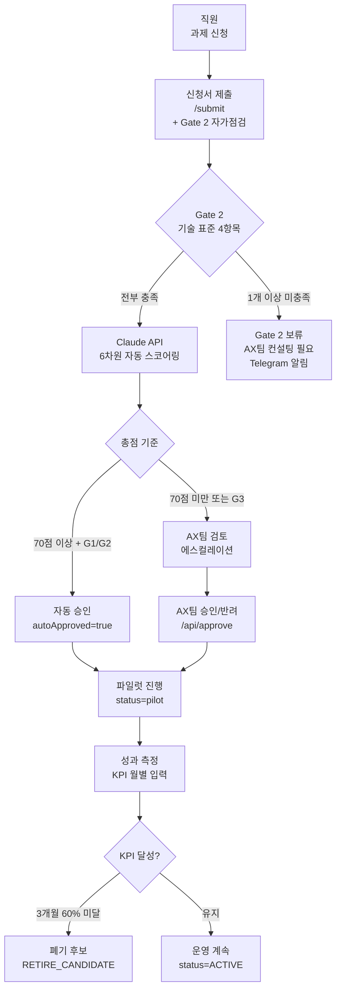
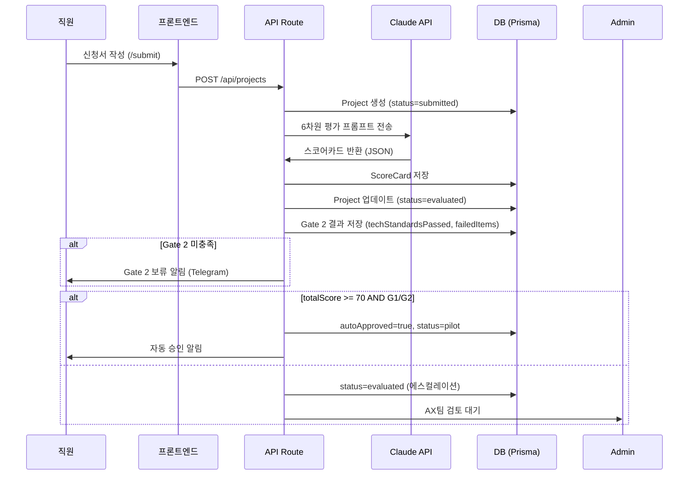
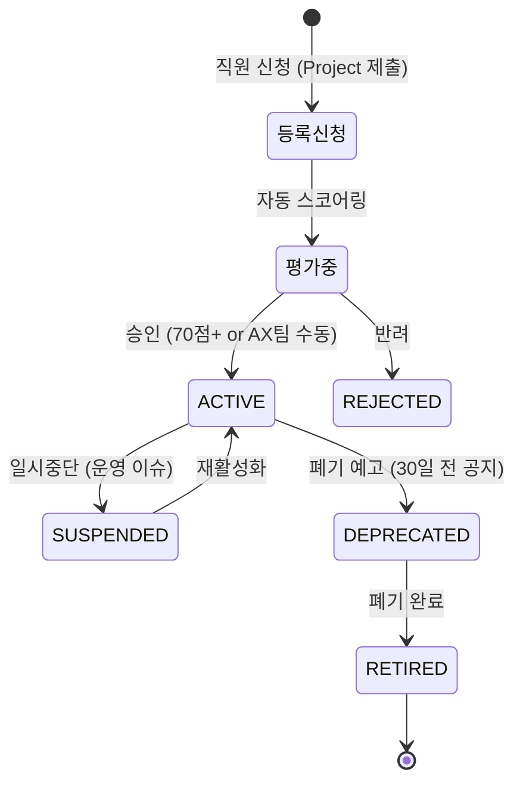

# 삼성AM AI Hub — 시스템 아키텍처

> 최종 갱신: 2026-07-22  
> 레포: honggun2233/ax-request-hub (PRIVATE)  
> 목표: **삼성자산운용 전사 AI 과제 신청·평가·거버넌스·에이전트 라이프사이클 통합 관리**

---

## 1. 설계 원칙

| 원칙 | 구현 |
|------|------|
| 거버넌스 추적 가능성 | 모든 AI 과제·에이전트 결정에 감사 로그 (AuditLog) |
| 자동화 + 인간 검토 | 6차원 자동 스코어링 → 임계값 이상 자동승인, 나머지 에스컬레이션 |
| KPI 기반 관리 | 에이전트 등록 시 KPI 4필드 필수. 토큰 사용량 ≠ 성과 지표 |
| 접근 권한 분리 | 일반 직원 / 부서장 / AX팀 관리자 역할 분리, NextAuth 세션 기반 |
| 단일 진실 소스 | Prisma + SQLite가 모든 상태의 SSOT |

---

## 2. 전체 시스템 플로우



---

## 3. 시스템 구성도

```mermaid
graph TD
    Browser["브라우저\nhttp://localhost:3005"] --> Next["Next.js 14\nApp Router\n(SSR + API Routes)"]
    Next --> Prisma["Prisma ORM\n(SQLite)"]
    Next --> Claude["Claude API\nanthropic SDK\n(평가·채팅·추출)"]
    Next --> Auth["NextAuth.js\n세션 관리"]
    Prisma --> DB["ax_hub.db\nSQLite 20+ 모델"]

    subgraph Employee ["일반 직원 (EMPLOYEE)"]
        E1["/ 홈 대시보드"]
        E2["/submit 과제 신청"]
        E3["/status/[id] 과제 현황"]
        E4["/chat AI 상담 챗봇"]
        E5["/skills AI 스킬 라이브러리"]
        E6["/docs 거버넌스 문서 뷰어"]
        E7["/me/* 내 정보·레벨·수강"]
        E8["/me/tools 내 AI 도구 현황"]
        E9["/me/usage 토큰 사용 내역"]
    end

    subgraph DeptHead ["부서장 (DEPT_HEAD)"]
        D1["/dept/tools AI 도구 배정·회수"]
    end

    subgraph Admin ["관리자 (AX팀 / ADMIN)"]
        A1["/dashboard 관리자 현황"]
        A2["/governance 감사 로그"]
        A3["/registry 에이전트 레지스트리"]
        A4["/admin/agents 에이전트·KPI 관리"]
        A5["/admin/retired 폐기 에이전트"]
        A6["/admin/skills 스킬 라이브러리 관리"]
        A7["/admin/docs 거버넌스 문서 관리"]
        A8["/admin/tools AI 도구 계정 관리"]
        A9["/admin/employees 직원 권한 관리"]
        A10["/admin/tokens 토큰 정책"]
        A11["/admin/distribution 배분 정책"]
    end

    subgraph CLevel ["경영진 (C_LEVEL / EXECUTIVE)"]
        X1["/executive C레벨 대시보드"]
    end

    Next --> Employee
    Next --> DeptHead
    Next --> Admin
    Next --> CLevel

    E5 <-->|"스킬 데이터 공유\n(Skill 모델)"| A6
    E6 <-->|"문서 메타 공유\n(GovernanceDoc 모델)"| A7
    E4 -->|"POST /api/chat\nClaude 스트리밍"| Claude
    E2 -->|"POST /api/projects\n자동 평가"| Claude
```



---

## 4. 사용자 역할 & 접근 권한

```
┌──────────────────────────────────────────────────────────────────┐
│  역할           접근 가능 페이지            주요 기능              │
├──────────────────────────────────────────────────────────────────┤
│  EMPLOYEE       /submit, /status, /chat,    과제 신청             │
│                 /me/*, /skills, /docs       내 과제 조회          │
│                                             AI 스킬 조회·평가     │
│                                             거버넌스 문서 열람    │
├──────────────────────────────────────────────────────────────────┤
│  DEPT_HEAD      /dept/tools                 AI 도구 부서 배정     │
│  (부서장)                                   할당·회수 위임        │
├──────────────────────────────────────────────────────────────────┤
│  ADMIN          전체 페이지                 과제 평가·승인        │
│  (AX팀)         /admin/*, /governance,      에이전트 관리         │
│                 /dashboard, /executive      직원 권한 관리        │
│                                             토큰·쿼터 정책        │
│                                             감사 로그 조회        │
│                                             AI 도구 계정 관리     │
└──────────────────────────────────────────────────────────────────┘
```

---

## 5. 과제 신청 → 평가 시퀀스



---

## 6. 6차원 자동 스코어카드

| 차원 | 가중치 | 측정 기준 |
|------|--------|---------|
| 비즈니스 임팩트 | 25점 | 영향 범위, 반복성, 자동화 가능성 |
| ROI 예상 | 25점 | 시간 절감, 비용 절감, 수익 기여 |
| 기밀등급 리스크 | 15점 | G1(공개)=15, G2(내부)=10, G3(기밀)=5 |
| 기술 난이도 | 15점 | 낮을수록 높은 점수 |
| AI 준비도 | 10점 | 데이터 품질, 인프라 준비도 |
| 전략 정합성 | 10점 | AX팀 전략 목표 부합 |
| **합계** | **100점** | |

**자동 승인 조건:** 총점 ≥ 70 AND 기밀등급 G1 또는 G2  
**에스컬레이션:** 총점 < 70 OR G3(기밀) → AX팀 수동 검토

---

## 6-A. Gate 2 기술 표준 자가점검 (2026-07-15)

과제 신청·재평가 시 6차원 스코어링과 **병행**으로 실행되는 기술 요건 체크.

| 항목 | 요건 | 미충족 시 |
|------|------|-----------|
| API 명세 작성 | OpenAPI 3.0 또는 동등한 인터페이스 문서 | Gate 2 보류 |
| 데이터 기밀 처리 계획 | G1/G2/G3 등급 분류 및 처리 계획 명세 | Gate 2 보류 |
| 감사로그 설계 | 주요 이벤트 로그 구조 및 보존 계획 | Gate 2 보류 |
| 테스트 커버리지 | 비즈니스 로직 80% 이상 단위 테스트 | Gate 2 보류 |

---

## 7. AI 에이전트 라이프사이클



**폐기 기준:**
- KPI 60% 미달 3개월 연속 → RETIRE_CANDIDATE 플래그
- 12개월 미사용 (lastUsedAt 기준)
- 데이터 보안 위반 발생
- 연관 사업 폐지

---

## 7-A. 상태 체계 통합 전이표

> ⚠️ 현재 에이전트 상태가 3개 체계에 분산되어 있음 (2026-07-22 검토보고 P2-2). 통합 전이표 작성 전까지 아래 매핑 기준을 따른다.

| Project.status (과제) | AgentRegistry.lifecycleStage (레지스트리) | Agent.status (폐기관리) | 전환 조건 |
|----------------------|------------------------------------------|------------------------|-----------|
| submitted → evaluated | — | — | Claude 자동평가 완료 |
| evaluated → pilot | GATE1 통과 | ACTIVE | 70점+ 자동승인 or AX팀 수동 승인 |
| pilot → (운영) | GATE2 통과 | ACTIVE | pilot 기간(3개월) KPI 60% 이상 달성 + AX팀 검토 |
| — | GATE3 통과 | ACTIVE | 대규모 운영 확대 심의 통과 |
| — | — | DEPRECATED | 폐기 예고 30일 전 공지 |
| — | — | RETIRED | 폐기 완료 |

> ⚠️ **P2-1 모델 이중화 경고**: `AgentRegistry`(Gate·라이프사이클·신뢰점수)와 `Agent`(KPI·폐기 관리)가 별도 모델로 존재. 단일 모델 통합 전까지 **AgentRegistry가 마스터**, Agent는 폐기 워크플로 전용으로 역할 분리. 상태 불일치 발생 시 AgentRegistry 기준으로 정정.

---

## 7-B. Agent vs AgentRegistry — 역할 경계 및 동기화 규칙 (P2-1)

> 갱신: 2026-07-23  
> 현재 두 모델이 공존하며 각각 다른 역할을 담당. **AgentRegistry가 마스터**, Agent는 폐기 전용.

### 역할 경계

| 항목 | `AgentRegistry` | `Agent` |
|------|-----------------|---------|
| **목적** | Gate 라이프사이클 추적 + 운영 신뢰도 관리 | KPI 기반 폐기 의사결정 관리 |
| **상태 필드** | `lifecycleStage` (DEVELOPING→RETIRED) | `status` (ACTIVE→DEPRECATED→RETIRED) |
| **생성 시점** | ETF SAM LAB 등 기술 에이전트 시드 단계 | /admin/agents에서 AX팀 수동 등록 |
| **KPI 관리** | 없음 (performanceScore만 참조) | `kpiName`, `kpiTarget`, `kpiMeasureCycle`, `kpiMissCount` 전담 |
| **Gate 진행도** | `gate1Passed`, `gate2Passed`, `gate3Passed`, Gate별 통과일시 | 없음 |
| **운용역 신뢰점수** | `operatorTrustScore`, `sam30dAccuracy` | 없음 |
| **폐기 워크플로** | `lifecycleStage = RETIRED` (단순 기록) | DEPRECATED → RETIRED 2단계 + 사유·후계 에이전트·지식 추출 필수 |
| **프로젝트 연결** | AgentProjectLink (M:N) | 없음 |
| **API** | `/api/registry` GET/PATCH | `/api/agents`, `/api/agents/[id]/deprecate`, `/api/agents/[id]/retire` |

### 왜 두 모델이 공존하는가?

```
AgentRegistry                    Agent
────────────────                 ─────────────────────
ETF 도메인 에이전트               전사 업무 자동화 에이전트
(MomentumAgent, ThematicAgent…)  (DMS분류기, 보고서요약기…)
Gate 정확도·신뢰도 중심           KPI 달성률·사용량 중심
기술팀(CTO) 담당                  AX팀 담당
```

- **AgentRegistry**: 정량적 Gate 검증(fallback율·정확도)이 필요한 ETF 앙상블 에이전트군
- **Agent**: 업무 자동화 에이전트 — Gate 검증 없이 KPI만으로 존속 판단

### 동기화 규칙

1. **상태 충돌 시 AgentRegistry 기준** — `AgentRegistry.lifecycleStage == RETIRED`이면 연결된 Agent도 폐기로 간주.
2. **폐기 절차는 Agent 모델만 실행** — AgentRegistry가 RETIRED여도 `/api/agents/[id]/deprecate` → `/api/agents/[id]/retire` 워크플로를 통해 지식 추출·아티팩트 이관을 완료해야 거버넌스 요건 충족.
3. **KPI 기록은 Agent 모델에** — AgentRegistry에는 KPI 필드가 없으므로 `/api/admin/agents/[id]/kpi-record`는 `Agent` 모델을 대상으로 한다.
4. **신규 에이전트 등록 경로 분기:**
   - ETF 도메인 (Gate 검증 필요) → `AgentRegistry` 시드 → Gate 파이프라인
   - 업무 자동화 (KPI 관리 필요) → `/admin/agents` POST → `Agent` 모델

### 향후 통합 방향

> **P2-1 미결**: 두 모델의 필드를 단일 `AIAgent` 모델로 통합하되, Gate 진행도·KPI·폐기 워크플로를 모두 수용하는 설계 필요. 통합 전까지 위 동기화 규칙을 준수한다.

---

## 8. AI 에이전트 레지스트리 (/registry) — 2026-07-15 개편

```mermaid
graph LR
    R[/registry 레지스트리] --> AV[에이전트 뷰\n파이프라인 바 필터\n라이프사이클 단계별]
    R --> PV[프로젝트 뷰\nAXProject 별\n연결 에이전트 목록]

    AV --> SO[슬라이드오버\n신뢰점수 태깅\nGate 진행도\n프로젝트 M:N 연결]

    subgraph 라이프사이클 단계
        S1[GATE1 대기\n7개]
        S2[GATE2 통과\n11개]
        S3[GATE3 통과\n1개]
    end
```

**에이전트-프로젝트 M:N 구조:**
- AXProject 5개: ETF SAM LAB / DMS / IT예산 / 효율화 / AX Hub
- AgentProjectLink 28개 시드
- role: PRIMARY / SUPPORTING / EXPERIMENTAL

---

## 9. AI 스킬 라이브러리 (/skills) — 2026-07 신설

전사 직원이 공유하는 AI 프롬프트/스킬 라이브러리.

| 기능 | 설명 |
|------|------|
| 스킬 조회·검색 | 부서·카테고리별 필터 |
| 스킬 평가 | 별점 + 사용 후기 (POST /api/skills/rate) |
| 스킬 씨드 | AX팀이 초기 스킬 일괄 등록 (POST /api/skills/seed) |
| 관리자 편집 | /admin/skills — 스킬 등록·수정·삭제 |

---

## 10. AI 도구 계정 관리 — 2026-07-21 신설

GPT 150개 + Gemini 50개 계정 배분·모니터링 시스템.

```mermaid
graph TD
    AT[/admin/tools\nAX팀 계정 풀 관리] --> QS[/admin/tools/quota-setup\n부서별 쿼터 설정]
    QS --> DT[/dept/tools\n부서장 위임 배정]
    DT --> MT[/me/tools\n개인 도구 현황]

    AT --> API1[POST /api/admin/tools/quota\n부서 쿼터 설정]
    DT --> API2[POST /api/dept/tools/assign\n도구 배정]
    DT --> API3[POST /api/dept/tools/revoke\n도구 회수]
```

---

## 11. C레벨 경영진 대시보드 (/executive) — 2026-07-22 신설

| 항목 | 내용 |
|------|------|
| 접근 권한 | ADMIN (AX팀) |
| 주요 지표 | 전사 AI 과제 현황, 에이전트 성과 KPI 요약, 부서별 AI 활용도 |
| API | GET /api/executive |

---

## 12. 거버넌스 문서 뷰어 (/docs) — 2026-07 신설

| 기능 | 설명 |
|------|------|
| 문서 열람 | .md 거버넌스 문서를 렌더링해서 직원에게 제공 |
| 메타 조회 | GET /api/governance-docs/meta |
| 씨드 | POST /api/governance-docs/seed |
| 관리자 편집 | /admin/docs |

---

## 13. DB 모델 구성 (20+ Prisma 모델)

```
┌──────────────────────────────────────────────────────────────────┐
│                         과제 관리                                  │
│  Project (과제) ──1:1── ScoreCard (6차원 점수)                    │
│  Project ──1:1── ChatSession (AI 상담 내역)                       │
│  AuditLog (모든 주요 결정 감사 추적)                               │
├──────────────────────────────────────────────────────────────────┤
│                         직원 & 권한                                │
│  Employee (직원 정보 + AI 리터러시 레벨 L0~L4)                    │
│  LevelApplication (레벨 신청) ── LevelHistory (이력)              │
│  ServiceAllocation (서비스별 토큰 할당)                            │
│  DistributionPolicy (부서별 토큰 배분 정책)                        │
│  TokenPolicy (글로벌 토큰 정책)                                    │
│  UsageRecord (토큰 사용 기록) ── UsageAlert (사용량 알림)          │
├──────────────────────────────────────────────────────────────────┤
│                         AI 에이전트 레지스트리                     │
│  AgentRegistry (에이전트 라이프사이클 · Gate 진행도 · KPI)         │
│    ├── AgentScore (월별 스코어 기록)                               │
│    └── AgentProjectLink ──M:N── AXProject                        │
│  AXProject (전사 프로젝트 단위 5개)                                │
├──────────────────────────────────────────────────────────────────┤
│                         에이전트 폐기 관리                         │
│  Agent (폐기 대상 에이전트 + KPI + 라이프사이클 상태)              │
│  AgentKpiRecord (월별 KPI 실적 기록)                              │
│  AgentArtifact (에이전트 산출물)                                   │
│  AgentKnowledgeExtract (지식 추출)                                │
├──────────────────────────────────────────────────────────────────┤
│                         AI 도구 계정 (2026-07-21 신설)            │
│  AiTool (도구 계정 — GPT/Gemini)                                  │
│  ToolAllocation (직원별 배정 이력)                                 │
│  DeptToolQuota (부서별 쿼터)                                       │
├──────────────────────────────────────────────────────────────────┤
│                         스킬 라이브러리 (2026-07 신설)             │
│  Skill (AI 스킬/프롬프트)                                          │
│  SkillRating (직원 평가)                                           │
├──────────────────────────────────────────────────────────────────┤
│                         거버넌스 문서                              │
│  GovernanceDoc (문서 목록 + 메타)                                  │
├──────────────────────────────────────────────────────────────────┤
│                         리터러시                                   │
│  LiteracyCourse (AI 리터러시 교육 과정)                            │
│  LiteracyEnrollment (수강 신청 + 이수)                             │
└──────────────────────────────────────────────────────────────────┘
```

---

## 14. 프론트엔드 페이지 구성

```
app/
├── page.tsx                    홈 대시보드 (KPI 요약·신청추세·토큰사용)
│
├── submit/                     AI 과제 신청 (Gate 2 자가점검 포함)
├── status/[id]/                내 과제 현황 조회
├── chat/                       AI 과제 상담 챗봇
├── docs/                       거버넌스 문서 뷰어 (전직원)
├── skills/                     AI 스킬 라이브러리 (전직원) ★신설
├── executive/                  C레벨 경영진 AI 현황 대시보드 ★신설
│
├── dept/
│   └── tools/                  부서장 AI 도구 배정·회수 ★신설
│
├── me/
│   ├── page.tsx                내 정보 + AI 레벨
│   ├── level/                  레벨업 신청
│   ├── literacy/               수강 리터러시 과정
│   ├── services/               서비스 할당 현황
│   ├── tools/                  내 AI 도구 현황 ★신설
│   └── usage/                  토큰 사용 내역 ★신설
│
├── dashboard/                  관리자 현황 (ADMIN)
├── governance/                 AI 감사 로그 (ADMIN)
├── registry/                   AI 에이전트 레지스트리 (ADMIN)
│
└── admin/
    ├── page.tsx                관리자 홈
    ├── agents/                 에이전트 등록·KPI 관리
    ├── retired/                폐기 에이전트 관리 ★신설
    ├── skills/                 스킬 라이브러리 관리 ★신설
    ├── docs/                   거버넌스 문서 관리 ★신설
    ├── tools/                  AI 도구 계정 관리 ★신설
    │   └── quota-setup/        부서별 쿼터 설정 ★신설
    ├── distribution/           토큰 배분 정책
    ├── employees/              직원 권한 관리
    ├── literacy/               리터러시 과정 관리
    └── tokens/                 토큰 정책 설정
```

---

## 15. API 라우트 명세

| Route | Method | 설명 | 권한 |
|-------|--------|------|------|
| `/api/projects` | GET/POST | 과제 목록·신청 + 자동 스코어링 | ALL/ADMIN |
| `/api/projects/[id]` | GET | 과제 상세 | 본인/ADMIN |
| `/api/evaluate/[id]` | POST | 과제 재평가 (Claude) | ADMIN |
| `/api/approve/[id]` | POST | 과제 승인/반려 | ADMIN |
| `/api/agents` | GET/POST | 에이전트 목록·등록 | ADMIN |
| `/api/agents/[id]` | PATCH | 에이전트 상태·KPI 수정 | ADMIN |
| `/api/agents/[id]/deprecate` | POST | 폐기 예고 | ADMIN |
| `/api/agents/[id]/retire` | POST | 폐기 완료 | ADMIN |
| `/api/agents/[id]/artifacts` | GET/POST | 산출물 관리 | ADMIN |
| `/api/agents/[id]/knowledge` | GET/POST | 지식 추출 | ADMIN |
| `/api/agents/retired` | GET | 폐기 에이전트 목록 | ADMIN |
| `/api/admin/agents/flags` | GET | WARNING/RETIRE_CANDIDATE 목록 | ADMIN |
| `/api/admin/agents/[id]/kpi-record` | POST | 월별 KPI 실적 입력 | ADMIN |
| `/api/admin/agents/[id]/last-used` | PUT | lastUsedAt 업데이트 | SYSTEM |
| `/api/admin/tools/quota` | GET/POST | 부서별 AI 도구 쿼터 설정 | ADMIN |
| `/api/admin/tools/[id]` | PATCH/DELETE | 도구 계정 관리 | ADMIN |
| `/api/dept/tools/assign` | POST | 도구 배정 (부서장 위임) | DEPT_HEAD |
| `/api/dept/tools/revoke` | POST | 도구 회수 | DEPT_HEAD |
| `/api/registry` | GET/PATCH | 에이전트 레지스트리 + 단계 전환 | ADMIN |
| `/api/registry/links` | POST/DELETE | 에이전트-프로젝트 M:N 연결 | ADMIN |
| `/api/ax-projects` | GET | AXProject 목록 + 연결 에이전트 | ADMIN |
| `/api/skills` | GET/POST | 스킬 라이브러리 조회·등록 | ALL/ADMIN |
| `/api/skills/rate` | POST | 스킬 평가 | ALL |
| `/api/skills/seed` | POST | 스킬 초기 데이터 등록 | ADMIN |
| `/api/executive` | GET | C레벨 대시보드 집계 | ADMIN |
| `/api/governance-docs` | GET | 거버넌스 문서 목록·내용 조회 | ALL (읽기 전용) |
| `/api/governance-docs/meta` | GET | 문서 메타 목록 | ALL |
| `/api/governance-docs/meta` | POST/PATCH | 문서 메타 등록·수정 | ADMIN |
| `/api/governance-docs/seed` | POST | 거버넌스 문서 씨드 | ADMIN (수정됨 — P2-3) |
| `/api/admin/dashboard` | GET | 홈 대시보드 집계 | ADMIN |
| `/api/admin/employees` | GET/POST | 직원 관리 | ADMIN |
| `/api/admin/employees/export` | GET | 직원 데이터 엑셀 export | ADMIN |
| `/api/admin/level/[id]` | PATCH | 레벨 심사 | ADMIN |
| `/api/admin/literacy` | GET/POST | 리터러시 과정 관리 | ADMIN |
| `/api/admin/tokens` | GET/POST | 토큰 정책 설정 | ADMIN |
| `/api/admin/distribution` | GET/POST | 토큰 배분 정책 | ADMIN |
| `/api/level` | GET/POST | 레벨 신청 | ALL |
| `/api/literacy` | GET/POST | 수강 신청·이수 | ALL |
| `/api/usage` | GET | 토큰 사용 기록 | ADMIN |
| `/api/services` | GET/POST | 서비스 할당 관리 | ADMIN |
| `/api/governance` | GET | 감사 로그 조회 | ADMIN |
| `/api/chat` | POST | AI 상담 (Claude 스트리밍) | ALL |
| `/api/me/summary` | GET | 내 정보 요약 | ALL |
| `/api/auth/[...nextauth]` | ALL | NextAuth 인증 | - |

---

## 16. 기술 스택

```
Frontend: Next.js 14 (App Router) + TypeScript + Tailwind CSS
          recharts (차트) + lucide-react (아이콘) + xlsx (엑셀 export)

Backend:  Next.js API Routes (serverless)
          Prisma ORM → SQLite (ax_hub.db)
          NextAuth.js (세션 기반 인증)

AI:       @anthropic-ai/sdk (Claude API)
          용도: 과제 평가·채팅 상담·지식 추출

포트:     http://localhost:3005 (개발)
DB 경로:  prisma/dev.db 또는 DATABASE_URL 환경변수
실행:     $env:PORT=3005; npm run dev
```

---

## 17. 환경 변수

```env
DATABASE_URL="file:./dev.db"
NEXTAUTH_SECRET="..."
NEXTAUTH_URL="http://localhost:3005"
ANTHROPIC_API_KEY="..."
```

---

## 18. 미결 사항

| 항목 | 상태 | 출처 |
|------|------|------|
| 토큰 배분 → 실제 Claude API 연동 | 미구현 | - |
| 리터러시 레벨 자동 평가 | 수동 심사, 자동화 미구현 | - |
| 온프레미스 배포 (사내 서버) | 개발 환경 로컬만 운영 중 | - |
| 모바일 반응형 | 미최적화 | - |
| AI 도구 계정 → 실제 GPT/Gemini 연동 | UI만 구현, 실 계정 연동 미구현 | - |
| ~~G3 기밀 데이터 → Claude API 전송 순서~~ | ✅ 완료 — 안A 적용: G3 판정 시 Claude 평가 생략, 즉시 AX팀 수동 검토 | P1-1 |
| ~~Telegram 알림 채널~~ | ✅ 완료 — Telegram 호출 전면 제거 (사내 채널 연동은 추후 결정) | P1-2 |
| ~~이의제기(재심) API 부재~~ | ✅ 완료 — `/api/projects/[id]/appeal` (GET/POST/PATCH) 신설, ProjectAppeal 모델 추가 | P1-3 |
| ~~AgentRegistry + Agent 역할 경계 미명문화~~ | ✅ 완료 — §7-B 역할 경계 + 동기화 규칙 섹션 추가 | P2-1 |
| AgentRegistry + Agent 모델 **완전 통합** | 역할 경계 명문화 완료; 단일 모델 통합은 차기 작업 | P2-1 |
| ~~통합 상태 전이표 문서화~~ | ✅ 완료 — registry-lifecycle-design.md §8 추가 | P2-2 |
| SQLite → PostgreSQL 전환 | 전사 동시성·백업·다중 인스턴스 한계 → [OI-001](OPEN_ISSUES.md#oi-001) | P3-4 |
| 감사로그 보존기간·위변조 방지 명세 | 전자금융감독규정 관점 → [OI-002](OPEN_ISSUES.md#oi-002) | P3-4 |
| 시크릿 관리 체계 (사내 배포 시) | Vault 등 KMS 연동 필요 → [OI-003](OPEN_ISSUES.md#oi-003) | P3-4 |
| KPI 자동 판정 로직 실행 주체 | 배치 스케줄러 옵션 포함 → [OI-004](OPEN_ISSUES.md#oi-004) | P3-4 |
| 이의제기 SLA 미정의 | API 구현 완료, SLA·통보 미명세 → [OI-005](OPEN_ISSUES.md#oi-005) | P3-4 |
| ~~EXECUTIVE 역할 분리~~ | ✅ 완료 — `/api/executive` C_LEVEL + AX_TEAM + EXECUTIVE 허용, proxy.ts 매처 추가 | P3-3a |
| ~~부서장(DEPT_HEAD) 지정 절차~~ | ✅ 완료 — `/api/admin/users/[id]/role` PATCH (AX_TEAM 전용) 신설 | P3-3b |

---

*최초 생성: 2026-07-10 | 최종 갱신: 2026-07-23 — P3-1 mermaid 갱신, P3-4 OPEN_ISSUES.md 링크 추가*
