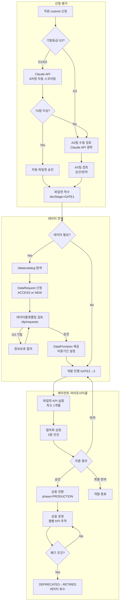

# 삼성자산운용 AX Request Hub — 전체 시스템 구조서

| 항목 | 내용 |
|------|------|
| 문서번호 | AX-ARCH-2026-001 |
| 버전 | v1.1 |
| 작성일 | 2026-07-23 |
| 레포 | honggun2233/ax-request-hub (PRIVATE) |
| 로컬 주소 | http://localhost:3005 |
| 목적 | AX Hub 전체 구조를 단일 문서로 정리 — 검토·공유·온보딩 기준 문서 |

---

## 목차

1. [시스템 목표](#1-시스템-목표)
2. [전체 플로우 다이어그램](#2-전체-플로우-다이어그램)
3. [기술 스택](#3-기술-스택)
4. [앱 라우트 전체 목록](#4-앱-라우트-전체-목록)
5. [API 라우트 전체 목록](#5-api-라우트-전체-목록)
6. [사용자 역할 & 접근 권한](#6-사용자-역할--접근-권한)
7. [DB 모델 전체 목록 (32종)](#7-db-모델-전체-목록-32종)
8. [핵심 서브시스템별 설명](#8-핵심-서브시스템별-설명)
   - 8-1. 과제 신청 · 평가 · 승인
   - 8-2. 에이전트 이중 라이프사이클
   - 8-3. 데이터 프로비저닝
   - 8-4. AI 도구 계정 · 토큰 관리
   - 8-5. AI 스킬 라이브러리
   - 8-6. AI 리터러시 레벨
   - 8-7. 협의회(AX위원회) 심의
   - 8-8. 감사 로그 & 거버넌스
9. [설계 원칙 & 미결 사항](#9-설계-원칙--미결-사항)
10. [문서 이력](#10-문서-이력)

---

## 1. 시스템 목표

삼성자산운용 전사 AI 도입을 **신청 → 평가 → 데이터 연계 → 개발/파일럿 → 협의회 상용 전환 → 운영/폐기** 전 과정을 하나의 시스템으로 추적·거버넌스한다.

| 해결하려는 문제 | AX Hub의 답 |
|----------------|------------|
| AI 도입 과제가 파악 안 됨 | 정형 신청 폼 + 자동 스코어카드로 전수 등록 |
| 승인 근거가 남지 않음 | AuditLog + ScoreCard + CouncilAgendaItem으로 모든 의사결정 추적 |
| 데이터 사용 통제 불가 | DataRequest → DataProvision 흐름으로 데이터 이력 관리 |
| 에이전트 상태를 아무도 모름 | AgentRegistry 단일 모델 + 이중 라이프사이클 |
| AI 도구 계정 난립 | ToolAccount + DepartmentQuota + DistributionPolicy로 통제 |

---

## 2. 전체 플로우 다이어그램



---

## 3. 기술 스택

| 레이어 | 기술 |
|--------|------|
| 프레임워크 | Next.js 16 (App Router, Turbopack) |
| 언어 | TypeScript |
| 스타일 | Tailwind CSS + shadcn/ui |
| 인증 | NextAuth.js (credentials) |
| ORM | Prisma 6 |
| DB | SQLite (`prisma/dev.db`) → PostgreSQL 전환 예정 |
| AI | Anthropic Claude API (claude-sonnet-4-5) |
| 미들웨어 | `proxy.ts` (nextauth withAuth 기반 라우트 보호) |
| 로컬 포트 | 3005 |

---

## 4. 앱 라우트 전체 목록

### 공개·전 직원

| 라우트 | 설명 | 역할 |
|--------|------|------|
| `/` | 홈 — 시스템 소개 | 누구나 |
| `/login` | 로그인 | 미인증 |
| `/submit` | AI 도입 과제 신청 | 로그인 전체 |
| `/chat` | AI 상담 챗 (과제 구체화) | 로그인 전체 |
| `/skills` | AI 스킬 라이브러리 열람 | 로그인 전체 |
| `/docs` | 거버넌스 문서 뷰어 | 로그인 전체 |
| `/data/catalog` | 데이터 자산 카탈로그 탐색 + 이용 신청 | 로그인 전체 |
| `/status/[id]` | 내 과제 상태 상세 조회 | 로그인 전체 |

### /me — 내 정보

| 라우트 | 설명 |
|--------|------|
| `/me` | 내 프로필 + AI 리터러시 레벨 |
| `/me/tools` | 내 AI 도구 계정 목록 |
| `/me/usage` | 내 토큰 사용량 현황 |
| `/me/level` | AI 리터러시 레벨 신청 |
| `/me/literacy` | 리터러시 교육 이수 현황 |
| `/me/data` | 내 데이터 신청 + 제공 현황 |
| `/me/services` | 내 사용 서비스 목록 |

### /dept — 부서장

| 라우트 | 설명 | 역할 |
|--------|------|------|
| `/dept/tools` | 부서 AI 도구 배정·관리 | DEPT_HEAD |

### /dp — 데이터플랫폼팀

| 라우트 | 설명 | 역할 |
|--------|------|------|
| `/dp/requests` | 데이터 신청 검토·승인·제공 처리 | DATA_PLATFORM |

### /executive — C레벨

| 라우트 | 설명 | 역할 |
|--------|------|------|
| `/executive` | 전사 AI 현황 경영진 대시보드 | EXECUTIVE, ADMIN |

### /admin — AX팀 관리자

| 라우트 | 설명 |
|--------|------|
| `/dashboard` | 전체 과제 KPI + 칸반 보드 |
| `/governance` | 감사 로그 전체 이력 |
| `/registry` | 에이전트 레지스트리 (개발/상용 이중 라이프사이클) |
| `/admin/employees` | 직원 계정 + 역할 관리 |
| `/admin/tokens` | 토큰 정책 + 배분 현황 |
| `/admin/tools` | AI 도구 계정 전체 관리 |
| `/admin/tools/quota-setup` | 부서별 쿼터 설정 |
| `/admin/skills` | 스킬 등록·검수·폐기 |
| `/admin/docs` | 거버넌스 문서 등록·관리 |
| `/admin/distribution` | 토큰 배분 정책 설정 |
| `/admin/literacy` | AI 리터러시 레벨 심사 |
| `/admin/agents` | 레거시 에이전트 관리 |
| `/admin/retired` | 폐기 에이전트 아카이브 |

---

## 5. API 라우트 전체 목록

### 과제 (Projects)

| 메서드 | 경로 | 권한 | 설명 |
|--------|------|------|------|
| GET | `/api/projects` | 로그인 | 과제 목록 (역할별 필터) |
| POST | `/api/projects` | 로그인 | 과제 신청 |
| GET | `/api/projects/[id]` | 로그인 | 단건 조회 |
| PATCH | `/api/projects/[id]` | ADMIN | 상태 변경 |
| POST | `/api/projects/[id]/appeal` | 본인/ADMIN | 이의제기 신청 |
| GET | `/api/projects/[id]/appeal` | ADMIN | 이의제기 목록 |
| PATCH | `/api/projects/[id]/appeal` | ADMIN | 이의제기 처리 |

### 평가 (Evaluate)

| 메서드 | 경로 | 권한 | 설명 |
|--------|------|------|------|
| POST | `/api/evaluate/[id]` | ADMIN | 과제 AI 재평가 (G3 자동 에스컬레이션 포함) |

### 에이전트 레지스트리 (Registry)

| 메서드 | 경로 | 권한 | 설명 |
|--------|------|------|------|
| GET | `/api/registry` | ADMIN | 레지스트리 목록 |
| POST | `/api/registry` | ADMIN | 에이전트 등록 |
| PATCH | `/api/registry/[id]` | ADMIN | 단계 전환 + 신뢰점수 업데이트 |

### 데이터 (Data)

| 메서드 | 경로 | 권한 | 설명 |
|--------|------|------|------|
| GET | `/api/data/assets` | 로그인 | 데이터 자산 목록 (검색·필터) |
| POST | `/api/data/assets` | DATA_PLATFORM | 자산 등록 |
| GET | `/api/data/assets/[id]` | 로그인 | 자산 단건 조회 |
| PATCH | `/api/data/assets/[id]` | DATA_PLATFORM | 자산 수정 |
| GET | `/api/data/requests` | 로그인 | 데이터 신청 목록 (본인/전체) |
| POST | `/api/data/requests` | 로그인 | 데이터 신청 |
| GET | `/api/data/requests/[id]` | 로그인 | 단건 조회 |
| PATCH | `/api/data/requests/[id]` | DATA_PLATFORM | 상태 변경 (승인/반려/제공) |
| POST | `/api/data/provisions` | DATA_PLATFORM | 데이터 제공 처리 |

### AI 도구 & 계정

| 메서드 | 경로 | 권한 | 설명 |
|--------|------|------|------|
| GET/POST | `/api/tools` | ADMIN | 도구 목록/등록 |
| GET/POST/PATCH | `/api/admin/tools/quota` | ADMIN | 부서 쿼터 관리 |
| POST | `/api/dept` | DEPT_HEAD | 부서장 도구 배정 |

### 역할 & 직원

| 메서드 | 경로 | 권한 | 설명 |
|--------|------|------|------|
| GET/POST | `/api/me` | 본인 | 내 프로필 조회/수정 |
| PATCH | `/api/admin/users/[id]/role` | ADMIN | 역할 변경 (DEPT_HEAD 지정 포함) |

### 기타

| 메서드 | 경로 | 설명 |
|--------|------|------|
| GET/POST | `/api/skills` | 스킬 목록/등록 |
| GET/POST | `/api/governance-docs` | 거버넌스 문서 (ADMIN POST) |
| GET/POST | `/api/governance` | 감사 로그 |
| GET | `/api/executive` | 경영진 대시보드 데이터 |
| * | `/api/auth/*` | NextAuth 인증 |

---

## 6. 사용자 역할 & 접근 권한

| 역할 | 설명 | 주요 접근 범위 |
|------|------|---------------|
| `EMPLOYEE` | 일반 직원 | /chat, /me/*, /skills, /docs, /data/catalog, /me/data, /me/projects |
| `DEPT_HEAD` | 부서장 | EMPLOYEE + /dept/tools (AI 도구 배정·위임) |
| `DATA_PLATFORM` | 데이터플랫폼팀 | EMPLOYEE + /dp/requests, /dp/catalog (데이터 신청 검토·제공·카탈로그 관리) |
| `EXECUTIVE` | C레벨 임원 | EMPLOYEE + /executive (읽기 전용 경영진 대시보드) |
| `AX_TEAM` | AX팀 | 전체 페이지 (/admin/*, /dashboard, /governance, /registry, /council, /dp/*) |

**테스트 계정:**

| 이메일 | 이름 | 역할 |
|--------|------|------|
| admin@samsungam.com | AX팀 관리자 | AX_TEAM |
| dept@samsungam.com | 부서장 테스트 | DEPT_HEAD |
| exec@samsungam.com | 임원 테스트 | EXECUTIVE |
| dp@samsungam.com | 데이터플랫폼 테스트 | DATA_PLATFORM |
| test@samsungam.com | 테스트 직원 | EMPLOYEE |

**직무 분리 원칙:**
- 데이터 승인·제공 행위 → DATA_PLATFORM 전용 (ADMIN은 읽기만)
- 상용 전환 의결 → 협의회 의결 없이는 불가 (ADMIN도 단독 전환 불가)
- 감사 로그 → AuditLog 자동 기록 (수동 삭제 불가 설계)

---

## 7. DB 모델 전체 목록 (32종)

### 과제 관련 (3)

| 모델 | 설명 |
|------|------|
| `Project` | AI 도입 과제 (신청~승인~파일럿) |
| `ScoreCard` | 6차원 자동 평가 결과 |
| `ProjectAppeal` | 이의제기 신청·처리 이력 |

### 직원 & 계정 (2)

| 모델 | 설명 |
|------|------|
| `Employee` | 임직원 계정 (role: EMPLOYEE/DEPT_HEAD/DATA_PLATFORM/EXECUTIVE/ADMIN) |
| `ChatSession` | AI 상담 챗 세션 |

### AI 도구 & 토큰 (7)

| 모델 | 설명 |
|------|------|
| `ToolAccount` | AI 도구 계정 (GPT/Gemini 등) |
| `DepartmentQuota` | 부서별 AI 도구 쿼터 (석수·밀도·부서장 위임) |
| `ServiceAllocation` | 도구 계정 배정 이력 |
| `TokenPolicy` | 전사 토큰 정책 (월 한도·초과 처리) |
| `DistributionPolicy` | 토큰 배분 정책 |
| `UsageRecord` | 토큰 사용 이력 |
| `UsageAlert` | 토큰 초과 알림 |

### AI 리터러시 (4)

| 모델 | 설명 |
|------|------|
| `LevelApplication` | AI 리터러시 레벨 신청 (L0~L4) |
| `LevelHistory` | 레벨 이력 |
| `LiteracyCourse` | 리터러시 교육 과정 |
| `LiteracyEnrollment` | 교육 이수 현황 |

### 에이전트 레지스트리 (5)

| 모델 | 설명 |
|------|------|
| `AgentRegistry` | 에이전트 단일 SSOT (phase + devStage/prodStatus) |
| `AgentScore` | 에이전트 KPI 실적 (개발/상용 분리) |
| `AXProject` | AX 프로젝트 (ETF SAM LAB 등 5종) |
| `AgentProjectLink` | 에이전트-프로젝트 M:N 연결 |
| `CouncilMeeting` | 협의회 회의록 |

| `CouncilAgendaItem` | 협의회 안건 (PROD_APPROVAL 등 5종) |
| `AgentArtifact` | 에이전트 산출물 |
| `AgentKnowledgeExtract` | 에이전트 지식 추출 결과 |

*(레거시 `Agent`, `AgentKpiRecord` — v3 이관 완료, 향후 제거 예정)*

### 스킬 & 문서 (3)

| 모델 | 설명 |
|------|------|
| `Skill` | AI 스킬 (프롬프트 라이브러리) |
| `SkillRating` | 스킬 평가 |
| `GovernanceDoc` | 거버넌스 문서 등록·버전 |

### 데이터 프로비저닝 (3)

| 모델 | 설명 |
|------|------|
| `DataAsset` | 데이터 자산 카탈로그 (G1/G2/G3 분류) |
| `DataRequest` | 데이터 이용/신규 신청 (ACCESS/NEW) |
| `DataProvision` | 데이터 제공 이력 (연결정보·이용기간·회수) |

### 감사 (1)

| 모델 | 설명 |
|------|------|
| `AuditLog` | 모든 자동승인·에스컬레이션·상태변경 추적 |

---

## 8. 핵심 서브시스템별 설명

### 8-1. 과제 신청 · 평가 · 승인

```
직원 신청(/submit)
  → G3 판정: G3이면 Claude API 생략, AX팀 수동 검토 (P1-1 적용)
  → 6차원 Claude 자동 스코어링 (100점)
  → 70점+ AND G1/G2: 자동 파일럿 승인 → AgentRegistry 생성(devStage=GATE1)
  → 나머지: AX팀 에스컬레이션 → 수동 승인/반려
  → 이의제기: /api/projects/[id]/appeal (P1-3)
```

**6차원 스코어카드:** 비즈니스 임팩트(25) + ROI(25) + 기밀등급(15) + 기술 난이도(15) + AI 준비도(10) + 전략 정합성(10)

### 8-2. 에이전트 이중 라이프사이클

**개발 (DEVELOPMENT):** `SUBMITTED → EVALUATED → GATE1 → GATE2 → GATE3 → PILOT_PROVEN → COUNCIL_PENDING → COND_APPROVED`

**전환점: 협의회 의결(CouncilAgendaItem) — 이것 없이는 상용 불가**

**상용 (PRODUCTION):** `ACTIVE → SUSPENDED / DEPRECATED(30일 예고) → RETIRED`

폐기 시 해당 에이전트에 연결된 DataProvision 전건 자동 회수 필요 (미결 §21).

### 8-3. 데이터 프로비저닝

```
/data/catalog 탐색 → DataRequest 신청(ACCESS/NEW)
  → DATA_PLATFORM 검토(/dp/requests)
  → G3: 정보보호 협의(기밀 검토) 추가
  → 승인: DataProvision 생성 (deliveryMode: API/FILE/DB, connectionRef, expiresAt)
  → 상용 전환 시: 파일럿 제공 만료 → 재신청(forProduction=true) 필수
```

**Gate 조건:** DataRequest 전건 PROVISIONED 상태가 되어야 GATE1→GATE2 전환 가능.

### 8-4. AI 도구 계정 · 토큰 관리

- GPT 150석 + Gemini 50석 (총 200석) DepartmentQuota로 배분
- 부서장이 `/dept/tools`에서 팀원 배정 (DEPT_HEAD 위임 방식)
- `/admin/tools/quota-setup`에서 AX팀이 전체 쿼터 조정
- ToolAccount → UsageRecord → UsageAlert → 초과 시 자동 알림

### 8-5. AI 스킬 라이브러리

- 전사 공유 AI 프롬프트 라이브러리 (`/skills`)
- 등록 기준: AX팀 검수, 부적절 프롬프트 필터링
- SkillRating으로 품질 평가 누적
- `/admin/skills`에서 관리·폐기

### 8-6. AI 리터러시 레벨

- L0~L4 레벨 체계 (LevelApplication → AX팀 심사 → LevelHistory)
- 레벨별 AI 도구 접근 권한 연계 (상위 도구는 L3+ 요건)
- `/admin/literacy`에서 심사 관리

### 8-7. 협의회(AX위원회) 심의

**안건 유형 5종:**
| 유형 | 설명 |
|------|------|
| `PROD_APPROVAL` | 파일럿→상용 전환 승인 |
| `RETIRE_APPROVAL` | 상용 에이전트 폐기 승인 |
| `MAJOR_CHANGE` | 상용 에이전트 주요 변경 |
| `PILOT_EXTENSION` | 파일럿 기간 연장 |
| `EMERGENCY` | 긴급 안건 |

**상정 요건:** Gate3 통과 + 파일럿 30일+ + 파일럿KPI 달성

**의결 유형:** `APPROVED / CONDITIONAL / REMANDED / REJECTED / DEFERRED`

### 8-8. 감사 로그 & 거버넌스

- AuditLog: 자동승인·에스컬레이션·협의회 의결·데이터 제공 등 모든 주요 이벤트 기록
- `/governance`에서 AX팀 전체 이력 조회
- 소급 승인(제0차 협의회): v3 이관 시 기존 상용 에이전트 7건 일괄 추인 안건 생성됨

---

## 9. 설계 원칙 & 미결 사항

### 설계 원칙

| 원칙 | 구현 |
|------|------|
| 거버넌스 추적 가능성 | AuditLog 전수 기록 |
| 자동화 + 인간 검토 | 6차원 자동 → 임계값 이상 자동승인, 나머지 에스컬레이션 |
| 상용 확정 = 협의회 의결 | AgentRegistry prodStatus는 CouncilAgendaItem APPROVED 없이 불가 |
| 기밀등급 관통 | G1/G2/G3 필수 부여, G3 이중 승인, 산출물 등급 상속 |
| 데이터 직무 분리 | 승인·제공 = DATA_PLATFORM, 감독 = ADMIN(읽기) |
| 단일 진실 소스 | Prisma + SQLite SSOT, 상태 중복 없음 |

### 미결 사항 (OPEN_ISSUES.md 참조)

| # | 항목 | 우선순위 |
|---|------|---------|
| 1 | SQLite → PostgreSQL 전환 (전사 배포 시 동시성·백업) | 배포 전 필수 |
| 2 | 감사로그 보존기간·위변조 방지 (전자금융감독규정) | 배포 전 필수 |
| 3 | 시크릿 관리 (NEXTAUTH_SECRET, ANTHROPIC_API_KEY) | 배포 전 필수 |
| 4 | G3 신청서 외부 API 전송 마스킹 or 선판정 구현 | P1 |
| 5 | KPI 3개월 60% 미달 자동 판정 배치 스케줄러 | P2 |
| 6 | 레거시 Agent/AgentKpiRecord 모델 제거 (v3 이관 완료 후) | P2 |
| 7 | 폐기 에이전트 DataProvision 자동 회수 로직 | P2 |
| 8 | /council 협의회 안건 관리 UI 미구현 | P2 |
| 9 | Telegram 알림 → 사내 메일/메신저 교체 | P3 |
| 10 | 이의제기 SLA 정의 (현재 API만 있고 SLA 미명세) | P3 |

---

## 10. 문서 이력

| 버전 | 날짜 | 변경 내용 |
|------|------|-----------|
| v1.1 | 2026-07-23 | 사이드바 AppSidebar 교체(역할별 필터·아이콘), DEPT_HEAD/EXECUTIVE/DATA_PLATFORM 테스트 계정 추가, docs 페이지 hydration 버그 수정, 역할 표 테스트 계정 섹션 추가 |
| v1.0 | 2026-07-23 | 최초 작성 — 전체 구조 통합 (라우트 32개, 모델 32종, 역할 5종, 서브시스템 8개) |

---

*본 문서는 `docs/architecture_v3_통합본.md`(설계 상세)와 거버넌스 문서 체계(`AX_거버넌스_문서체계_v1.3.md`)를 보완하는 구조 요약서다. 코드 변경 시 동기화 필요.*
