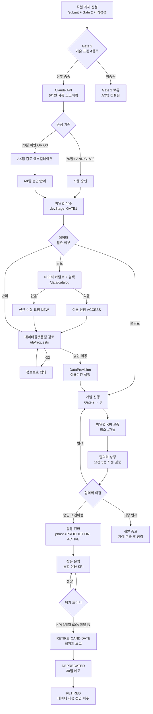
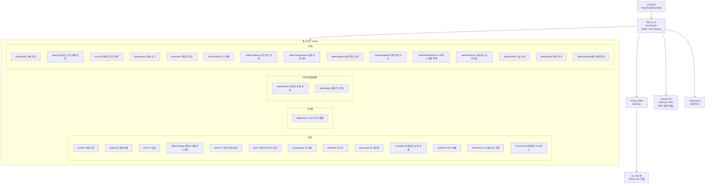
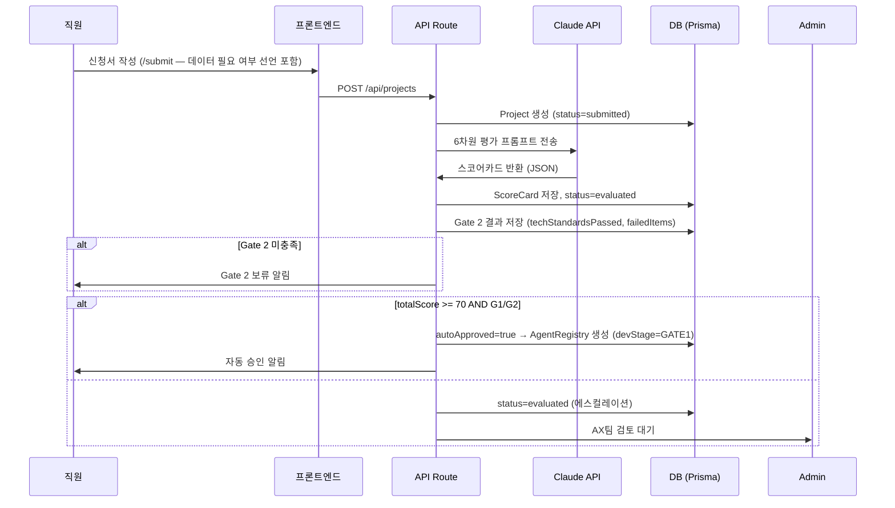
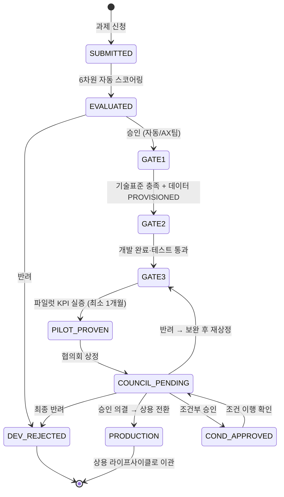
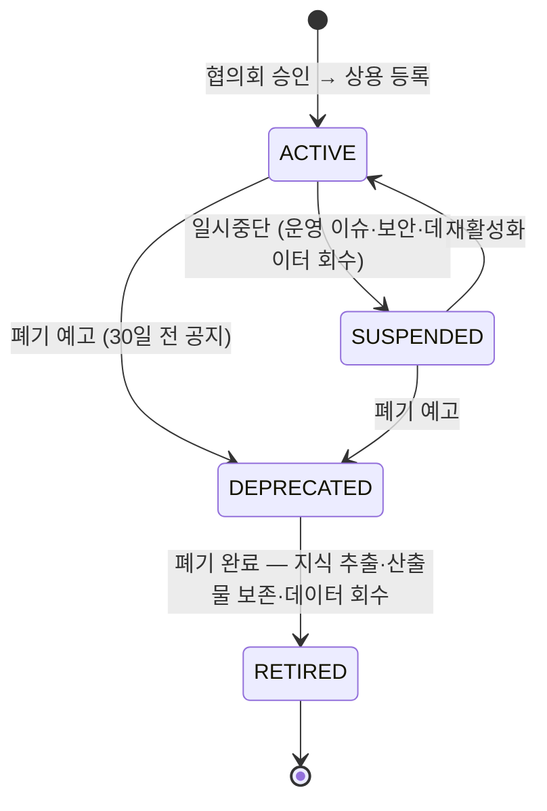
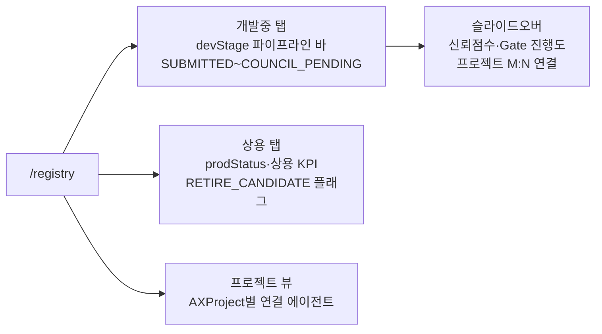
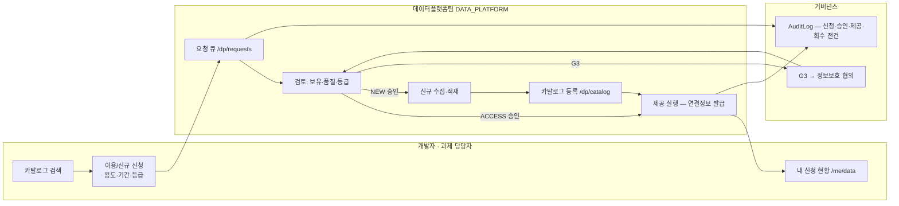
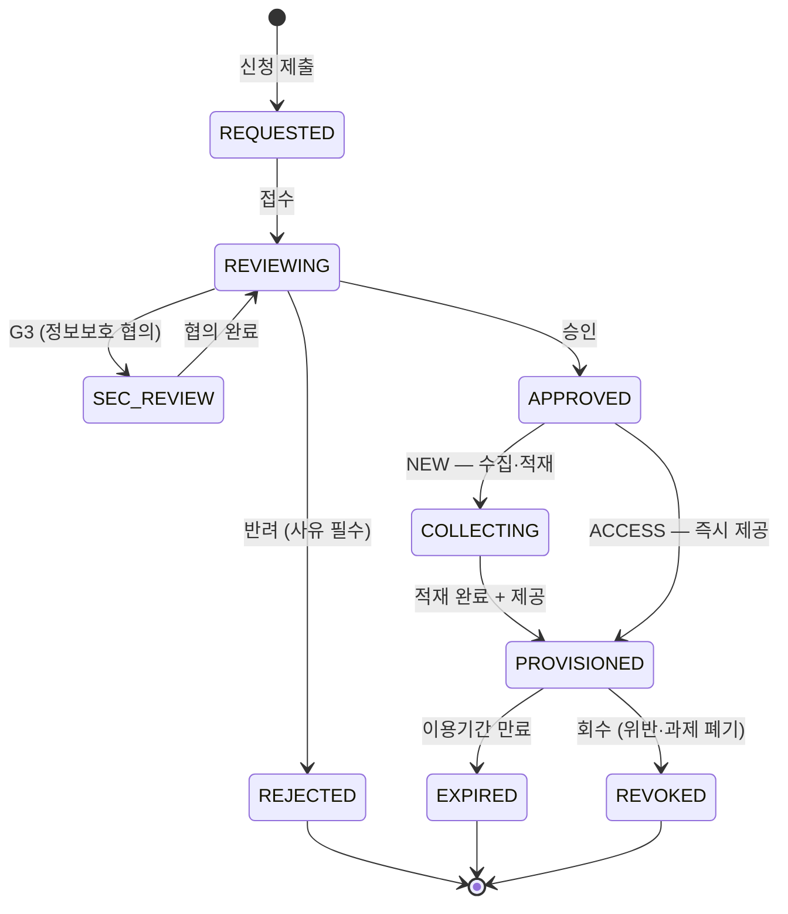
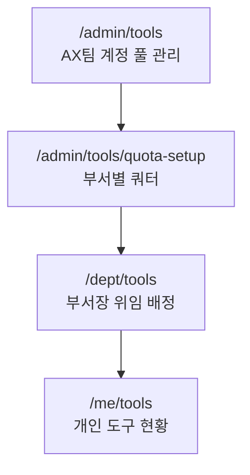

# 삼성AM AX Hub — 시스템 아키텍처 v3 (통합본)

> 최종 갱신: 2026-07-23
> 레포: honggun2233/ax-request-hub (PRIVATE)
> 목표: **삼성자산운용 전사 AI 과제 신청·평가·거버넌스·데이터 프로비저닝·에이전트 이중 라이프사이클 통합 관리**
>
> 본 문서는 기존 `architecture.md`(2026-07-22)에 다음 두 설계를 병합한 **단일 SSOT**다.
> 이 문서로 기존 architecture.md를 대체하고, v2·v3 증분 문서는 폐기한다.
> - v2: 데이터 프로비저닝 서브시스템 (AI 데이터플랫폼팀 연계)
> - v3: 이중 라이프사이클 (개발/상용) + AI 위원회 승인 체계, Agent 모델 통합

---

## 1. 설계 원칙

| 원칙 | 구현 |
|------|------|
| 거버넌스 추적 가능성 | 모든 과제·데이터·에이전트·협의회 결정에 감사 로그 (AuditLog) |
| 자동화 + 인간 검토 | 6차원 자동 스코어링 → 임계값 이상 자동승인, 나머지 에스컬레이션. **상용 확정은 협의회 의결로만** |
| KPI 기반 관리 | 파일럿 KPI(전환 근거)와 상용 KPI(운영 판단) 이원화. 토큰 사용량 ≠ 성과 지표 |
| 접근 권한·직무 분리 | EMPLOYEE / DEPT_HEAD / DATA_PLATFORM / ADMIN 역할 분리. 데이터 승인(데이터플랫폼팀)과 감독(AX팀) 분리 |
| 단일 진실 소스 | Prisma + SQLite가 모든 상태의 SSOT. 에이전트 상태는 AgentRegistry 단일 모델 |
| 기밀등급 관통 | 데이터 자산 G1/G2/G3 필수 부여, G3 이중 승인, 산출물 등급 상속 |

---

## 2. 전체 시스템 플로우



---

## 3. 시스템 구성도



---

## 4. 사용자 역할 & 접근 권한

```
┌──────────────────────────────────────────────────────────────────────────────────────┐
│  역할            접근 가능 페이지                        주요 기능                    │
├──────────────────────────────────────────────────────────────────────────────────────┤
│  EMPLOYEE        /submit, /status/[id], /chat            과제 신청·조회·AI 상담      │
│                  /skills, /docs                          스킬·문서 열람              │
│                  /data/catalog                           데이터 카탈로그 검색·신청   │
│                  /me/projects, /me/tools, /me/usage      내 과제·도구·사용량 조회   │
│                  /me/data                                내 데이터 신청 현황         │
│                  /me/level, /me/literacy                 AI 레벨 신청·리터러시 수강 │
│                  /me/services                            배분된 AI 서비스 확인       │
├──────────────────────────────────────────────────────────────────────────────────────┤
│  DEPT_HEAD       /dept/tools                             AI 도구 부서 배정·할당      │
│  (부서장)                                                할당·회수 위임              │
├──────────────────────────────────────────────────────────────────────────────────────┤
│  DATA_PLATFORM   /dp/requests, /dp/catalog               데이터 요청 검토·승인       │
│  (데이터플랫폼팀)                                        카탈로그 등록·관리          │
│                                                          제공 실행·회수              │
├──────────────────────────────────────────────────────────────────────────────────────┤
│  ADMIN           전체 페이지 접근                        과제 평가·승인              │
│  (AX팀)          /dashboard, /registry, /council         레지스트리·협의회 간사      │
│                  /governance, /executive                 감사 로그·경영진 보고        │
│                  /admin/tools, /admin/tokens             도구 계정·토큰 한도 정책    │
│                  /admin/employees, /admin/distribution   직원 신청 승인·서비스 배분  │
│                  /admin/agents, /admin/appeals           에이전트 관리·이의신청 처리 │
│                  /admin/literacy, /admin/skills          리터러시 과정·스킬 관리     │
│                  /admin/docs, /admin/retired             문서 관리·폐기 에이전트     │
│                  /dp/* (읽기전용)                        데이터 현황 열람            │
└──────────────────────────────────────────────────────────────────────────────────────┘
```

- 직무 분리: 데이터 승인·제공 행위는 DATA_PLATFORM 전용, ADMIN은 /dp/* 읽기 전용 열람.
- 상용 전환 의결 입력은 ADMIN(협의회 간사)이 수행하되, 근거 의결(CouncilAgendaItem) 없이는 전환 불가.

---

## 5. 과제 신청 → 평가 시퀀스



> ⚠️ 검토보고(2026-07-22) P1-1: 신청서 자체가 G3일 경우의 외부 API 전송 문제 — 기밀등급 선판정 또는 마스킹 방식 확정 후 본 시퀀스 개정 필요 (§21 미결).

---

## 6. 6차원 자동 스코어카드

| 차원 | 가중치 | 측정 기준 |
|------|--------|---------|
| 비즈니스 임팩트 | 25점 | 영향 범위, 반복성, 자동화 가능성 |
| ROI 예상 | 25점 | 시간 절감, 비용 절감, 수익 기여 |
| 기밀등급 리스크 | 15점 | G1(공개)=15, G2(내부)=10, G3(기밀)=5 |
| 기술 난이도 | 15점 | 낮을수록 높은 점수 |
| AI 준비도 | 10점 | 데이터 품질, 인프라 준비도 |
| 전략 정합성 | 10점 | AX팀 전략 목표 부합 |
| **합계** | **100점** | |

**자동 승인:** 총점 ≥ 70 AND G1/G2 · **에스컬레이션:** 총점 < 70 OR G3

## 6-A. Gate 2 기술 표준 자가점검

| 항목 | 요건 | 미충족 시 |
|------|------|-----------|
| API 명세 작성 | OpenAPI 3.0 또는 동등 문서 | Gate 2 보류 |
| 데이터 기밀 처리 계획 | G1/G2/G3 분류·처리 계획 (§10 데이터 신청과 연동) | Gate 2 보류 |
| 감사로그 설계 | 주요 이벤트 로그 구조·보존 계획 | Gate 2 보류 |
| 테스트 커버리지 | 비즈니스 로직 80% 이상 | Gate 2 보류 |

---

## 7. 에이전트 이중 라이프사이클

**전환점은 협의회 의결 하나뿐이다.** Gate 3 통과나 파일럿 KPI 달성만으로는 상용이 되지 않으며, 협의회 승인 없이 prodStatus를 갖는 에이전트는 존재할 수 없다.

| 구분 | 개발 (DEVELOPMENT) | 상용 (PRODUCTION) |
|------|-------------------|-------------------|
| 목적 | 에이전트를 만들기 위한 과정 관리 | 확정된 상용 에이전트의 운영 관리 |
| 상태 축 | devStage | prodStatus |
| KPI | 파일럿 KPI (전환 근거) | 상용 KPI (유지/폐기 판단) |
| 데이터 | 파일럿용 제공 (기간 한정) | 상용 재승인 제공 |

### 7-1. 개발 라이프사이클



### 7-2. 상용 라이프사이클



**상용 폐기 트리거와 승인 주체**

| 트리거 | 처리 |
|--------|------|
| 상용 KPI 60% 미달 3개월 연속 | RETIRE_CANDIDATE 플래그(배치 자동) → 협의회 보고 후 DEPRECATED |
| 12개월 미사용 (lastUsedAt) | AX팀 직권 DEPRECATED (협의회 사후 보고) |
| 데이터 보안 위반 | 즉시 SUSPENDED (AX팀 직권) → 협의회 심의로 폐기/재개 |
| 연관 사업 폐지 | 협의회 보고 후 DEPRECATED |

---

## 8. AI 위원회 심의 프로세스

> 근거: AX-POLICY-2026-001 v4 제9~10장. 상용 전환 심의를 시스템 프로세스로 구체화.

### 8-1. 상정 요건 (전건 충족 시에만 상정 — 서버측 자동 검증)

| 요건 | 검증 |
|------|------|
| Gate 3 통과 | devStage ≥ GATE3 |
| 파일럿 KPI 실적 최소 1개월 | AgentScore(phase=DEVELOPMENT) 존재 |
| 데이터 제공 정상 | 연관 DataRequest 전건 PROVISIONED (만료·회수 없음) |
| 기밀등급 처리 이행 | Gate 2 자가점검 이행 확인 |
| 상용 운영 계획서 | 운영 담당자, 상용 KPI 목표 4필드, 장애 대응 절차 |

### 8-2. 의결 유형

| 의결 | 시스템 처리 |
|------|-------------|
| 승인 (APPROVED) | phase=PRODUCTION, prodStatus=ACTIVE, 상용 KPI 확정, AuditLog |
| 조건부 승인 (CONDITIONAL) | 조건 목록 등록 → 전건 이행 + 간사 확인으로 ACTIVE (재상정 불필요) |
| 반려 (REMANDED) | 사유 필수 → devStage=GATE3 회귀, 재상정 가능 |
| 최종 반려 (REJECTED) | 재상정 불가 → phase=CLOSED, 지식 추출 후 정리 |
| 보류 (DEFERRED) | 차기 협의회 이월 (사유 기록) |

### 8-3. 심의 패키지 자동 생성

상정 시 자동 구성: 과제 개요, 6차원 스코어카드, Gate 이력, 파일럿 KPI 차트, 데이터 이용 현황(자산·등급·기간), 상용 운영 계획서 → `/council/agenda/[id]` 열람.

---

## 9. 에이전트 레지스트리 (/registry)



- AXProject 5개: ETF SAM LAB / DMS / IT예산 / 효율화 / AX Hub — AgentProjectLink M:N 유지 (role: PRIMARY / SUPPORTING / EXPERIMENTAL)
- 기존 시드(GATE1 대기 7 / GATE2 통과 11 / GATE3 통과 1)는 devStage로 매핑 이관.

---

## 10. 데이터 프로비저닝 (AI 데이터플랫폼팀 연계)

### 10-1. 상세 플로우



### 10-2. DataRequest 상태 전이



### 10-3. 운영 규칙

- REJECTED는 rejectReason 필수. 재신청 시 새 DataRequest 생성 + 이전 건 참조(prevRequestId).
- 만료 배치(일 1회) — expiresAt 검사, 만료 14일 전 알림.
- 연관 Project 반려·폐기 시 PROVISIONED 전건 자동 REVOKED.
- 접속 정보 원문은 DB 저장 금지 — connectionRef는 시크릿 저장소 키만 보관.
- 모든 상태 전이는 AuditLog 기록 (트랜잭션 내 수행).

### 10-4. 라이프사이클 연계 규칙

| 시점 | 규칙 |
|------|------|
| Gate 진행 조건 | 데이터 필요 과제는 DataRequest 전건 PROVISIONED여야 GATE1 → GATE2 전환 (서버 검증) |
| 협의회 상정 | 데이터 이용 현황이 심의 패키지에 자동 포함 |
| 상용 전환 시 | **상용 재승인 필수** — 파일럿 제공분 만료 처리, forProduction=true 신규 신청 → 상용 기준(가용성·갱신주기·계정 분리) 재승인 |
| 상용 운영 중 | DataProvision REVOKED/EXPIRED → 해당 에이전트 자동 SUSPENDED + AX팀 알림 |
| 폐기(RETIRED) | 연관 DataProvision 전건 REVOKED |
| 등급 상속 | 산출물 기밀등급은 입력 데이터 최고 등급 이상 |

---

## 11. AI 스킬 라이브러리 (/skills)

| 기능 | 설명 |
|------|------|
| 스킬 조회·검색 | 부서·카테고리별 필터 |
| 스킬 평가 | 별점 + 후기 (POST /api/skills/rate) |
| 스킬 씨드 | AX팀 일괄 등록 (POST /api/skills/seed) |
| 관리자 편집 | /admin/skills |

## 12. AI 도구 계정 관리

GPT 150개 + Gemini 50개 계정 배분·모니터링. 운영 기준: AX-MANUAL-2026-002.



## 13. C레벨 경영진 대시보드 (/executive)

| 항목 | 내용 |
|------|------|
| 접근 권한 | ADMIN (※ 읽기 전용 EXECUTIVE 역할 신설 검토 — §21) |
| 주요 지표 | 전사 AI 과제 현황, **개발중/상용 에이전트 분리 요약**, 파일럿 예측 대비 상용 실제 성과, 부서별 AI 활용도, 데이터 이용 현황 |
| API | GET /api/executive |

## 14. 거버넌스 문서 뷰어 (/docs)

.md 거버넌스 문서 렌더링 제공. 메타: GET /api/governance-docs/meta, 씨드: POST /api/governance-docs/seed, 관리자 편집: /admin/docs.

---

## 15. DB 모델 구성 (25+ Prisma 모델)

```
┌──────────────────────────────────────────────────────────────────┐
│                         과제 관리                                  │
│  Project ──1:1── ScoreCard (6차원 점수)                           │
│  Project ──1:1── ChatSession (AI 상담)                            │
│  Project ──1:N── DataRequest (데이터 신청) ★신설                   │
│  AuditLog (모든 주요 결정 감사 추적)                               │
├──────────────────────────────────────────────────────────────────┤
│                         직원 & 권한                                │
│  Employee (role: EMPLOYEE/DEPT_HEAD/DATA_PLATFORM★/ADMIN,         │
│            AI 리터러시 L0~L4)                                     │
│  LevelApplication ── LevelHistory                                 │
│  ServiceAllocation / DistributionPolicy / TokenPolicy             │
│  UsageRecord ── UsageAlert                                        │
├──────────────────────────────────────────────────────────────────┤
│                  에이전트 (단일 모델로 통합) ★개편                 │
│  AgentRegistry (phase: DEVELOPMENT/PRODUCTION/CLOSED,             │
│                 devStage · prodStatus · 신뢰점수 · KPI 목표 2종)  │
│    ├── AgentScore (월별 실적 — phase로 파일럿/상용 구분)           │
│    ├── AgentProjectLink ──M:N── AXProject (5개)                  │
│    ├── AgentArtifact (산출물)                                     │
│    └── AgentKnowledgeExtract (지식 추출)                          │
│  ※ 기존 Agent·AgentKpiRecord 모델은 이관 후 폐기                  │
├──────────────────────────────────────────────────────────────────┤
│                         협의회 ★신설                              │
│  CouncilMeeting (차수·개최일·요록)                                 │
│    └── CouncilAgendaItem (안건·심의 패키지·의결·조건 이행)         │
├──────────────────────────────────────────────────────────────────┤
│                    데이터 프로비저닝 ★신설                         │
│  DataAsset (카탈로그: 소유부서·기밀등급·제공방식·갱신주기)          │
│  DataRequest (ACCESS/NEW · 상태 전이 · forProduction)             │
│    └── DataProvision (제공방식·connectionRef·만료·회수)            │
├──────────────────────────────────────────────────────────────────┤
│                    AI 도구 계정                                    │
│  AiTool / ToolAllocation / DeptToolQuota                          │
├──────────────────────────────────────────────────────────────────┤
│                    스킬 · 문서 · 리터러시                          │
│  Skill ── SkillRating                                             │
│  GovernanceDoc                                                    │
│  LiteracyCourse ── LiteracyEnrollment                             │
└──────────────────────────────────────────────────────────────────┘
```

### 15-1. 신설·개편 모델 Prisma 스키마

```prisma
enum DataClassification { G1 G2 G3 }
enum DataRequestType    { ACCESS NEW }
enum DataRequestStatus  { REQUESTED REVIEWING SEC_REVIEW APPROVED COLLECTING REJECTED PROVISIONED EXPIRED REVOKED }
enum AgentPhase         { DEVELOPMENT PRODUCTION CLOSED }
enum DevStage           { SUBMITTED EVALUATED GATE1 GATE2 GATE3 PILOT_PROVEN COUNCIL_PENDING COND_APPROVED DEV_REJECTED }
enum ProdStatus         { ACTIVE SUSPENDED DEPRECATED RETIRED }
enum CouncilDecision    { APPROVED CONDITIONAL REMANDED REJECTED DEFERRED }

model AgentRegistry {
  id             String      @id @default(cuid())
  name           String
  projectId      String
  phase          AgentPhase  @default(DEVELOPMENT)
  devStage       DevStage?   // phase=DEVELOPMENT 전용
  prodStatus     ProdStatus? // phase=PRODUCTION 전용
  trustScore     Int?
  pilotKpiTarget String?     // JSON 4필드
  prodKpiTarget  String?     // JSON 4필드 (협의회 승인 시 확정)
  retireFlag     Boolean     @default(false)
  lastUsedAt     DateTime?
  productionAt   DateTime?
  retiredAt      DateTime?
  createdAt      DateTime    @default(now())
  updatedAt      DateTime    @updatedAt
  scores         AgentScore[]
  councilItems   CouncilAgendaItem[]
  projectLinks   AgentProjectLink[]
  artifacts      AgentArtifact[]
  knowledge      AgentKnowledgeExtract[]
}

model AgentScore {
  id          String        @id @default(cuid())
  agentId     String
  agent       AgentRegistry @relation(fields: [agentId], references: [id])
  phase       AgentPhase    // 파일럿/상용 실적 구분
  month       String        // "2026-07"
  kpiActual   String        // JSON 4필드
  achieveRate Int
  createdAt   DateTime      @default(now())
}

model CouncilMeeting {
  id        String   @id @default(cuid())
  meetingNo Int      @unique
  heldAt    DateTime
  notes     String?
  items     CouncilAgendaItem[]
}

model CouncilAgendaItem {
  id           String          @id @default(cuid())
  meetingId    String
  meeting      CouncilMeeting  @relation(fields: [meetingId], references: [id])
  agentId      String
  agent        AgentRegistry   @relation(fields: [agentId], references: [id])
  itemType     String          // PROD_APPROVAL | RETIRE_APPROVAL | MAJOR_CHANGE
  packageMeta  String          // 심의 패키지 스냅샷 참조
  decision     CouncilDecision?
  decisionNote String?
  conditions   String?         // JSON: [{조건, 이행여부, 확인자}]
  decidedAt    DateTime?
}

model DataAsset {
  id             String             @id @default(cuid())
  name           String
  description    String
  ownerDept      String
  classification DataClassification
  schemaMeta     String?
  deliveryModes  String             // "API,FILE,DB"
  updateCycle    String?
  isActive       Boolean            @default(true)
  createdAt      DateTime           @default(now())
  updatedAt      DateTime           @updatedAt
  requests       DataRequest[]
}

model DataRequest {
  id             String             @id @default(cuid())
  type           DataRequestType
  status         DataRequestStatus  @default(REQUESTED)
  projectId      String
  project        Project            @relation(fields: [projectId], references: [id])
  agentId        String?
  assetId        String?
  asset          DataAsset?         @relation(fields: [assetId], references: [id])
  requesterId    String
  purpose        String
  requestedSpec  String?            // NEW 시 요구 명세
  classification DataClassification
  periodMonths   Int
  forProduction  Boolean            @default(false) // 상용 재승인 건
  rejectReason   String?
  reviewerId     String?
  prevRequestId  String?
  createdAt      DateTime           @default(now())
  updatedAt      DateTime           @updatedAt
  provision      DataProvision?
}

model DataProvision {
  id            String      @id @default(cuid())
  requestId     String      @unique
  request       DataRequest @relation(fields: [requestId], references: [id])
  deliveryMode  String      // API | FILE | DB
  connectionRef String      // 시크릿 저장소 키 (원문 저장 금지)
  providedAt    DateTime    @default(now())
  expiresAt     DateTime
  revokedAt     DateTime?
  revokeReason  String?
}
```

### 15-2. 무결성 제약 (애플리케이션 레벨 + 트랜잭션)

- `phase=DEVELOPMENT ⇒ prodStatus IS NULL`
- `phase=PRODUCTION ⇒ devStage IS NULL AND CouncilAgendaItem에 APPROVED(또는 조건 전건 이행된 CONDITIONAL) 의결 존재`
- `devStage=COUNCIL_PENDING 진입 ⇒ 상정 요건 5종(§8-1) 전건 충족`
- 데이터 필요 과제의 `GATE1 → GATE2 ⇒ DataRequest 전건 PROVISIONED`

---

## 16. 프론트엔드 페이지 구성

```
app/
├── page.tsx                    홈 대시보드 (KPI 요약·신청추세·토큰사용)
│
├── submit/                     AI 과제 신청 (Gate 2 자가점검 + 데이터 필요 선언 ★)
├── status/[id]/                내 과제 현황
├── chat/                       AI 과제 상담 챗봇
├── docs/                       거버넌스 문서 뷰어 (전직원)
├── skills/                     AI 스킬 라이브러리 (전직원)
├── executive/                  C레벨 대시보드 (개발/상용 분리 요약 ★)
│
├── data/                        ★신설
│   ├── catalog/                데이터 카탈로그 검색·조회 (전직원)
│   └── requests/[id]/          데이터 신청 상세·진행 상태
│
├── dp/                          ★신설 (DATA_PLATFORM)
│   ├── requests/               데이터 요청 처리 큐
│   └── catalog/                카탈로그 등록·관리
│
├── council/                     ★신설 (ADMIN — 협의회 간사)
│   ├── page.tsx                협의회 차수 목록
│   ├── agenda/[id]/            안건 상세 (심의 패키지)
│   └── decisions/              의결 입력·조건 이행 추적
│
├── dept/
│   └── tools/                  부서장 AI 도구 배정·회수
│
├── me/
│   ├── page.tsx                내 정보 + AI 레벨
│   ├── level/                  레벨업 신청
│   ├── literacy/               리터러시 과정
│   ├── services/               서비스 할당 현황
│   ├── tools/                  내 AI 도구 현황
│   ├── usage/                  토큰 사용 내역
│   └── data/                   내 데이터 신청 현황 ★신설
│
├── dashboard/                  관리자 현황 (ADMIN)
├── governance/                 AI 감사 로그 (ADMIN)
├── registry/                   에이전트 레지스트리 — 개발중/상용 탭 ★개편
│
└── admin/
    ├── page.tsx                관리자 홈
    ├── agents/                 에이전트 등록·KPI 관리 (phase 명시 ★)
    ├── retired/                폐기 에이전트 관리
    ├── skills/                 스킬 라이브러리 관리
    ├── docs/                   거버넌스 문서 관리
    ├── tools/                  AI 도구 계정 관리
    │   └── quota-setup/        부서별 쿼터 설정
    ├── distribution/           토큰 배분 정책
    ├── employees/              직원 권한 관리 (DATA_PLATFORM 역할 부여 ★)
    ├── literacy/               리터러시 과정 관리
    └── tokens/                 토큰 정책 설정
```

---

## 17. API 라우트 명세

### 과제

| Route | Method | 설명 | 권한 |
|-------|--------|------|------|
| `/api/projects` | GET/POST | 과제 목록·신청 + 자동 스코어링 | ALL/ADMIN |
| `/api/projects/[id]` | GET | 과제 상세 | 본인/ADMIN |
| `/api/evaluate/[id]` | POST | 과제 재평가 (Claude) | ADMIN |
| `/api/approve/[id]` | POST | 과제 승인/반려 | ADMIN |

### 에이전트 · 레지스트리 (★개편)

| Route | Method | 설명 | 권한 |
|-------|--------|------|------|
| `/api/registry` | GET/PATCH | phase·devStage·prodStatus 조회·전환 (전환 규칙 서버 검증) | ADMIN |
| `/api/registry/links` | POST/DELETE | 에이전트-프로젝트 M:N 연결 | ADMIN |
| `/api/ax-projects` | GET | AXProject 목록 + 연결 에이전트 | ADMIN |
| `/api/agents` | GET/POST | 에이전트 목록·등록 | ADMIN |
| `/api/agents/[id]` | PATCH | 상태·KPI 목표 수정 | ADMIN |
| `/api/agents/[id]/kpi-record` | POST | 월별 실적 입력 (phase 명시 ★) | ADMIN |
| `/api/agents/[id]/deprecate` | POST | 폐기 예고 (트리거별 승인 주체 검증 ★) | ADMIN |
| `/api/agents/[id]/retire` | POST | 폐기 완료 + 데이터 제공 전건 회수 ★ | ADMIN |
| `/api/agents/[id]/artifacts` | GET/POST | 산출물 관리 | ADMIN |
| `/api/agents/[id]/knowledge` | GET/POST | 지식 추출 | ADMIN |
| `/api/agents/retired` | GET | 폐기 에이전트 목록 | ADMIN |
| `/api/admin/agents/flags` | GET | WARNING/RETIRE_CANDIDATE 목록 | ADMIN |
| `/api/admin/agents/[id]/last-used` | PUT | lastUsedAt 업데이트 | SYSTEM |

### 협의회 (★신설)

| Route | Method | 설명 | 권한 |
|-------|--------|------|------|
| `/api/council/meetings` | GET/POST | 협의회 차수 생성·목록 | ADMIN |
| `/api/council/agenda` | POST | 안건 상정 (요건 5종 자동 검증 + 패키지 생성) | ADMIN |
| `/api/council/agenda/[id]` | GET | 심의 패키지 조회 | ADMIN |
| `/api/council/agenda/[id]/decide` | POST | 의결 입력 (유형별 후속 처리 트랜잭션) | ADMIN |
| `/api/council/agenda/[id]/conditions` | PATCH | 조건부 승인 조건 이행 체크 | ADMIN |

### 데이터 프로비저닝 (★신설)

| Route | Method | 설명 | 권한 |
|-------|--------|------|------|
| `/api/data/catalog` | GET | 카탈로그 검색 (이름·부서·등급 필터) | ALL |
| `/api/data/requests` | GET/POST | 내 신청 목록 · 신청 생성 | ALL |
| `/api/data/requests/[id]` | GET | 신청 상세 | 본인/DP/ADMIN |
| `/api/dp/requests` | GET | 전체 요청 큐 | DATA_PLATFORM/ADMIN(RO) |
| `/api/dp/requests/[id]/review` | POST | 검토 시작·SEC_REVIEW 전환 | DATA_PLATFORM |
| `/api/dp/requests/[id]/approve` | POST | 승인/반려 (반려 사유 필수) | DATA_PLATFORM |
| `/api/dp/requests/[id]/provision` | POST | 제공 실행 (DataProvision 생성) | DATA_PLATFORM |
| `/api/dp/provisions/[id]/revoke` | POST | 제공 회수 | DATA_PLATFORM |
| `/api/dp/catalog` | GET/POST/PATCH | 카탈로그 등록·수정 | DATA_PLATFORM |

### 도구 · 스킬 · 문서 · 기타 (기존 유지)

| Route | Method | 설명 | 권한 |
|-------|--------|------|------|
| `/api/admin/tools/quota` | GET/POST | 부서별 AI 도구 쿼터 | ADMIN |
| `/api/admin/tools/[id]` | PATCH/DELETE | 도구 계정 관리 | ADMIN |
| `/api/dept/tools/assign` | POST | 도구 배정 | DEPT_HEAD |
| `/api/dept/tools/revoke` | POST | 도구 회수 | DEPT_HEAD |
| `/api/skills` | GET/POST | 스킬 조회·등록 | ALL/ADMIN |
| `/api/skills/rate` | POST | 스킬 평가 | ALL |
| `/api/skills/seed` | POST | 스킬 씨드 | ADMIN |
| `/api/executive` | GET | C레벨 대시보드 집계 | ADMIN |
| `/api/governance-docs` | GET/POST | 거버넌스 문서 목록 (※ POST 권한 ADMIN 확인 필요 — §21) | ALL |
| `/api/governance-docs/meta` | GET | 문서 메타 | ALL |
| `/api/governance-docs/seed` | POST | 거버넌스 문서 씨드 | ADMIN |
| `/api/admin/dashboard` | GET | 홈 대시보드 집계 | ADMIN |
| `/api/admin/employees` | GET/POST | 직원 관리 (DATA_PLATFORM 부여 ★) | ADMIN |
| `/api/admin/employees/export` | GET | 직원 엑셀 export | ADMIN |
| `/api/admin/level/[id]` | PATCH | 레벨 심사 | ADMIN |
| `/api/admin/literacy` | GET/POST | 리터러시 과정 관리 | ADMIN |
| `/api/admin/tokens` | GET/POST | 토큰 정책 | ADMIN |
| `/api/admin/distribution` | GET/POST | 토큰 배분 정책 | ADMIN |
| `/api/level` | GET/POST | 레벨 신청 | ALL |
| `/api/literacy` | GET/POST | 수강 신청·이수 | ALL |
| `/api/usage` | GET | 토큰 사용 기록 | ADMIN |
| `/api/services` | GET/POST | 서비스 할당 관리 | ADMIN |
| `/api/governance` | GET | 감사 로그 조회 | ADMIN |
| `/api/chat` | POST | AI 상담 (Claude 스트리밍) | ALL |
| `/api/me/summary` | GET | 내 정보 요약 | ALL |
| `/api/auth/[...nextauth]` | ALL | NextAuth 인증 | - |

---

## 18. 기술 스택

```
Frontend: Next.js 14 (App Router) + TypeScript + Tailwind CSS
          recharts + lucide-react + xlsx (엑셀 export)

Backend:  Next.js API Routes (serverless)
          Prisma ORM → SQLite (ax_hub.db)
          NextAuth.js (세션 기반 인증)

AI:       @anthropic-ai/sdk (Claude API)
          용도: 과제 평가·채팅 상담·지식 추출

포트:     http://localhost:3005 (개발)
DB 경로:  prisma/dev.db 또는 DATABASE_URL
실행:     $env:PORT=3005; npm run dev
```

## 19. 환경 변수

```env
DATABASE_URL="file:./dev.db"
NEXTAUTH_SECRET="..."
NEXTAUTH_URL="http://localhost:3005"
ANTHROPIC_API_KEY="..."
```

---

## 20. 개발 로드맵 (병합 기준)

| 단계 | 작업 | 비고 |
|------|------|------|
| 1 | enum 7종 + AgentRegistry 개편 + Council 2모델 + Data 3모델 마이그레이션 | 기존 Agent/AgentKpiRecord → AgentRegistry/AgentScore 이관 스크립트 |
| 2 | /registry 탭 분리 + phase 전환 서버 검증 | 기존 화면 개편 |
| 3 | 데이터: /api/data/* + /data/catalog + /api/dp/* + /dp/requests | 신청→승인→제공 |
| 4 | Gate 진행 조건 검증 (데이터 PROVISIONED) + /me/data + 알림 | 라이프사이클 연계 |
| 5 | 협의회: /council 안건·상정 요건 검증·심의 패키지·의결 트랜잭션 | 상용 전환 완성 |
| 6 | 상용 데이터 재승인(forProduction) + 만료·회수 배치 + 자동 SUSPENDED | 운영 안정화 |
| 7 | KPI phase 이원화 + RETIRE_CANDIDATE 배치 + /executive 개편 | 성과 분석 |

---

## 21. 미결 사항

| 항목 | 상태 |
|------|------|
| 리터러시 레벨 자동 평가 | 수동 심사, 자동화 미구현 |
| 모바일 반응형 | 미최적화 |
| **[P1] G3 신청서의 Claude API 전송** | 기밀 선판정 또는 마스킹 방식 확정 필요 (검토보고 P1-1) |
| **[P1] 이의제기(재심) 절차·API** | 규정 조항 + API 신설 필요 (검토보고 P1-3) |
| `/api/governance-docs` POST 권한 | ALL → ADMIN 확인·수정 필요 |
| 감사로그 보존기간·위변조 방지 | 전자금융감독규정 관점 명세 필요 |
| 정보보호 협의(SEC_REVIEW) 주체·방식 | 시스템 내 처리 vs 오프라인 기록 |
| 제공 방식별 기술 표준 | API 인증·파일 전달 경로·DB 읽기전용 계정 정책 |
| 협의회 명칭·구성·개최 주기 | AX-POLICY 제9~10장 실제 조문 대조 ('AI 위원회' 확정) |
| 위원용 읽기 전용 역할(COUNCIL) / EXECUTIVE 역할 | v3은 간사 대리 입력 가정, 역할 신설 검토 |
| 파일럿 KPI 실증 최소 기간 | 1개월 가정 — 협의회 기준 확정 필요 |
| 기존 시드 devStage 매핑 검수 | GATE1 대기 7 / GATE2 통과 11 / GATE3 통과 1 |
| **[보류] 내부 기간계 연동** | SSO/AD·예산시스템 연동 — 2차 개발에서 착수 |
| **[보류] HR 시스템 연동** | 직원 데이터 자동 동기화 — 제외 결정 (2026-07-29) |

### 2026-07-29 확정된 결정사항

| 항목 | 결정 |
|------|------|
| 알림 채널 | ~~Telegram~~ → **Samsung Knox 연동** (사내 채널) |
| GPT/Gemini 토큰 수집 | OpenAI Usage API + Google Cloud Billing API 배치 수집 구현 — §23 |
| 데이터 카탈로그 | Snowflake 메타데이터 미러 방식 구현 — §23 |
| DB | SQLite → **PostgreSQL** 전환 — §23 |
| 배포 | 온프레미스 서버 배포 — §23 |
| HR 시스템 연동 | 제외 (Employee 테이블 수동 관리 유지) |

---

## 23. 외부 연동 설계 (2026-07-29 확정)

### 23-1. Snowflake 데이터 카탈로그 연동

**방식**: Read-through 미러 (Snowflake가 SSOT, AX Hub는 동기화 캐시)

```
Snowflake Information Schema
  └── INFORMATION_SCHEMA.TABLES / COLUMNS / ROW_ACCESS_POLICIES
        ↓ (일 1회 배치 또는 수동 새로고침)
DataAsset 테이블 (sourceSystem=SNOWFLAKE, externalId=<DB.SCHEMA.TABLE>)
        ↓
/data/catalog 검색 UI
```

**추가 DB 필드 (DataAsset)**:
```prisma
model DataAsset {
  // 기존 필드 유지 +
  sourceSystem   String  @default("INTERNAL")  // INTERNAL | SNOWFLAKE | AWS_GLUE
  externalId     String?                        // Snowflake: DB.SCHEMA.TABLE
  syncedAt       DateTime?                      // 마지막 동기화 시각
  snowflakeDb    String?
  snowflakeSchema String?
}
```

**연동 API**:
- `POST /api/admin/catalog/sync` — Snowflake 메타데이터 수동 동기화 트리거
- 배치: 일 1회 자동 실행 (Next.js Route + cron 또는 별도 스크립트)

**환경변수 추가**:
```env
SNOWFLAKE_ACCOUNT=<account>
SNOWFLAKE_USER=<user>
SNOWFLAKE_PASSWORD=<password>
SNOWFLAKE_WAREHOUSE=<warehouse>
SNOWFLAKE_DATABASE=<database>
SNOWFLAKE_ROLE=READONLY
```

**보안**: Snowflake 계정은 `READONLY` 역할 전용. 데이터 원문 접근 불가, 메타데이터만 읽음.

---

### 23-2. LLM 3종 토큰 사용량 자동 수집

**아키텍처**: 각 LLM 운영사 Usage API → 일 1회 배치 → UsageRecord upsert

#### Claude (Anthropic)
- API: `GET https://api.anthropic.com/v1/usage` (월별 집계)
- 현재 `/api/chat` 호출 시 `inputTokens + outputTokens` → UsageRecord 실시간 누적 ✅
- 추가: Anthropic 청구 API 연동으로 일별 정확도 보완

#### ChatGPT (OpenAI)
- API: `GET https://api.openai.com/v1/organization/usage/completions?start_time=<unix>&end_time=<unix>`
- 응답: `{ data: [{ usage: { input_tokens, output_tokens }, cost }] }`
- 배치: 매일 00:10 KST, 전일 데이터 수집 → UsageRecord upsert (`service=ChatGPT`)

#### Gemini (Google)
- API: Google Cloud Billing API `projects/{project}/billingAccounts/{account}/reports`
- 또는 Vertex AI: `aiplatform.googleapis.com/v1/projects/{project}/locations/*/models:usage`
- 배치: 매일 00:20 KST → UsageRecord upsert (`service=Gemini`)

**배치 구현 방식**:
```
scripts/collect-llm-usage.ts (Next.js standalone 실행 or cron)
  ├── collectOpenAIUsage(date) → upsert UsageRecord[]
  ├── collectGeminiUsage(date) → upsert UsageRecord[]
  └── collectAnthropicUsage(date) → 보완 업데이트
```

**추가 환경변수**:
```env
OPENAI_API_KEY=<org-level key>
OPENAI_ORG_ID=<org_id>
GOOGLE_CLOUD_PROJECT=<project_id>
GOOGLE_APPLICATION_CREDENTIALS=<service_account_json_path>
```

---

### 23-3. Samsung Knox 알림 연동

**역할**: 기존 Telegram Bot 알림을 Knox 사내 채널로 전환

**Knox 연동 방식**:
- Knox Manage API 또는 Knox Email Gateway (사내 담당자 확인 필요)
- 단기: Knox 이메일 발송 API (`POST /knox/api/v1/notify/send`)
- 장기: Knox 메신저 채널 webhook

**알림 대상 이벤트**:
| 이벤트 | 수신자 |
|--------|--------|
| 과제 에스컬레이션 (70점 미만 or G3) | AX팀 |
| Gate 단계 전환 | AX팀 + 과제 담당자 |
| 데이터 요청 승인/반려 | 신청자 |
| 토큰 경고 (80% / 100%) | AX팀 + 해당 직원 |
| 협의회 상정 준비 완료 | AX팀 |
| 에이전트 자동 SUSPENDED | AX팀 |

**알림 추상화 레이어** (Telegram 제거 + Knox 교체):
```typescript
// lib/notify.ts
export async function notify(event: NotifyEvent, recipients: string[]) {
  // NOTIFY_CHANNEL=knox | email | console (dev)
  if (process.env.NOTIFY_CHANNEL === 'knox') {
    return sendKnoxNotification(event, recipients)
  }
  // fallback: console.log (개발환경)
}
```

**추가 환경변수**:
```env
NOTIFY_CHANNEL=knox
KNOX_API_ENDPOINT=<사내 Knox API URL>
KNOX_API_KEY=<knox_api_key>
KNOX_SENDER_ID=<ax_team_id>
```

---

### 23-4. PostgreSQL 전환 + 온프레미스 배포

#### DB 전환

```
현재: SQLite (prisma/dev.db)
전환: PostgreSQL 16 (사내 서버 또는 AWS RDS)
```

**Prisma 변경사항**:
```prisma
// schema.prisma
datasource db {
  provider = "postgresql"  // sqlite → postgresql
  url      = env("DATABASE_URL")
}
```

**마이그레이션 절차**:
1. `prisma migrate dev` → PostgreSQL용 SQL 생성
2. 기존 SQLite 데이터 pg_dump 등가 스크립트로 이전
3. `connectionRef` 시크릿: DB 암호화 컬럼 또는 사내 Vault

**배포 환경**:
```env
DATABASE_URL=postgresql://<user>:<password>@<host>:5432/ax_hub
NEXTAUTH_URL=https://<사내도메인>
```

#### 온프레미스 배포 구성

```
[사내 서버]
  ├── Node.js 20 + PM2 (또는 systemd)
  ├── Next.js standalone build (`output: 'standalone'`)
  ├── PostgreSQL 16
  ├── Nginx reverse proxy (HTTPS)
  └── 환경변수: .env.production (서버 로컬, git 제외)
```

**배포 스크립트** (`scripts/deploy.sh`):
```bash
git pull origin main
npm ci
npx prisma migrate deploy
npm run build
pm2 restart ax-hub
```

**next.config.ts 추가**:
```typescript
output: 'standalone'
```

---

## 22. 거버넌스 문서 반영 필요 목록

| 문서 | 반영 내용 |
|------|-----------|
| AX-REGULATION-2026-001 제1조·제5조 | 데이터 자산 등급 부여 의무, G3 이중 승인, 상용 확정 권한=협의회 명시 |
| AX-POLICY-2026-001 제9~10장 | 상용 전환 심의를 위원회 정식 안건 유형으로 명문화 (상정 요건·의결 유형·조건부 처리) |
| AX-POLICY-2026-001 제19~27조 | 개발/상용 라이프사이클 분리, 데이터 프로비저닝 절차 조항화 |
| `AX_AI개발플로우_추가조항.md` | 상정 요건 5종, 데이터 플로우·상태 전이, Gate 진행 조건 |
| `registry-lifecycle-design.md` | 이중 라이프사이클로 전면 갱신 (Gate 진행도는 devStage로 흡수) |
| AX-MANUAL-2026-001 | 데이터 신청 실무 가이드 섹션 추가 |
| `AX_거버넌스_문서체계.md` | 문서 목록·시스템 연결 구조도(/data, /dp, /council 추가)·이력 v1.3 갱신 |

---

*최초 생성: 2026-07-10 | v3 통합: 2026-07-23 — 데이터 프로비저닝·이중 라이프사이클·협의회 승인 체계·Agent 모델 통합 반영. 본 문서가 architecture.md를 대체하는 단일 SSOT.*
