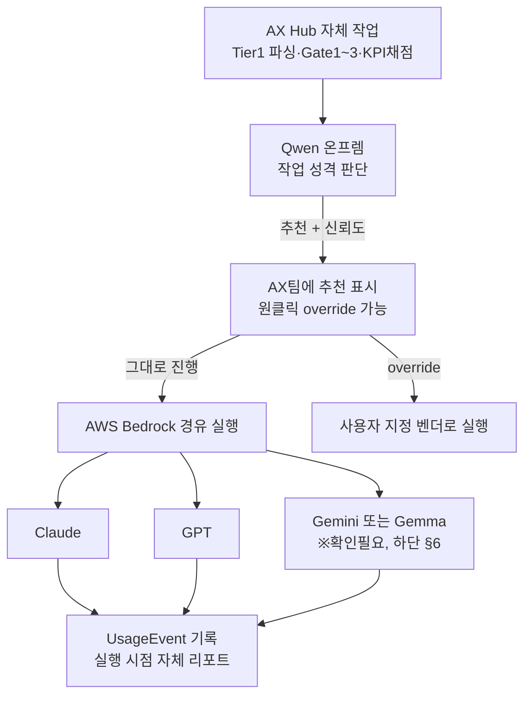

# AX Hub — AI 라우팅 아키텍처 최종 정리

**작성일**: 2026-08-21
**성격**: 이전 라우팅 설계 3차 리뷰까지의 내용을 전면 대체. 근본 전제가 잘못 이해되어 있었음을 확인하고 재정리.

---

## 1. 정정된 개념 모델

**온프렘 Qwen은 실행 후보가 아니라 순수 판단자(router)입니다.**

```
[작업/프롬프트] → Qwen(온프렘)이 작업 성격을 분류·판단
                    "이 작업엔 Claude가 맞다 / GPT가 맞다 / Gemini가 맞다"
                 → 판단 결과에 따라 실제 작업은 AWS Bedrock 경유로
                    해당 벤더 모델(Claude/GPT/Gemini)이 실행
                 → 실행에 쓰인 토큰은 API 연동으로 관리 (기존 A트랙 설계)
```

이전 3차례 리뷰에서 만들었던 `costRank`/`qualityRank`/`eligible` 비교 로직은 **"Qwen이냐 클라우드냐"를 경쟁시키는 잘못된 전제** 위에 있었습니다. Qwen은 후보가 아니라 심판이므로 이 비교 자체가 성립하지 않습니다.

---

## 2. G3(기밀등급) 제약 재검토 — 차단 근거 소멸

기존 설계는 "G3는 클라우드로 못 나간다"는 전제로 Qwen을 G3 전용 강제 목적지로 취급했습니다. 그런데 **AWS Bedrock은 AWS 계정·리전 경계 안에서 벤더 모델을 호스팅하는 방식**이라, 각 벤더사(Anthropic/OpenAI/Google) 서버로 데이터가 직접 나가지 않습니다. 회의 §9의 우려("기밀데이터는 클라우드 못 감")가 원래 걱정했던 것은 "각 벤더 퍼블릭 API로 데이터가 나가는 것"이었는데, Bedrock 경유는 이 경로를 타지 않습니다.

**결론**: `confidentialityLevel` 기반으로 특정 벤더를 강제 차단하는 로직은 근거가 사라졌으므로 제거합니다. G1~G3 전부 Bedrock 경유로 어느 벤더든 갈 수 있습니다.

---

## 3. 최종 아키텍처



---

## 4. Qwen의 역할 — 판단만, 실행 없음

- Qwen은 분류 프롬프트("이 작업이 단순한가 복잡한가, 코드인가 텍스트인가 등")만 처리
- Qwen 자체의 토큰 비용은 기존 결정(온프렘 호출 `costKrw=0` 처리) 그대로 적용 — 판단 비용은 무시 가능한 수준으로 설계
- 판단 결과는 신뢰도와 함께 표시하고, AX팀이 원클릭으로 override 가능 (기존에 정립한 "AI 판단 + 사람 확인" 패턴 재사용)

---

## 5. 실행 — AWS Bedrock 경유

- 실제 추론은 전부 Bedrock을 통해 Claude/GPT/(Gemini 또는 Gemma)로 나감
- 온프렘 Qwen을 실행 목적지로 쓰는 경우는 없음 (판단 전용)
- 데이터 경계: Bedrock은 AWS 계정·리전 내 처리이므로 기밀등급과 무관하게 사용 가능 (§2)

---

## 6. Gemini 관련 확인 필요 사항 (낮은 우선순위)

검색 결과 AWS Bedrock에 있는 건 "Gemini"가 아니라 Google의 오픈웨이트 모델인 "Gemma"입니다. 실제 계약 대상이 Gemini라면 Bedrock이 아닌 Google Vertex AI로 별도 연동이 필요할 수 있습니다. 지금 단계에서 중요도가 낮다고 판단하셨으므로 이 문서에서는 기존 전제(3사 모두 Bedrock 경유)를 그대로 유지하고, 실제 구현 단계에서 Jarvis가 확인하도록 남겨둡니다.

---

## 7. 토큰 관리 — 기존 A트랙 설계 재사용

"나눠진 LLM의 토큰 관리는 API 연동으로 한다"는 말씀은 기존에 이미 설계된 **A트랙(엔터프라이즈 벤더 관리자 API 수집, v20~v21에서 설계)**과 같은 성격입니다. 다만 Bedrock 경유 호출은 각 벤더사의 자체 관리자 콘솔(Anthropic Analytics API 등)에 잡히지 않고 **AWS 계정 단위 청구**로 잡히므로, 정확히는:

```
Bedrock 경유 실행 비용 추적 방식 (택1, 확인 필요):
  (a) AWS Cost Explorer/CloudWatch에서 Bedrock 사용량을 모델별로 태깅해 집계 (Pull)
  (b) AX Hub가 Bedrock 호출 시점에 자체적으로 UsageEvent에 기록 (Push, 기존 B/C트랙과 동일 방식)
```

**권장**: (b) Push 방식. 이전에 A트랙 벤더 API 의존을 재검토했던 이유(v11 이슈5, 온프렘 전환 시 무의미화)와 같은 논리로, AWS Cost Explorer 의존도 나중에 인프라가 바뀌면 다시 문제가 됩니다. AX Hub가 이미 알고 있는 정보(어떤 작업에 어떤 모델을 얼마나 썼는지)를 자체 기록하는 게 일관됩니다.

이전 설계의 `GatewayCallLog`는 정확히 이 목적(이벤트 단위 기록)으로 만들어졌으므로 **그대로 유지**하되, `costRank`/`qualityRank` 비교 로직만 제거합니다.

---

## 8. 개발 반영 가이드 — 이전 3차 리뷰분 정정 지시

```
폐기:
  - ModelProvider.costRank, qualityRank 필드 및 관련 정렬 로직
  - selectProvider()의 costRank/qualityRank 기반 비교 로직
  - confidentialityLevel 기반 강제 차단 로직 (G3→onprem 강제)

유지:
  - GatewayCallLog (이벤트 단위 토큰 기록 — 목적 자체는 유효)
  - AuditLog 필드명(actorEmail: 'SYSTEM') 수정 반영분
  - eligible 빈 배열 시 에러 처리 원칙 (다만 이제 "적격 프로바이더 없음" 상황 자체가 거의 발생 안 함 — Bedrock 경유면 대부분 다 가능)

신규 설계 필요:
  - Qwen의 작업 분류 로직 (기존 selectProvider와는 다른 목적 — "판단"이지 "필터링"이 아님)
  - Bedrock 호출 래퍼 + UsageEvent Push 기록
  - AX팀 override UI (Qwen 추천 + 원클릭 변경)
```

---

## 9. 이번 정정에 이르기까지 — 요약

라우팅 설계는 총 4차례 반복됐습니다:
1. 하드코딩 규칙 (`if G3 return onprem`)
2. DB 기반 동적 규칙 (`ModelProvider` 테이블 조회) — costTier 알파벳 정렬 버그 발견
3. costRank/qualityRank 분리 — GATE3_RATIONALE 품질선택 버그, 전taskType 온프렘 쏠림 발견
4. **근본 전제 자체가 틀렸음을 확인** — Qwen은 목적지가 아니라 판단자였고, 실행은 Bedrock 경유이며 G3 차단 근거도 없었음

1~3차의 버그 수정 노력 자체는 유효했으나, 애초에 잘못된 아키텍처를 정교하게 다듬고 있었던 것으로 확인됐습니다. 이번 4차 정리가 최종 아키텍처입니다.
