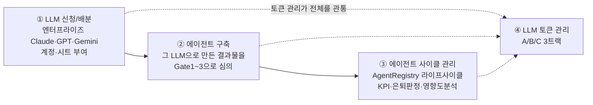

# AX Hub 전체 틀 재정리 — 모델 라우팅 재설계 + 카탈로그 3종

**작성일**: 2026-08-21
**배경**: `/me/ai` 존폐 논의를 계기로 AX Hub의 전체 틀을 재확인하고, 그 틀 안에서 모델 라우팅·카탈로그 개념을 다시 배치

---

## 1. AX Hub의 전체 틀 — 4단계



| 단계 | 내용 |
|---|---|
| ① LLM 신청/배분 | A트랙 — 엔터프라이즈 계정 사용량 관리, 서비스 배분(grant/revoke) |
| ② 에이전트 구축 | 표준 인테이크(AX_INTAKE_V1), Tier0/1 파싱, Gate1~3 심사, 이의제기 |
| ③ 에이전트 사이클 관리 | AgentRegistry 라이프사이클, KPI 자동플래그, 영향도 질의엔진, 카탈로그 |
| ④ 토큰 관리 | A(엔터프라이즈 API수집)·B(AX Hub 자체엔진)·C(배포에이전트 런타임) 3트랙 |

---

## 2. Qwen의 위치 — 이 틀 밖의 인프라

AX Hub 자체가 온프렘 Qwen 위에서 호스팅되므로, Qwen은 "①에서 신청하는 LLM"이 아니라 **AX Hub를 구동하는 인프라**입니다. 이 4단계 틀 안에 들어가는 개념이 아니라 그 밑을 받치는 기반입니다.

---

## 3. `/me/ai` 처리 방향 — 제거

**범용 AI 채팅(Claude/GPT/Gemini 상당 용도)은 제거합니다.** 엔터프라이즈 계약을 이미 맺은 벤더 앱(Claude.ai, ChatGPT, Gemini)이 UX·기능에서 AX Hub의 미니 채팅창보다 항상 나을 수밖에 없고, AX Hub팀이 그걸 따라 만들 이유가 없습니다. **AX Hub는 판단하는 곳이지 활용의 대체재가 아닙니다** — 앞서 라우팅 플로우 컨트롤을 채택하지 않은 것과 같은 논리입니다.

---

## 4. 모델 라우팅 재설계 — A트랙이 아니라 B트랙에 위치

### 기존 설계의 문제
원래 라우팅 설계는 `/me/ai`(A트랙, 여러 벤더 중 사용자가 고르는 범용채팅)를 전제로 만들었습니다. `/me/ai`가 없어지면서 그 전제가 사라졌습니다.

### 재배치 — ②에이전트 구축 단계(B트랙)로
AX Hub 자체 심의엔진(Tier1 인테이크 파싱, Gate2 코드리뷰, Gate3 채점·근거생성)이 호출하는 AI를 클라우드/온프렘 중 어디로 보낼지 정하는 문제로 다시 놓습니다.

### 왜 이게 더 나은가

1. **내용 분류가 필요 없어짐**: 어느 엔드포인트가 호출하는지(Tier1=단순 파싱, Gate3=복잡한 근거생성)로 이미 작업 성격을 압니다. 규칙 하나면 충분합니다.
2. **컴플라이언스 문제가 사라짐**: 기존 설계의 `inputPreview` 마스킹 미결사항 — 프롬프트 내용을 분류를 위해 저장할 필요 자체가 없어지니 G2/G3 데이터가 로그에 남을 걱정이 없습니다.
3. **판단 기준이 추측이 아니라 선언값이 됨**: AX_INTAKE_V1에 이미 있는 `기밀등급`(G1/G2/G3) 필드를 그대로 씁니다. G3면 무조건 온프렘 Qwen, G1/G2는 클라우드 허용.

### 재설계된 라우팅 규칙

```
IF Project.confidentialityLevel === 'G3'
  → 온프렘 Qwen 강제 (예외 없음)
ELSE IF 작업유형 === 'TIER1_PARSE' (단순 구조화)
  → 온프렘 Qwen 우선 (비용 절감)
ELSE IF 작업유형 === 'GATE3_RATIONALE' (복잡한 근거생성)
  → 클라우드 상위모델 우선 (품질 우선)
ELSE
  → 기본값(중간 성능), 필요 시 AX팀이 수동 override
```

LLM으로 내용을 분석하는 분류 로직 자체가 없어지므로, 이전 설계의 Tier0/Tier1(규칙기반→임베딩) 구조도 필요 없습니다. **분류가 아니라 조회**(기밀등급이 뭔지, 어느 엔드포인트인지)로 충분합니다.

### 스키마 변경 (기존 설계 대체)

```prisma
// ❌ 폐기: RoutingDecision (내용 분류 기반 — 더 이상 필요 없음)

// ✅ 대체: 라우팅은 규칙표로 관리, 별도 판단 로그 테이블 불필요
//    UsageEvent.providerKey가 이미 어떤 프로바이더로 갔는지 기록하므로
//    "왜 이 프로바이더로 갔는지"는 confidentialityLevel + 작업유형 조합으로 사후에도 설명 가능
```

기존 라우팅 설계 문서(`AX-Hub-ai-gateway-model-routing-design.md`)는 이 문서로 대체되며 폐기합니다.

---

## 5. 카탈로그 3종 체계

기존 결정(에이전트 카탈로그·데이터 카탈로그 노출 강화, ★★)에 **모델 카탈로그**를 추가합니다.

| 카탈로그 | 역할 | 사용 위치 |
|---|---|---|
| 에이전트 카탈로그 (`AgentRegistry`) | 이미 만들어진 에이전트 탐색 | ③사이클 관리, 중복신청 방지 |
| 데이터 카탈로그 (`dp/catalog`) | 사용 가능한 데이터 자산 탐색 | ②구축 시 데이터요건 매칭 |
| **모델 카탈로그 (신규)** | 신청 가능한 LLM 목록 + 각 모델의 비용·기밀등급 적합성 | ①신청 단계에서 "뭘 신청할 수 있는지" 안내, §4 라우팅 규칙표가 이 데이터를 그대로 참조 |

모델 카탈로그와 §4 라우팅 규칙은 **같은 데이터를 공유**합니다 — 카탈로그에 "Qwen 온프렘: G1~G3 전부 가능, 비용 최저"라고 등록해두면, 라우팅 로직이 그 메타데이터를 그대로 조회해서 씁니다. 별도로 유지할 필요가 없습니다.

---

## 6. 이전 결정 중 유지되는 것

| 항목 | 판단 | 비고 |
|---|---|---|
| 스캐너 (감사 도구 한정) | 유지 | §3 변경과 무관 |
| 라우팅 기반 플로우 컨트롤 (실시간 트래픽 제어) | 미채택 유지 | §4의 "모델 라우팅"과는 다른 개념 — 혼동 주의 |
| 카탈로그 노출 강화 | 유지 + 모델 카탈로그 추가 | §5 |

---

## 7. 다음 액션

| 항목 | 우선순위 |
|---|---|
| 기존 라우팅 설계 문서 폐기, 본 문서로 대체 | — |
| 모델 카탈로그 스키마·API 설계 | ★★ |
| §4 라우팅 규칙을 Gate2/Gate3 호출 로직에 반영 | ★★ |
| Qwen 온프렘 실제 연결 상태 확인 | ★★★ (여전히 미확인 상태) |
