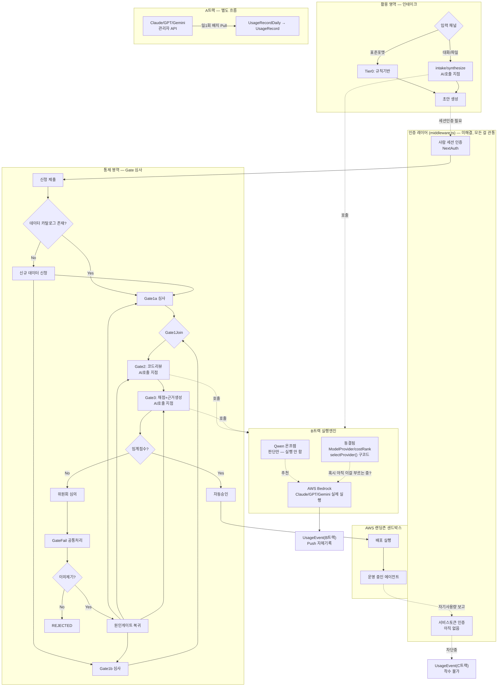

# AX Hub 전체 워크플로우 — 현황 다이어그램 + 끊긴 지점 체크리스트

**작성일**: 2026-08-21
**목적**: 지금까지 확정된 모든 요소(인증·인테이크·Gate심사·B/C트랙·A트랙)를 하나로 합쳐 끊기거나 꼬인 지점을 점검

---

## 1. 통합 다이어그램

---

## 2. 끊기거나 꼬인 부분 점검

| # | 지점 | 상태 | 설명 |
|---|---|---|---|
| 1 | `intake/synthesize`·Gate2·Gate3가 지금 어느 코드를 부르는지 | 🔴 미확인 | 동결된 구코드(`selectProvider`)로 연결돼 있으면 B트랙 재설계 시 다시 끊어야 함. 인테이크 재개 작업이 지금 이 지점을 지나는 중이라 가장 시급 |
| 2 | 세션인증(사람) → 서비스토큰인증(에이전트) | 🔴 끊어짐 | `middleware.ts`가 사람 세션만 다뤄서 C트랙 전체가 이 지점에서 막혀 있음 |
| 3 | Gate1Join의 AND/단독 조건 | ✅ 명세됨 | v7에서 설계 완료, 실제 코드 반영 여부만 확인 필요 |
| 4 | GateFail → 이의제기 → 원인게이트 복귀 | ✅ 설계 완료 | v8~v9에서 설계, 실제 코드 반영 여부는 별도 확인 필요 |
| 5 | Agent ↔ AgentRegistry (`agentRegistryId`) | 🟠 불확실 | "자동 세팅 코드가 실제로 있는지" 확인 요청이 아직 답변 안 됨. KPI/은퇴판정 흐름에 계속 걸려있는 문제 |
| 6 | A트랙 → B/C트랙 | ✅ 의도적 분리 | 서로 다른 흐름이라 맞는 설계, 끊긴 게 아니라 원래 분리된 것 |
| 7 | dp/requests의 "나머지 전환" 구형 PATCH 사용 여부 | 🟡 미확인 | 예전에 확인 요청했으나 이후 문서에서 언급 없음 |

---

## 3. 우선순위

| 항목 | 우선순위 |
|---|---|
| #1 — 인테이크/Gate2/Gate3의 AI 호출부가 구코드를 부르는지 확인 | ★★★ 즉시 (진행 중인 작업과 직결) |
| #2 — middleware.ts 서비스토큰 | ★★★ 즉시 |
| #5 — agentRegistryId 자동세팅 여부 재확인 | ★★ |
| #7 — dp/requests 잔여 전환 확인 | ★ |
