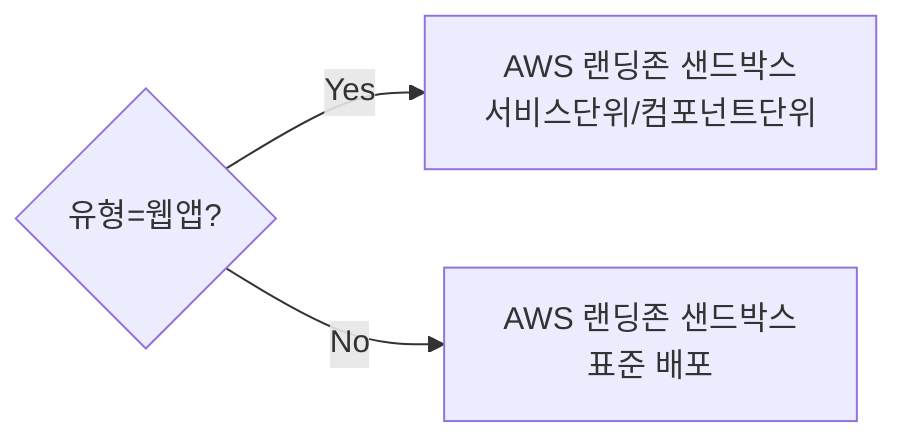

# AX Hub 워크플로우 v18 — 인프라 이원화 확정 (온프렘 AX Hub ↔ AWS 배포)

**작성일**: 2026-08-21
**전제 문서**: v3~v17 설계안
**변경 동기**: "배포 관리"의 의미 확인 — AX Hub 자체 호스팅만 해당, 배포처는 AWS 원안 유지

---

## 1. 확정된 인프라 구조

```
[AX Hub — 온프렘 Qwen 기반]
  역할: 판단·심의만 (Tier0/1 인테이크, Gate1~3, 코드리뷰, 채점)
  배포 대상 아님 — AX Hub 자신이 배포되는 곳일 뿐

[승인된 에이전트 — AWS 랜딩존 샌드박스]
  역할: 실제 실행
  v3 원안 그대로 유지 (Deploy[샌드박스/AWS])
```

두 인프라는 완전히 분리됩니다. AX Hub는 "판단하고 파악하는" 존재로만 존재하고, 실행은 AWS 쪽에서 일어납니다. v17에서 제가 "배포처가 온프렘으로 이동할 수 있다"고 가정했던 건 **틀린 추정**이었습니다.

---

## 2. Deploy 단계 — v16 원안으로 복귀 확정



v11~v17에서 있었던 "배포처 온프렘 이동" 논의는 폐기합니다. 다이어그램 본체(v8~v16의 CTRL 서브그래프)는 수정 없이 그대로 유효합니다.

---

## 3. C 트랙 재확인 — 실비용 발생 (costKrw=0 아님)

v17에서 "배포처가 온프렘이면 C트랙도 무비용 처리 가능성"이라 언급했던 건 전제가 틀렸으므로 폐기합니다. 배포된 에이전트는 AWS에서 실행되므로 **실제 클라우드 API 종량제 비용이 그대로 발생**합니다.

```prisma
model AgentRuntimeUsage {
  id            String   @id @default(cuid())
  agentId       String
  agent         Agent    @relation(fields: [agentId], references: [id])
  ownerEmail    String   // 배포 시 지정된 오너 (회의 §6)
  providerKey   String   // 에이전트가 실제 어떤 모델을 쓰는지 (AWS 위에서 호출하는 API)
  tokenUsed     Int
  costKrw       Decimal  // 실비용 — 0 처리 불가, B트랙(온프렘)과 다름
  calledAt      DateTime @default(now())

  @@index([agentId, calledAt])
}
```

**B트랙(`UsageEvent`, 온프렘 Qwen)과 C트랙(`AgentRuntimeUsage`, AWS)의 비용 성격이 다릅니다** — B는 온프렘 고정비라 이벤트 단위 종량제 개념이 약하고(v9 이슈P 로직), C는 AWS 클라우드 종량제라 실비용 추적이 그대로 유효합니다. 두 트랙을 같은 방식으로 취급하면 안 됩니다.

---

## 4. 미결 사항 (v17 대비 갱신)

| 항목 | 내용 |
|---|---|
| ~~Deploy 단계 배포처~~ | **해결됨 — AWS 랜딩존 샌드박스로 확정, v3 원안 유지** |
| C 트랙(`AgentRuntimeUsage`) 구현 우선순위 | 여전히 미결 — 다만 실비용이 발생하는 트랙이라 우선순위가 B보다 높을 수 있음(회의 §6의 본래 관심사) |
| A 트랙 엔터프라이즈 API 연동 | v3부터 동일 미결 |
| ~~middleware.ts GitHub 이슈 등록 여부~~ | 여전히 최우선 미결 |

---

## 5. 변경 이력 (v17 → v18)

| 항목 | v17 상태 | v18 조치 |
|---|---|---|
| Deploy 단계 배포처 | "온프렘으로 이동 가능성" 가정, 확인 대기 | **AWS 랜딩존 샌드박스로 확정** — v3 원안이 처음부터 맞았음. 다이어그램 본체 수정 불필요 |
| AX Hub ↔ Qwen ↔ AWS 관계 | 불명확 | AX Hub(온프렘, 판단전용) / 배포 에이전트(AWS, 실행전용)로 인프라 이원화 확정 |
| C트랙 비용 성격 | v17에서 "0 처리 가능성" 잘못 언급 | AWS 실비용 발생 확인, B트랙과 다른 회계처리 필요함을 명시 |
