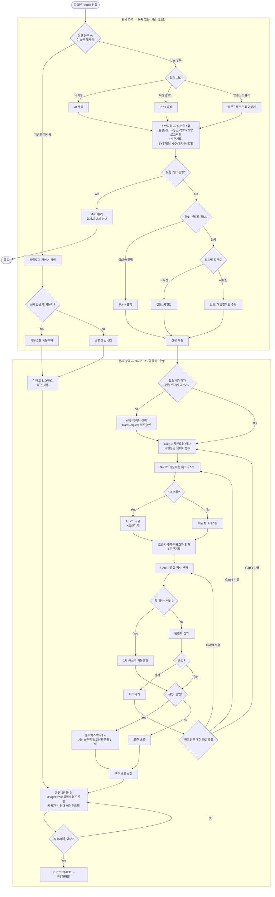
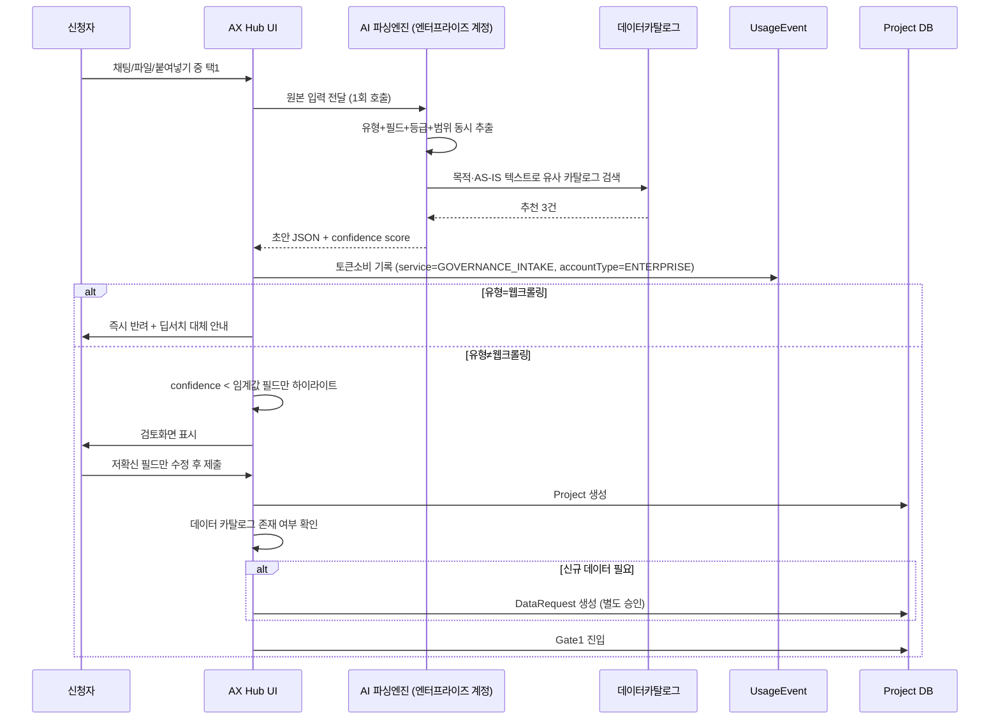

# AX Hub 워크플로우 v5 — 통제/활용 분리 + 토큰 로깅 설계안

**작성일**: 2026-08-21
**전제 문서**: `AX-Hub-워크플로우v3-설계안.md`, `AX-Hub-워크플로우v4-AI인테이크-설계안.md`
**변경 동기**: v4 플로우 재검토 결과 — 오버엔지니어링 제거, 통제/활용 영역 명시적 분리, 심의과정 자체의 토큰 소비 미기록 문제 해결, 회의록 미반영분(신규데이터신청·웹앱배포단위·시간대로깅) 반영

---

## 1. 설계 원칙

1. **사람은 검토만, 작성은 AI가** (v4 유지)
2. **확신도 기반 선택적 검토** (v4 유지)
3. **AI 호출은 필요한 최소 횟수로**: v4에서 도입했던 "1차 유형분류 → 2차 전체분류" 이중호출은 오버엔지니어링이었음. 파싱 1회로 유형·필드를 동시에 뽑고, 유형에 따른 분기는 코드 레벨에서 처리한다.
4. **통제(Control)와 활용(Utility)은 분리해서 관리한다**: 활용 영역(초안지원·카탈로그검색·기승인재사용)은 "막을 수 없는" 편의 기능이고, 통제 영역(Gate1~3·위원회·운영모니터링)만 실제 승인/반려 권한을 가진다. 이름에 "Gate"를 붙이는 건 통제 영역에만 한정한다.
5. **이의제기는 원인 게이트로 복귀한다**: 반려 사유가 발생한 게이트로 되돌아가야지, 항상 마지막 게이트(Gate3)로 보내면 원인과 무관한 재심사가 된다.
6. **시스템이 자동 실행하는 AI 호출은 개인 오너 토큰과 분리 회계한다**: 초안지원·AI코드리뷰·비용평가는 신청자가 직접 실행하는 게 아니라 AX Hub가 심의를 위해 자동으로 돌리는 것이므로, "오너 토큰 소진 시 오너 책임"(회의 §6) 원칙을 적용할 수 없다. 엔터프라이즈 계정으로 별도 회계한다.

---

## 2. 전체 플로우 다이어그램



---

## 3. 시퀀스 다이어그램 — 초안지원(활용) → Gate1(통제) 진입



---

## 4. DB 스키마 — v5 증분 (v3·v4 대비)

```prisma
model Project {
  // ... v3·v4 필드 유지 ...
  // v4의 lowConfidenceFields, aiExtractedFields, aiConfidenceScore, humanReviewedAt 그대로 사용
  // intakeMethod: CHAT | FILE | PROMPT | FORM(폴백) — v4와 동일

  // ▼ v5 신규: 웹앱 배포단위 (결정사항 #4, 회의 §4)
  deployUnit   String?  // SERVICE | COMPONENT (agentType=WEBAPP일 때만 사용)
}

// ▼ v5 신규: 이벤트 단위 토큰 로깅 (기존 UsageRecord는 월단위 정산용으로 유지)
model UsageEvent {
  id                String   @id @default(cuid())
  service           String   // GOVERNANCE_INTAKE | GOVERNANCE_CODEREVIEW | GOVERNANCE_COSTEVAL | 사용자 직접호출 시 실제 서비스명
  accountType       String   @default("ENTERPRISE")  // ENTERPRISE | PERSONAL
  sourceType        String   // SYSTEM_GOVERNANCE | USER_DIRECT
  relatedProjectId  String?
  employeeId        String?  // USER_DIRECT일 때만 값 존재
  tokenUsed         Int
  costKrw           Float
  calledAt          DateTime @default(now())

  @@index([calledAt])
  @@index([service, calledAt])
}
```

**판단 근거**:
- `deployUnit`을 `Project`에 얹은 이유는 웹앱 배포단위가 Project 1건당 1개 값이라 별도 모델로 뺄 이유가 없기 때문.
- `UsageEvent`를 `UsageRecord`와 별도로 둔 이유는 §7(미결사항) 참고 — 월단위 집계로는 "시간대별 부하"(S1) 질문에 답할 수 없어서.

---

## 5. API 명세 — v5 증분

```
POST /api/intake/parse            채널 무관 통합 파싱 엔드포인트 (v4의 3개 분리 API를 1개로 통합)
GET  /api/data-catalog/check      필요 데이터가 카탈로그에 있는지 확인 → 없으면 DataRequest 유도
POST /api/deploy/webapp           유형=웹앱일 때 deployUnit 지정 후 배포
GET  /api/usage-events            시간대별 토큰 사용량 조회 (calledAt 범위 쿼리)
POST /api/appeals/{id}/reroute    이의제기 승인 시 원인 게이트로 재진입 처리
```

---

## 6. 미결 사항

| 항목 | 내용 |
|---|---|
| 확신도 임계값 | 여전히 미정 — Gate1 진입 전 실측 데이터로 조정 필요 |
| UsageEvent → UsageRecord 집계 배치 주기 | 일배치/월배치 중 미정 |
| DataRequest 처리 SLA | 신규 데이터 신청이 Gate1 진입을 얼마나 지연시키는지 기준 없음 |
| 엔터프라이즈 계정 API 연동 | 정보전략팀 회신 대기 (기존 미결사항과 동일 — 회신 전까지 UsageEvent는 수동/추정 입력) |
| Knox 메뉴 네이밍 | 미확정 (v3부터 이어짐) |

---

## 7. 변경 이력 (v3 → v4 → v5)

| 구분 | v3 | v4 | v5 (최종) |
|---|---|---|---|
| 신청서 작성 방식 | Form 직접 작성 | AI 인테이크 기본 경로 도입 | 동일 (유지) |
| 유형 분류 AI 호출 | — | 1차(유형)+2차(전체) 이중 호출 | **1회 호출로 통합** — 이중호출은 오버엔지니어링으로 판단, 제거 |
| Gate0 명칭/성격 | — | "Gate0"으로 명명, 통제 게이트처럼 보임 | **"초안지원(Draft Assist)"로 재명명, 활용 영역으로 이동** — 실제 반려 권한이 없는데 Gate로 불러 통제 이력과 혼동될 소지 제거 |
| 통제/활용 영역 구분 | 미구분 | 미구분 | **subgraph로 명시적 분리** (UTIL / CTRL) |
| 이의제기 라우팅 | ProjectAppeal → Gate3 고정 | 동일 | **반려 원인 게이트(Gate1/2/3)로 복귀** |
| 웹크롤링 반려 시점 | Gate1 이전 | Draft 생성 이후(Submit 이후) — 원칙4 위배 | **초안지원 직후 즉시 반려로 환원** |
| 파싱 실패 폴백 | — | 미결사항으로만 언급, 플로우 미반영 | **FormFallback 노드로 플로우에 명시** |
| 신규 데이터 신청 분기 | 미반영 | 미반영 | **DataCheck → DataRequest 분기 추가** (회의 §1) |
| 웹앱 배포단위 | 미반영 | 미반영 | **DeployMode 분기 + `deployUnit` 필드 추가** (회의 §4) |
| 토큰 로깅 단위 | 월단위 `UsageRecord`만 | 동일 | **이벤트 단위 `UsageEvent` 신설**, 시간대 분석 가능 (회의 §7) |
| 심의과정 자체의 토큰 소비 | 미기록 | 미기록 | **초안지원·AI코드리뷰·비용평가 3개 지점에 ⚡토큰기록 삽입**, `accountType=ENTERPRISE`로 개인 오너 토큰과 분리 회계 (회의 §6, §9) |
| 기승인 재사용 경로 | 카탈로그 검색 기반 | 변경 없음 | 변경 없음 |

**요약**: v4는 "누가 입력을 채우는가"를 사람→AI로 바꾼 버전이었고, v5는 v4의 설계 결함(이중호출, 통제/활용 혼재, 웹크롤링 반려 지연)을 고치면서 **회의록에서 아직 안 담겼던 3가지(신규데이터신청·웹앱배포단위·시간대토큰로깅)를 마저 반영**한 버전입니다.
