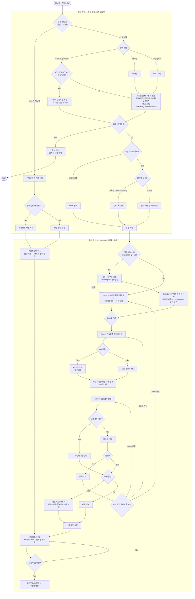

# AX Hub 워크플로우 v6 — 리뷰 반영 + 표준 인테이크 포맷 설계

**작성일**: 2026-08-21
**전제 문서**: v3·v4·v5 설계안
**변경 동기**: v5 리뷰에서 발견된 이슈 4건 수정 + AI 인테이크의 정형 포맷 부재 문제 해결

---

## 1. 설계 원칙 (v5에 추가)

7. **정형 입력은 AI를 거치지 않는다**: 표준 포맷과 일치하는 입력은 규칙기반 파싱만으로 처리하고 LLM 호출을 생략한다. LLM은 자유형식 입력(대화·비정형 파일)에만 쓴다 — 이게 인테이크 단계에서 실질적으로 토큰을 절감하는 유일한 지점이다.
8. **Gate1은 데이터종속 항목과 무관 항목을 분리 심사한다**: DataRequest 승인 대기가 전체 심사를 블로킹하지 않도록, 데이터와 무관한 항목(기밀등급 등)은 먼저 진행하고 데이터분류 항목만 DataRequest 완료를 기다린다.

---

## 2. 표준 인테이크 포맷 v1

회의 결정사항 #10("표준 프롬프트 예시를 주면 그대로 만들려 한다")의 실제 산출물입니다. 신청자가 Claude/GPT에서 아래 프롬프트를 실행하면, AX Hub가 **파싱 룰만으로** 읽을 수 있는 고정 마크다운이 나옵니다.

### 신청자에게 제공할 표준 프롬프트

```
아래 형식 그대로, 각 항목을 채워서 마크다운으로 정리해줘.
형식을 벗어나거나 항목을 생략하지 마.

## AX_INTAKE_V1
- 프로젝트명:
- 부서:
- 목적(왜 지금):
- AS-IS:
- 기대효과:
- 필요 데이터: (카탈로그에 있는 항목명 또는 "신규 데이터 필요")
- 에이전트 유형: (SKILL | MCP | WEBAPP | CRAWLING 중 하나)
- 공개범위: (DEPT | DIVISION | COMPANY 중 하나)
- 기밀등급 추정: (G1 | G2 | G3 중 하나)
```

### 파싱 로직

```
IF 입력에 "## AX_INTAKE_V1" 헤더 존재
  AND 필수 9개 항목 모두 파싱 성공
  → Tier 0: 규칙기반 매핑, LLM 호출 없음, aiConfidenceScore = 100
ELSE
  → Tier 1: LLM 구조화 추출 (기존 v4·v5 방식), UsageEvent 기록
```

**판단 근거**: 형식 이탈 시 바로 Tier1로 폴백하므로 안전장치는 유지되고, 형식을 지킨 신청 건은 인테이크 비용이 사실상 0에 가까워집니다. 표준 포맷 준수를 유도하려면 신청 화면에 "표준 프롬프트 복사" 버튼을 눈에 띄게 배치하는 UI 설계가 필요합니다(Phase 3에서 CTO 전달).

---

## 3. 전체 플로우 다이어그램 (v6)



---

## 4. DB 스키마 — v6 증분 (v5 대비 수정)

```prisma
// ▼ 수정: enum 도입 (이슈2)
enum UsageService {
  GOVERNANCE_INTAKE
  GOVERNANCE_CODEREVIEW
  GOVERNANCE_COSTEVAL
  USER_DIRECT
}

enum AccountType {
  ENTERPRISE
  PERSONAL
}

enum IntakeSourceType {
  SYSTEM_GOVERNANCE
  USER_DIRECT
}

// ▼ 수정: UsageEvent — 타입 안전성 확보 (이슈2, 이슈4)
model UsageEvent {
  id                String            @id @default(cuid())
  service           UsageService
  accountType       AccountType       @default(ENTERPRISE)
  sourceType        IntakeSourceType
  relatedProjectId  String?           // sourceType=SYSTEM_GOVERNANCE면 API 레벨에서 NOT NULL 강제 (이슈4)
  employeeId        String?           // sourceType=USER_DIRECT일 때만 값 존재
  tokenUsed         Int
  costKrw           Decimal           @db.Decimal(10, 4)   // Float→Decimal (이슈2)
  calledAt          DateTime          @default(now())

  @@index([calledAt])
  @@index([service, calledAt])
}

model Project {
  // ... v3~v5 필드 유지 ...

  // ▼ v6 신규: 표준 포맷 사용 여부 (§2 표준 인테이크 포맷)
  usedStandardTemplate Boolean @default(false)  // true면 intakeMethod와 무관하게 Tier0 처리됨
}
```

**API 레벨 validation (이슈4 후속)**:
```
POST /api/usage-events
  IF sourceType === "SYSTEM_GOVERNANCE" AND relatedProjectId === null
    → 400 에러, "시스템 거버넌스 이벤트는 projectId 필수"
```

---

## 5. 미결 사항 (v5 대비 갱신)

| 항목 | 내용 |
|---|---|
| Gate1a/1b 분리 후 UI 표시 방식 | 신청자에게 "일부 항목 심사중, 일부 대기중"을 어떻게 노출할지 미정 |
| 표준 포맷 버전 관리 | AX_INTAKE_V1 이후 필드 추가 시 V2 마이그레이션 전략 필요 |
| ~~확신도 임계값~~ | v5와 동일 미결 |
| ~~UsageEvent 집계 배치 주기~~ | v5와 동일 미결 |
| ~~엔터프라이즈 계정 API 연동~~ | v5와 동일 미결 (정보전략팀 회신 대기) |
| ~~Knox 메뉴 네이밍~~ | v3부터 동일 미결 |

---

## 6. 변경 이력 (v5 → v6)

| 이슈 | v5 상태 | v6 조치 |
|---|---|---|
| 이슈1: DataRequest 블로킹/논블로킹 모호 | 단일 Gate1이 DataRequest를 무조건 기다림 | Gate1을 1a(데이터무관, 즉시진행)/1b(데이터종속, 대기)로 분리 — 부분 블로킹으로 절충 |
| 이슈2: 스키마 타입 안전성 | service/accountType이 String, costKrw가 Float | `UsageService`/`AccountType`/`IntakeSourceType` enum 도입, `costKrw`를 `Decimal(10,4)`로 변경 |
| 이슈3: AccessGrant가 subgraph 경계를 넘어 연결 | AccessGrant는 UTIL에, Monitor는 CTRL에 있는데 직접 연결 | AccessGrant를 CTRL 서브그래프 내부로 이동 — "재배포 없이 합류"로 명시 |
| 이슈4: relatedProjectId nullable로 인한 추적성 저하 | nullable, 강제 로직 없음 | 스키마는 nullable 유지하되 `POST /api/usage-events`에 API 레벨 validation 추가 |
| (신규) AI 인테이크 정형 포맷 부재 | 표준 프롬프트 결정사항은 있었으나 실제 포맷 미정의, 모든 인테이크가 LLM(Tier1) 경유 | `AX_INTAKE_V1` 표준 포맷 정의, 형식 일치 시 Tier0(규칙기반, 무비용) 처리하는 2-tier 파싱 도입 |
