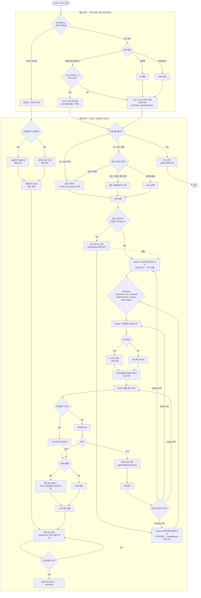

# AX Hub 워크플로우 v7 — v6 리뷰 이슈 반영

**작성일**: 2026-08-21
**전제 문서**: v3~v6 설계안
**변경 동기**: v6 리뷰에서 발견된 이슈(이슈3 미완, 신규 A/B/C/D) 수정

---

## 1. 설계 원칙 (v6에 추가)

9. **"판단이 개입하면" 통제 영역이다**: 검색·초안생성처럼 판단 없이 정보만 보여주는 건 UTIL, 접근권한 여부를 결정하는 순간부터는 아무리 가벼워도(자동승인 포함) CTRL이다. "경량"은 통제 강도의 차이일 뿐 통제 영역 자체를 벗어나는 이유가 되지 않는다.

---

## 2. 이슈별 조치

| 이슈 | 조치 |
|---|---|
| 3 (재검토) | ZoneCheck/AutoGrant/PermReq/AccessGrant를 UTIL에서 CTRL로 완전히 이동 — "경량 승인 트랙"으로 명명. UTIL은 Catalog 검색까지만 |
| A | EarlyType 이후 분기에 소스 조건 추가: Tier0는 ParseCheck를 우회해 ReviewLow로 직행 |
| B | Gate1Join 완료 조건 명시: DataCheck=Yes → Gate1a만으로 충족 / DataCheck=No → Gate1a **AND** Gate1b 모두 완료해야 충족 |
| C | `usedStandardTemplate` 제거, `intakeMethod`를 `STANDARD_FORMAT \| CHAT \| FILE \| MANUAL_FORM`으로 확장해 필드 통합 |
| D | 반려 시점에 `gate1FailedSubgate: "1A" \| "1B"` 기록, 이의제기 승인 시 이 값 기준으로 Gate1a/1b 정확히 복귀 |

---

## 3. 전체 플로우 다이어그램 (v7)



**§1 원칙9 적용 결과**: UTIL은 이제 정말로 "판단 없는" 4개 노드(Catalog·Channel·FormatCheck·Tier0/1)만 남았습니다. subgraph 경계를 넘는 화살표(Catalog→ZoneCheck, Tier0/1→EarlyType)는 있지만, 이건 "활용에서 통제로 진입하는 시작점"이라 경계를 넘는 게 오히려 맞는 그림입니다 — v5·v6에서 문제였던 건 통제 판단(AutoGrant 등)이 UTIL 안에 있었던 것이지, 경계를 넘는 화살표 자체가 아니었습니다.

---

## 4. DB 스키마 — v7 증분

```prisma
model Project {
  // ... v3~v6 필드 유지, 아래 2개 변경 ...

  // ▼ 변경: intakeMethod 확장, usedStandardTemplate 제거 (이슈C)
  intakeMethod   String  @default("MANUAL_FORM")  // STANDARD_FORMAT | CHAT | FILE | MANUAL_FORM

  // ▼ 신규: 이의제기 정확 복귀용 (이슈D)
  gate1FailedSubgate String?  // "1A" | "1B" | null — Gate1 반려 시에만 값 존재
}
```

`usedStandardTemplate: Boolean` 필드는 제거합니다. `intakeMethod = STANDARD_FORMAT`이면 Tier0 처리된 것으로 단일 판단 가능합니다.

---

## 5. Gate1Join 완료 조건 명세 (이슈B)

```
Gate1Join 통과 조건:
  IF DataCheck == "Yes" (카탈로그에 데이터 이미 존재)
    THEN Gate1a.status == PASSED 만으로 충족
  IF DataCheck == "No" (신규 데이터 필요)
    THEN Gate1a.status == PASSED AND Gate1b.status == PASSED 모두 충족해야 함
    (Gate1b는 DataRequest.status == APPROVED 이후에만 시작 가능)
```

---

## 6. 미결 사항 (v6 대비 갱신)

| 항목 | 내용 |
|---|---|
| Gate1a/1b 진행상태 UI 노출 방식 | 여전히 미정 |
| 표준 포맷 버전 관리 (AX_INTAKE_V2 마이그레이션) | 여전히 미정 |
| ~~확신도 임계값 / UsageEvent 배치주기 / 엔터프라이즈 API 연동 / Knox 네이밍~~ | v5·v6과 동일 미결 |

---

## 7. 변경 이력 (v6 → v7)

| 이슈 | v6 상태 | v7 조치 |
|---|---|---|
| 이슈3 (재검토) | AccessGrant만 CTRL로 이동, ZoneCheck/AutoGrant/PermReq는 UTIL에 잔류 | 원칙9 신설 — "판단이 개입하면 통제". ZoneCheck부터 AccessGrant까지 전부 CTRL 이동, UTIL은 검색·초안생성만 남음 |
| 이슈A | Tier0도 ParseCheck를 거칠 수 있는 경로 존재 | EarlyType 분기에 소스 조건(Tier0/Tier1) 추가, Tier0는 ReviewLow로 직행 |
| 이슈B | Gate1Join의 AND/단독 조건 미명세 | §5에 완료조건 의사코드로 명세 |
| 이슈C | `intakeMethod`와 `usedStandardTemplate` 중복 가능성 | `usedStandardTemplate` 제거, `intakeMethod`에 `STANDARD_FORMAT` 값 추가로 통합 |
| 이슈D | 이의제기 Gate1 복귀가 항상 Gate1a로 고정 | `gate1FailedSubgate` 필드 신설, 반려 시점에 1A/1B 기록 후 정확히 복귀 |
