# AX Hub 워크플로우 v8 — Gate 탈락 경로 + enum 완성

**작성일**: 2026-08-21
**전제 문서**: v3~v7 설계안
**변경 동기**: v7 리뷰 이슈 E/F/G 반영 — 특히 Gate1a/1b/Gate2 중간탈락 경로 부재는 구조적 결함

---

## 1. 이슈별 조치

| 이슈 | 조치 |
|---|---|
| E | `intakeMethod`, `gate1FailedSubgate` enum화. `gate1FailedSubgate`는 F 조치와 함께 `failedGate`로 통합·확장 |
| F | Gate1a/Gate1b/Gate2 각각에 통과여부 분기 추가. 실패 시 공통 경로(AX팀 반려처리 → 이의제기 여부 확인 → 복귀/종료)로 수렴 |
| G | 콤마 포함 라벨을 중간 분기 노드(`SourceCheck`)로 대체 |

---

## 2. Gate 탈락 처리 설계 (이슈F)

**원칙**: 모든 게이트(1a, 1b, 2, 3/위원회)는 동일한 실패 처리 경로를 공유한다. 게이트마다 다른 반려 프로세스를 만들지 않는다 — 어느 게이트에서 떨어지든 "AX팀 반려처리 → 이의제기 여부 확인" 순서는 동일하고, 이의제기 승인 시 복귀 지점만 달라진다.

```
게이트 통과 실패 (Gate1a | Gate1b | Gate2 | Gate3위원회)
  → Project.failedGate 기록
  → AX팀 반려처리 (반려사유 기재)
  → 신청자에게 통보
  → 이의제기 신청함?
      Yes → Appeal → 위원회 재검토 → 승인 시 failedGate 지점으로 ReRoute
      No  → 신청 종료 (status = REJECTED)
```

---

## 3. 전체 플로우 다이어그램 (v8)

```mermaid
flowchart TD
    Start([로그인 / Knox 진입]) --> Branch{신규 등록 vs<br/>기승인 재사용}

    subgraph UTIL[활용 영역 — 판단 없음, 검색·초안생성만]
        Branch -->|기승인 재사용| Catalog[카탈로그 자연어 검색]

        Branch -->|신규 등록| Channel{입력 채널}
        Channel -->|표준포맷 붙여넣기| FormatCheck{AX_INTAKE_V1<br/>형식 일치?}
        Channel -->|대화형| Chat[AI 채팅]
        Channel -->|파일업로드| FileParse[PRD 파싱]

        FormatCheck -->|Yes| Tier0[Tier0: 규칙기반 매핑<br/>LLM 호출 없음]
        FormatCheck -->|No| Tier1
        Chat --> Tier1
        FileParse --> Tier1

        Tier1[Tier1: LLM 구조화 추출<br/>⚡토큰기록]
    end

    Catalog --> ZoneCheck
    Tier0 --> EarlyType{유형=웹크롤링?}
    Tier1 --> EarlyType

    subgraph CTRL[통제 영역 — 판단이 개입하는 모든 것]
        ZoneCheck{공개범위 내 사용자?}
        ZoneCheck -->|Yes| AutoGrant[사용권한 자동부여]
        ZoneCheck -->|No| PermReq[관리자 승인 신청]
        AutoGrant --> AccessGrant[기배포 인스턴스<br/>접근 허용]
        PermReq --> AccessGrant
        AccessGrant --> Monitor

        EarlyType -->|Yes| Reject[즉시 반려<br/>딥서치 대체 안내]
        EarlyType -->|No| SourceCheck{Tier0 처리건?}
        SourceCheck -->|Yes| ReviewLow[검토: 확인만]
        SourceCheck -->|No| ParseCheck{파싱 신뢰도 확보?}
        ParseCheck -->|실패/저품질| FormFallback[Form 폴백]
        ParseCheck -->|성공, 고확신| ReviewLow
        ParseCheck -->|성공, 저확신| ReviewHigh[검토: 해당필드만 수정]
        ReviewLow --> Submit
        ReviewHigh --> Submit
        FormFallback --> Submit

        Submit[신청 제출] --> DataCheck{필요 데이터가<br/>카탈로그에 있는가?}
        DataCheck -->|No| DataRequest[신규 데이터 신청]
        DataCheck -->|Yes| Gate1a

        Gate1a[Gate1a 심사<br/>기밀등급 등]
        DataRequest -.병렬.-> Gate1a
        DataRequest --> Gate1b[Gate1b 심사<br/>데이터분류]

        Gate1a --> Gate1aCheck{통과?}
        Gate1aCheck -->|No| GateFail
        Gate1aCheck -->|Yes| Gate1Join

        Gate1b --> Gate1bCheck{통과?}
        Gate1bCheck -->|No| GateFail
        Gate1bCheck -->|Yes| Gate1Join

        Gate1Join{Gate1Join<br/>DataCheck=Yes: Gate1a만<br/>DataCheck=No: Gate1a AND Gate1b}
        Gate1Join --> Gate2[Gate2: 기술표준 체크리스트]
        Gate2 --> Gate2Check{통과?}
        Gate2Check -->|No| GateFail
        Gate2Check -->|Yes| CodeReview

        CodeReview{Git 연동?}
        CodeReview -->|Yes| AIReview[AI 코드리뷰<br/>⚡토큰기록]
        CodeReview -->|No| Manual[수동 체크리스트]
        AIReview --> CostEval
        Manual --> CostEval[토큰사용량·비용효과 평가<br/>⚡토큰기록]

        CostEval --> Gate3[Gate3: 종합 점수 산정]
        Gate3 --> ScoreCheck{임계점수 이상?}
        ScoreCheck -->|Yes| AutoApprove[1차 AI심의 자동승인]
        ScoreCheck -->|No| Committee[위원회 심의]
        Committee --> CommDecision{승인?}
        CommDecision -->|반려| GateFail
        CommDecision -->|승인| DeployMode
        AutoApprove --> DeployMode

        GateFail[failedGate 기록<br/>AX팀 반려처리 + 통보] --> AppealCheck{이의제기<br/>신청함?}
        AppealCheck -->|No| Closed([신청 종료<br/>REJECTED])
        AppealCheck -->|Yes| AppealReview[위원회 재검토]
        AppealReview --> AppealDecision{재검토 승인?}
        AppealDecision -->|No| Closed
        AppealDecision -->|Yes| ReRoute{failedGate 지점으로 복귀}
        ReRoute -->|GATE1A| Gate1a
        ReRoute -->|GATE1B| Gate1b
        ReRoute -->|GATE2| Gate2
        ReRoute -->|GATE3_COMMITTEE| Gate3

        DeployMode{유형=웹앱?}
        DeployMode -->|Yes| WebDeploy[샌드박스/AWS +<br/>배포단위 선택]
        DeployMode -->|No| StdDeploy[표준 배포]
        WebDeploy --> Deploy
        StdDeploy --> Deploy

        Deploy[신규 배포 실행] --> Monitor[운영 모니터링<br/>UsageEvent 로깅]
        Monitor --> Lifecycle{성능/비용 이상?}
        Lifecycle -->|Yes| Deprecate[DEPRECATED → RETIRED]
        Lifecycle -->|No| Monitor
    end

    Reject --> End1([종료])
```



---

## 4. DB 스키마 — v8 증분

```prisma
// ▼ 신규 enum (이슈E)
enum IntakeMethod {
  STANDARD_FORMAT
  CHAT
  FILE
  MANUAL_FORM
}

// ▼ 변경: gate1FailedSubgate(v7) → failedGate로 확장 (이슈E+F)
enum FailedGate {
  GATE1A
  GATE1B
  GATE2
  GATE3_COMMITTEE
}

model Project {
  // ... v3~v6 필드 유지 ...

  intakeMethod  IntakeMethod  @default(MANUAL_FORM)   // String → enum (이슈E)
  failedGate    FailedGate?                            // gate1FailedSubgate 대체, 전체 게이트 커버 (이슈E+F)
  status        String        @default("IN_PROGRESS")  // IN_PROGRESS | REJECTED | APPROVED | DEPLOYED (신규: 반려종결 상태 표현)
}
```

---

## 5. 미결 사항 (v7 대비 갱신)

| 항목 | 내용 |
|---|---|
| 이의제기 재검토 SLA | `AppealReview` 단계 처리기한 미정 |
| GateFail 시 신청자 통보 채널 | 이메일/사내메신저 등 구체 방식 미정 |
| ~~Gate1a/1b UI 노출, 표준포맷 버전관리, 확신도 임계값, UsageEvent 배치주기, 엔터프라이즈 API연동, Knox 네이밍~~ | v5~v7과 동일 미결 |

---

## 6. 변경 이력 (v7 → v8)

| 이슈 | v7 상태 | v8 조치 |
|---|---|---|
| E | `intakeMethod`, `gate1FailedSubgate`가 String | `IntakeMethod`, `FailedGate` enum 도입 |
| F | Gate1a/1b/Gate2 중간탈락 시 이의제기 경로 없음 — 위원회 반려에만 Appeal 존재 | 모든 게이트에 통과여부 분기 추가, 공통 `GateFail` 노드로 수렴 → 이의제기 여부 확인 → 승인 시 `failedGate` 기준 정확한 지점으로 복귀, 미신청/재검토반려 시 `REJECTED`로 종결 |
| G | `EarlyType -->|No, Tier0 경로|` 형태의 콤마 포함 라벨 — Mermaid 파싱 위험 | `SourceCheck{Tier0 처리건?}` 중간 분기 노드로 대체 |
