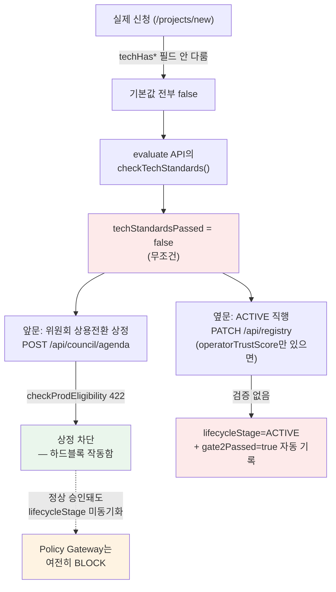

# 개발 표준 → 등재 과정 실태 분석

> 작성: Claude AI / 2026-09-05(주말 확인)
> 질문: "개발 표준이 있는지, 미달 시 제언을 할 수 있는지"
> 결론: **표준 문서는 있음. 검증 로직도 있음. 그런데 그 둘을 잇는 UI가 전부 고아 코드라 실제로는 아무도 도달 못 함.**

---

## 1. 개발 표준 문서 — 있음, 꽤 잘 되어 있음

`AI-STD-2026-006` (v1.3, 2026-08-27 개정) — "AI 과제 개발 표준(전사용)"

- **Phase 1(PoC)**: 샘플 데이터만 사용, AX Hub 사전 등록, 기밀등급별 외부 AI API 사용 기준(G3는 온프레미스만) — 완료 시 4개 제출물(기능시연·입출력명세·버전관리저장소·기밀등급명시) 준비 후 **"인수 신청"**
- **Phase 2(AX팀 검토)**: Gate2 기술 자가점검 **4항목**(API명세·데이터기밀처리계획·감사로그설계·테스트커버리지 80%) — 미충족 시 "보류(거부 아님), AX팀 컨설팅 후 재신청"이라고 명시 → **제언 절차가 문서에는 있음**
- **Phase 3**: 임직원이 직접 배포 안 함. AX팀 인수 → 데이터플랫폼팀이 배포

문서 자체는 개발자가 참고하기에 충분히 구체적임.

---

## 2. 검증 로직 — 있음, 그런데 문서보다 항목이 더 많음

`checkTechStandards()`(`src/lib/scoring.ts`)가 실제로 6항목을 체크함:

| # | 항목 | 문서(AI-STD-2026-006)에 있는가 |
|---|---|---|
| 1 | API 스펙 문서 | ✅ 있음 |
| 2 | 데이터 기밀등급 처리 문서화 | ✅ 있음 |
| 3 | 감사추적(로깅) | ✅ 있음 |
| 4 | 테스트 커버리지 | ✅ 있음 |
| 5 | 데이터 무결성 검증 (R-07) | ❌ **문서에 없음** |
| 6 | Human-in-the-loop 절차 (R-09) | ❌ **문서에 없음** |

코드가 문서보다 2개 더 엄격함 — 개발자가 공식 문서만 보고 준비하면 두 항목에서 반드시 미달함.

---

## 3. 진짜 문제 — 검증 결과를 볼 수 있는 화면이 전부 고아 코드

이 체크리스트를 다루는 컴포넌트가 **3개나 만들어져 있는데, 전부 어디서도 import되지 않음** — 실제 코드에서 직접 확인함:

| 컴포넌트 | 역할 | 실제 연결 |
|---|---|---|
| `src/components/ProjectForm.tsx` | 개발자 자가 체크(4항목), 제출 폼 | `/submit` 라우트에서만 쓰이는데, **`/submit`이 사이드바 어디에도 링크 안 됨** — 완전 고아 |
| `components/gate2-checklist.tsx` | AX팀이 체크리스트 채워넣는 UI | **어디서도 import 안 됨** — 완전 고아, PATCH API(`/api/projects/[id]/gate2`)를 호출할 방법이 UI상 아예 없음 |
| `src/components/ScoreCard.tsx` | 통과/미통과 + 미달 항목 표시(신청자용 "제언" 화면) | **어디서도 import 안 됨** — 완전 고아 |

그리고 실제로 사용자가 쓰는 등록 경로(`/projects/new`, 사이드바에 실제 연결된 화면)를 열어보면 — **`techHas*` 필드를 아예 다루지 않음.** AI가 신청서를 합성(synthesize)하는 다른 방식이라, 기술표준 체크리스트 자체가 그 흐름에 없음.

---

## 4. 결과적으로 벌어지는 일

**읽는 법**: 기술표준이 미달(`false`)이어도 **옆문(오른쪽)은 아무 검증 없이 ACTIVE로 통과**시키고, 심지어 `gate2Passed=true`까지 기록함. 반면 앞문(왼쪽, 위원회 상정)은 하드블록이 정상 작동하지만, 승인되더라도 `lifecycleStage`가 동기화되지 않아 Policy Gateway에서는 계속 막힌 상태로 남음(주황). 즉 **정식 경로는 막히고 우회 경로만 뚫려 있는** 구조 — 필터링 스펙의 B-0(경로 통합)과 B-1b(옆문 차단)가 각각 이 두 문제를 해결함.

> **[정정 이력]** 이 장의 결론은 두 차례 정정을 거쳤음. ①초판: "AX팀이 `/api/registry/[id]` 우회 경로로 조작했을 것" → 그 경로는 지난주 이미 패치됨(코드 91번 줄) ②v1 정정: "5요건 체크가 GATE 로직에 안 물려 아무 검증 없이 통과" → 이것도 과했음. `checkProdEligibility`는 **위원회 상정 시점에 422 하드블록으로 살아서 작동함**. ③현재(v2, 위 다이어그램에 반영됨): 진짜 문제는 `PATCH /api/registry` 96번 줄의 **ACTIVE 직행 경로(옆문)가 `checkProdEligibility`를 안 거치는 것** + 위원회 정식 승인이 `lifecycleStage`를 동기화하지 않아 Policy Gateway에서 안 풀리는 것, 두 가지임. 기존 ACTIVE 건 중 옆문 통과분이 몇 건인지는 운영 DB 실조회 필요(필터링 스펙 B-4).

"인수 신청" 기능도 문서엔 핵심 절차로 나오는데 코드에 완전히 없음 — Phase1→Phase2 전환을 트리거하는 버튼 자체가 존재하지 않음.

---

## 5. 결론 — 인표님 판단이 정확했음

"이 부분이 안 되어 있으면 개발해야 한다"고 하셨는데, 정확히 그 상태임. 없는 게 아니라 **만들어놓고 연결을 안 한** 상태에 가까움 — 컴포넌트 3개, 문서 1개, 검증 함수 1개가 다 있는데 서로 이어져 있지 않음.

### 필요한 작업 (우선순위순)

| 우선순위 | 항목 |
|---|---|
| ★★★ | `/projects/new`(실제 등록 경로)에 기술표준 6항목 입력 단계 추가 — 지금 아예 안 물어봄 |
| ★★★ | 문서(4항목)와 코드(6항목) 항목 수 일치 — 문서에 2개 추가하거나, 코드에서 2개 제거 |
| ★★ | 미달 시 "제언" 표시 — `ScoreCard.tsx`를 신청자 화면(`/me/projects` 또는 과제 상세)에 실제로 연결, 미달 항목별 구체적 보완 가이드 문구 추가 |
| ★★ | "인수 신청" 기능 신규 개발 — Phase1(PoC 완료) → Phase2(AX팀 검토) 전환 버튼 + 4개 제출물 업로드 |
| ★ | `gate2-checklist.tsx`를 AX팀 검토 화면(`/admin` 또는 `/registry/[id]`)에 실제로 연결 |

이거 전체를 별도 스펙으로 짜서 Jarvis에게 넘길까요? 범위가 꽤 커서(신규 UI 3곳 연결 + 문서 정합성 + 인수신청 신규 개발) 트랙 A/B처럼 나눠서 진행하는 게 나을 것 같습니다.
