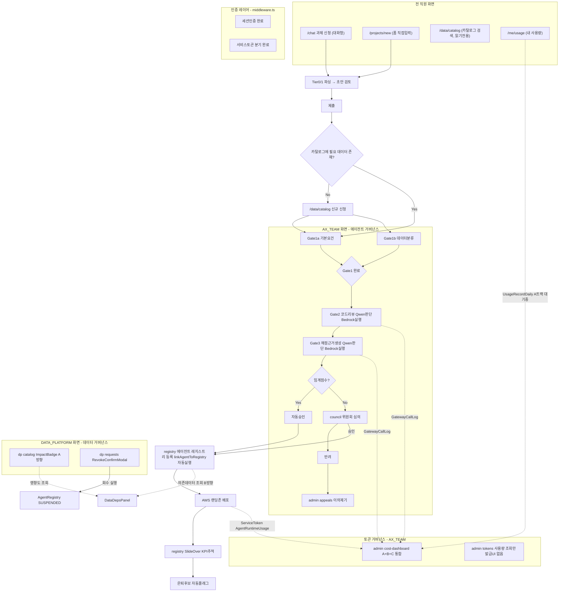

# AX Hub — UI를 배경으로 한 통합 워크플로우 재점검

**작성일**: 2026-08-21
**목적**: 확정된 UI 구조(2026-08-26 기준) 위에 전체 워크플로우를 겹쳐 그리고, 기술·UX·철학·보안·데이터정합성 다섯 관점에서 문제 재점검

---

## 1. UI 배경 통합 다이어그램

---

## 2. 다각도 문제 재점검

### 2-1. 기술적 관점

| 항목 | 상태 |
|---|---|
| `agentRegistryId` 자동세팅 | 확인됨 — `registry/route.ts` ACTIVE 전환 시 자동 호출 |
| `ModelProvider.costRank/qualityRank`가 라우팅에 관여 안 함 | 여전히 미확인 — 이전 리뷰에서 요청한 grep 결과 미회신 |
| `consultation.ts`의 `continueChat: GATE3_RATIONALE` 라벨 오분류 | 여전히 미확인 — CONSULTATION_CONTINUE로 분리 제안 미회신 |
| middleware.ts matcher/401 vs 리다이렉트 버그 재발 여부 | 여전히 미확인 — 명시적 테스트 결과 미회신 |

세 개 다 "고쳤다는 확인도, 반박도 없는" 상태입니다 — 방치되면 다음 라운드에서 또 놓칠 수 있어 재확인 요청이 필요합니다.

### 2-2. UX 관점 — 새로 발견

**`/dp/catalog`의 `isActive` 토글이 영향도 확인 없이 즉시 실행됩니다.** `/dp/requests`의 "회수"(DataProvision 삭제)는 `RevokeConfirmModal`로 보호되는데, `/dp/catalog`의 자산 비활성화(`isActive: false`, 신규 프로비저닝 차단)는 별도 보호장치 언급이 없습니다. 비활성화 자체가 기존 운영 중인 에이전트를 즉시 멈추는 건 아니지만(신규 신청만 막음), 관리자가 "왜 이 자산에 아무도 새로 신청을 못 하지"를 나중에야 알게 되는 건 여전히 불친절합니다.

**진입점 중복(`/chat` vs `/projects/new`)** — 여전히 미해결로 남아있습니다(이전 문서에서 이미 지적).

### 2-3. 철학적 관점

3축 프레임(에이전트·데이터·토큰)이 UI 구조에 상당히 잘 반영됐습니다. 다만 **토큰 축만 화면이 두 갈래(비용 대시보드 vs 토큰 관리)로 나뉘어 있고 아직 물리적으로 통합되지 않았습니다** — 사이드바 4그룹 재편이 완료돼야 이 축이 다른 두 축과 같은 수준의 응집도를 가집니다.

### 2-4. 보안 관점

로그인 인증 방식은 SSO 연동 이후 최종 확정될 사안이라 이번 검토 범위에서 제외합니다.

### 2-5. 데이터 정합성 관점

**`/me/usage`가 A트랙 데이터 없이 뭘 보여주는지 확인 필요합니다.** A트랙이 API 키 발급 전이라 데이터가 없는 상태에서, 개인별 사용량 화면이 "데이터 없음"을 명확히 보여주는지, 아니면 0이나 빈 화면을 애매하게 보여주는지 — 이건 이전에 `/admin/cost-dashboard`에 대해 지적했던 것과 같은 문제가 개인화면 버전으로도 존재할 수 있습니다.

**ServiceToken 발급 UI 부재** — C트랙이 코드로는 동작해도, 실제로 에이전트에게 토큰을 발급해주는 화면이 없으면 운영자가 매번 수동으로 처리해야 합니다. "중간 우선순위"로 남아있지만, C트랙을 실제로 쓰려면 이게 있어야 합니다.

---

## 3. 종합 — 우선순위 재정렬

| 항목 | 관점 | 우선순위 |
|---|---|---|
| `ModelProvider` 라우팅 관여 여부 재확인 요청 | 기술 | ★★★ (반복 미회신) |
| A트랙 API 키 발급 | 전체 전제조건 | ★★★ (변함없이 최우선) |
| `continueChat` taskType 분리 재확인 요청 | 기술 | ★★ (반복 미회신) |
| middleware.ts 버그 재발 여부 테스트 확인 | 기술 | ★★ (반복 미회신, SSO 무관한 부분 — matcher/401 응답 로직) |
| `/me/usage`·`/admin/cost-dashboard`의 "데이터없음" 명확 표시 | 데이터정합성 | ★★ |
| ServiceToken 발급 UI | UX/C트랙 실사용성 | ★★ |
| 사이드바 8→4 그룹 재편 | 철학/UX | ★★ |
| `/graph` 제거 | 철학 | ★★ |
| `/dp/catalog` isActive 토글에 영향 안내 추가 | UX | ★ |
| `/chat` vs `/projects/new` 진입점 통합 | UX | ★ |
