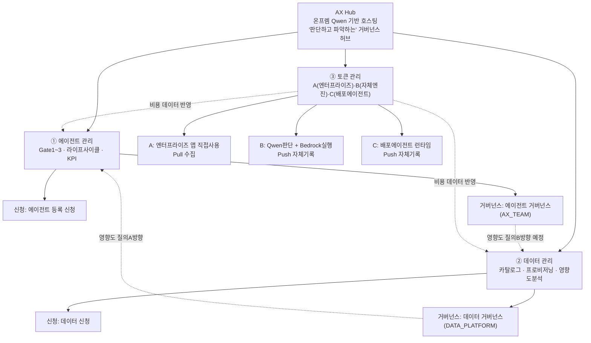
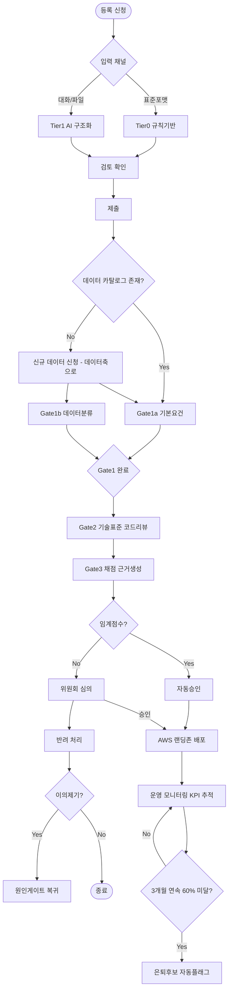
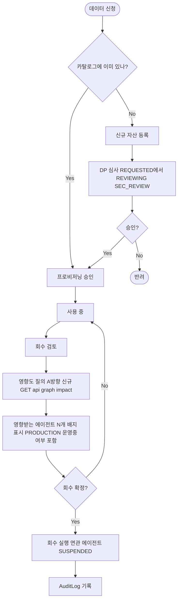
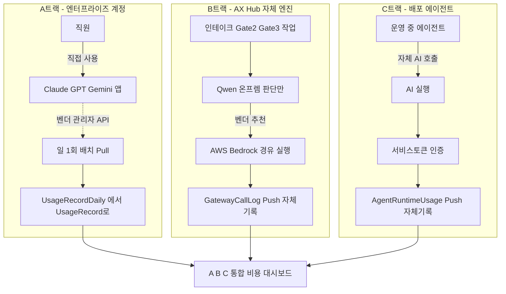

# AX Hub 거버넌스 다이어그램 — 3축 개요 + 축별 워크플로우

**작성일**: 2026-08-21

---

## 1페이지 — 거버넌스 개요

**세 축의 관계**: 에이전트와 데이터는 "신청(셀프서비스) → 거버넌스(심사)"라는 동일한 패턴을 공유하며, 영향도 질의 엔진으로 서로 연결된다(데이터 회수가 에이전트에 미치는 영향, 에이전트가 데이터에 의존하는 관계). 토큰은 세 트랙 모두 앞의 두 축을 가로질러 비용 데이터를 공급하는 관통 축이다.

---

## 2페이지 — 에이전트 관리 워크플로우

---

## 3페이지 — 데이터 관리 워크플로우

---

## 4페이지 — 토큰 관리 워크플로우 (A/B/C 3트랙)

**참고**: A트랙은 Claude Enterprise Analytics API 키 발급(승인 1건)만 남으면 완결. B·C트랙은 코드 구현 완료.
