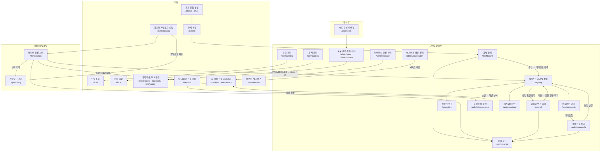

# AX AI 거버넌스 문서 체계

> 이 파일은 AX AI 거버넌스 문서 전체를 관리하는 마스터 인덱스다.
> 새 문서 추가·개정 시 반드시 이 파일을 함께 갱신한다.
> 최종 갱신: 2026-07-30

---

## 문서 계층 구조

```
L1  규정       (AX-REG, AX-COM)    — 전사 강제 준수 사항
 └─ L2  지침   (AX-POL, AX-STD)   — 방침·기준 설정
     └─ L3  가이드라인 (AX-OPS, AX-STD, AX-DEV) — 업무 수행 절차·기술 기준
         └─ L3  매뉴얼 (AX-MAN)   — 시스템 사용법
```

**타입**: 규정 / 지침 / 가이드라인 / 매뉴얼 (4종)  
**폴더**: `l1-규정/` / `l2-지침/` / `l3-가이드라인/` / `l3-매뉴얼/`  
**파일명**: `[타입]_한국어이름_docid소문자.md` (예: `[규정]_AI운영규정_ax-reg-2026-001.md`)

---

## 문서 목록

### 공식 문서 (Markdown SSOT — Word는 필요 시 별도 변환)

경로 기준: `docs/governance/` 하위. 폴더명이 레벨을 직접 표시.

#### L1 — 규정 (`l1-규정/`)

| 문서번호 | 파일명 (.md) | 버전 | 제정일 | 내용 요약 |
|----------|-------------|------|--------|-----------|
| AX-REG-2026-001 | `[규정]_AI운영규정_ax-reg-2026-001.md` | v1.0 | 2026-07-02 | 데이터 기밀등급(G1/G2/G3), 과제 신청·평가·승인 기준, AI 서비스 금지 행위 |
| AX-COM-2026-001 | `[규정]_AI운영위원회규정_ax-com-2026-001.md` | v1.0 | 2026-07-27 | AX위원회(구성·심의안건5종·상정요건·의결유형5종) + 실무협의체(구성·역할) |

#### L2 — 지침 (`l2-지침/`)

| 문서번호 | 파일명 (.md) | 버전 | 제정일 | 내용 요약 |
|----------|-------------|------|--------|-----------|
| AX-POL-2026-001 | `[지침]_AI운영지침_ax-pol-2026-001.md` | v4.0 (통합) | 2026-07-08 | 총칙·사용원칙(제1~5장) + AI 크루 파이프라인(제6~8장) + AX위원회·Agent 운영·생성형AI·PI T/F(제9~12장) |

#### L3 — 가이드라인 (`l3-가이드라인/`)

| 문서번호 | 파일명 (.md) | 버전 | 제정일 | 내용 요약 |
|----------|-------------|------|--------|-----------|
| AX-STD-2026-001 | `[가이드라인]_AI운영기준_ax-std-2026-001.md` | v1.1 | 2026-07-08 | AI 운영 공통 기준 — 승인 절차·데이터 거버넌스·보고 체계 |
| AX-STD-2026-002 | `[가이드라인]_AI리터러시레벨운영기준_ax-std-2026-002.md` | v1.0 | 2026-07-15 | AI 리터러시 레벨 정의·평가·권한 연계 기준 |
| AX-STD-2026-003 | `[가이드라인]_AX스킬라이브러리운영기준_ax-std-2026-003.md` | v1.0 | 2026-07-15 | 스킬 등록·검수·폐기·버전관리 운영 기준 |
| AX-STD-2026-004 | `[가이드라인]_AX토큰정책운영기준_ax-std-2026-004.md` | v1.0 | 2026-07-21 | 월 토큰 배분·모니터링·초과 처리 운영 기준 |
| AX-OPS-2026-001 | `[가이드라인]_AI에이전트등록운영가이드_ax-ops-2026-001.md` | v1.0 | 2026-07-14 | 에이전트 등록·Gate 단계·통제 운영 실무 가이드 |
| AX-OPS-2026-002 | `[가이드라인]_AI도구계정관리운영가이드_ax-ops-2026-002.md` | v1.0 | 2026-07-21 | GPT 150 + Gemini 50 계정 신청·배분·회수·모니터링 운영 절차 |
| AX-OPS-2026-003 | `[가이드라인]_생성형AI모델배분운영가이드_ax-ops-2026-003.md` | v1.0 | 2026-07-21 | 생성형 AI 모델 배분 기준 및 승인 흐름 |
| AX-DEV-2026-001 | `[가이드라인]_AI개발플로우추가조항_ax-dev-2026-001.md` | v1.1 | 2026-07-06 | AI 크루 범위·인수 기준, 배포환경 결정트리, 데이터플랫폼 연계, Gate 2 자가점검 |
| AX-DEV-2026-002 | `[가이드라인]_전사AI과제개발표준_ax-dev-2026-002.md` | v1.0 | 2026-07-15 | 표준 기술 스택(강제), 3단계 개발 요건, 코드품질, 데이터 거버넌스, 테스트 기준 |

#### L3 — 매뉴얼 (`l3-매뉴얼/`)

| 문서번호 | 파일명 (.md) | 버전 | 제정일 | 내용 요약 |
|----------|-------------|------|--------|-----------|
| AX-MAN-2026-001 | `[매뉴얼]_AX허브사용안내_ax-man-2026-001.md` | v1.0 | 2026-07-02 | AX Request Hub 신청·평가·승인 실무 가이드, 데이터 프로비저닝 6단계, FAQ |

### SLIM 압축본 (충돌 감지용 — 원본 불변)

> 데이터 플랫폼팀 데이터 거버넌스 문서와 상호 비교·충돌 감지용. 원본 문서는 건드리지 않는다.

| 파일명 | 원본 | 목적 |
|--------|------|------|
| `AX-COMMITTEE-SLIM.md` | AX-COM-2026-001 v1.0 | 제3조(안건5종)·제4조(상정요건)·제5조(의결유형)·제7조(협의체역할) 유지. 제2조 생략. |
| `AX-REGULATION-SLIM.md` | AX-REG-2026-001 v1.1 | 5장 9조 전체 유지. 장·조 번호 원본 그대로. |
| `AX-POLICY-SLIM.md` | AX-POL-2026-001 v4.1 | 12장 중 핵심 조항 선별. 생략 조항 *(생략)* 표시. 제1장부터 순서 유지. |
| `AX-MANUAL-SLIM.md` | AX-MAN-2026-001 v1.1 | 4단계(AI챗 활용) 생략. 1·2·3·5·6단계 + FAQ 4개 유지. |
| `AX-PROPOSAL-SLIM.md` | AX_전사AI운영체계_제안_2026-07 | 3대 과제 실행 구조·결정 사항 중심. 배경·상세 일정 생략. |

---

### 참조 문서 (설계·검토·제안)

> AX Hub 공식 거버넌스 문서(L1~L3)에 포함되지 않는 설계 참조·검토 문서. 하위 `docs/` 루트에 위치.

| 파일명 | 신설일 | 용도 |
|--------|--------|------|
| `architecture.md` | 2026-07-01 (**v3 통합 2026-07-23**) | AX Hub 전체 시스템 구조 — 데이터 프로비저닝·이중 라이프사이클·협의회 승인 체계 |
| `registry-lifecycle-design.md` | 2026-07-14 | 라이프사이클 기반 레지스트리 설계 (⚠️ v3로 갱신 예정) |
| `AX_Hub_검토보고_2026-07-22.md` | 2026-07-22 | 전체 교차 검토 — 규정 리스크 P1 3건, 아키텍처 P2 3건, 보완 P3 |
| `AX_전사AI운영체계_제안_2026-07.md` | 2026-07 | AX팀 조직·역할·프로세스 개선 방향 제안서 |

---

## 문서 간 참조 현황

| 조항 | 반영 상태 | 참조 위치 |
|------|-----------|-----------|
| AX-REG-2026-001 제5조 (승인기준) | ✅ 반영 완료 | 제5조 하단 Gate 2 callout → `[개발표준]_AI개발플로우추가조항_ax-dev-2026-001.md` §4 |
| AX-REG-2026-001 제1조·제5조 (등급·상용 확정 권한) | ✅ 반영 완료 | 제1조: 데이터 자산 등급 부여 의무·등급 확정 주체(데이터플랫폼팀) 추가. 제5조: G3 이중 승인(AX팀 에스컬레이션+데이터플랫폼팀 기밀 검토)·상용 확정 권한=협의회 의결 추가 |
| AX-POL-2026-001 제22조 (엔지니어 기준) | ✅ 반영 완료 | 제22조 하단 callout → `[개발표준]_전사AI과제개발표준_ax-dev-2026-002.md` (커버리지 80% 통일) |
| AX-POL-2026-001 제9~10장 (AX위원회) | ✅ 반영 완료 | AX-COM-2026-001로 분리 독립. 제28조: 상용 전환 심의 안건 5종·상정 요건 3가지 명문화. 제29조의2: 의결 유형 5종 추가 |
| AX-POL-2026-001 제19~27조 (파이프라인·데이터) | ✅ 반영 완료 | 제27조의2: 개발/상용 라이프사이클 분리 절차 신설. 제27조의3: 데이터 프로비저닝 절차(DataRequest→DataProvision) 신설 |
| AX-MAN-2026-001 3단계 (처리 절차) | ✅ 반영 완료 | Gate 2 자가점검 별도 callout 분리 |
| AX-MAN-2026-001 (데이터 신청 가이드) | ✅ 반영 완료 | 6단계: 데이터 카탈로그 탐색→DataRequest 신청→데이터플랫폼팀 검토→DataProvision 제공 실무 가이드 섹션 신규 추가 |

> **📌 Word 변환 시 참고**: .md 파일이 SSOT. Word 파일이 필요한 경우 해당 .md를 기준으로 변환.

---

## 신규 과제 신청 시 적용 문서 흐름

```
신청자 → AX Request Hub(/submit)
            │
            ├─ 기밀등급 판단        → AX-REG-2026-001 제1조
            ├─ 신청서 항목          → AX-MAN-2026-001 §2
            ├─ 데이터 필요 여부 선언 → architecture v3 §10 (신설)
            │
            ↓ 제출
         AI 자동평가 (6차원)       → AX-REG-2026-001 제4조
            ├─ Gate 2 자가점검     → AX-DEV-2026-001 §4
            ├─ 자동승인 (G1/G2 ≥70점)
            └─ 에스컬레이션 (G3 또는 <70점)

개발 착수 (개발 라이프사이클)
            ├─ 크루 PoC 범위       → AX-DEV-2026-001 §1
            ├─ 기술 스택 선택      → AX-DEV-2026-002 §4 (강제)
            ├─ 배포환경 결정       → AX-POL-2026-001 제24조
            └─ 데이터 확보         → architecture v3 §10 (신설)
                 카탈로그 검색(/data/catalog) → 있음: 이용 신청 / 없음: 신규 요청
                 데이터플랫폼팀 승인 (G3는 정보보호 협의) → 제공
                 ※ 데이터 PROVISIONED 전까지 Gate 2 진행 불가

상용 전환 (협의회 승인 — 신설)
            ├─ 상정 요건 5종 자동 검증 → architecture v3 §8-1
            ├─ AX위원회 심의·의결      → AX-COM-2026-001 / AX-POL-2026-001 제9~10장
            └─ 승인 시 상용 라이프사이클 이관 (데이터 상용 재승인 필수)

상용 운영
            ├─ 월별 상용 KPI 입력·판정 → architecture v3 §7-2
            └─ 폐기 트리거 → 협의회 보고 → DEPRECATED → RETIRED

AI 도구 계정 배정
            ├─ 부서장 → /dept/tools (AX팀 위임 범위 내)
            └─ AX팀 → /admin/tools — 운영 기준 → AX-OPS-2026-002
```

---

## AX Hub 시스템 연결 구조 (v3.1)



---

## 문서 이력

| 버전 | 일자 | 변경 내용 |
|------|------|-----------|
| v1.0 | 2026-07-15 | 최초 작성 — 공식 문서 4종 + 보완 md 3종 통합 인덱스 |
| v1.1 | 2026-07-21 | AX-MANUAL-2026-002 (AI 도구계정 관리운영가이드) 추가 |
| v1.2 | 2026-07-22 | 보완 문서 2종 추가(registry-lifecycle-design, 전사AI운영체계 제안), 시스템 연결 구조도 신설, architecture.md 갱신 반영 |
| v1.3 | 2026-07-23 | architecture.md **v3 통합**(데이터 프로비저닝·이중 라이프사이클·협의회 승인) 반영, 검토보고 문서 등재, 시스템 연결 구조도 v3 개편(고립 노드 해소, /data·/dp·/council 추가), 참조 현황에 반영 필요 항목 4건 등재, 과제 적용 문서 흐름에 데이터 확보·상용 전환·상용 운영 단계 신설 |
| v1.4 | 2026-07-23 | 참조 현황 ⬜ 4건 → ✅ 완료 처리: REGULATION 제1조·제5조, POLICY 제9~10장, POLICY 제19~27조, MANUAL 데이터 신청 가이드 — 각 규정 문서 v1.1/v4.1/v1.1로 개정 |
| v1.5 | 2026-07-24 | 시스템 연결 구조도 v3.1 업데이트 — 실제 구현된 라우트 전체 반영: /me/data·/me/level·/me/literacy·/me/services·/me/projects(직원), /admin/agents·/admin/appeals·/admin/employees·/admin/distribution·/admin/literacy·/admin/tokens·/admin/retired(AX팀) 추가. 에이전트 이의신청·레벨 승인·서비스 배분 흐름 연결선 추가. architecture_v3_통합본 Pages·역할표 동기화 |
| v1.6 | 2026-07-27 | SLIM 압축본 4종 추가 — 데이터 플랫폼팀 거버넌스 문서와 상호 충돌 감지용. AX-REGULATION-SLIM·AX-POLICY-SLIM·AX-GUIDELINE-SLIM·AX-MANUAL-SLIM |
